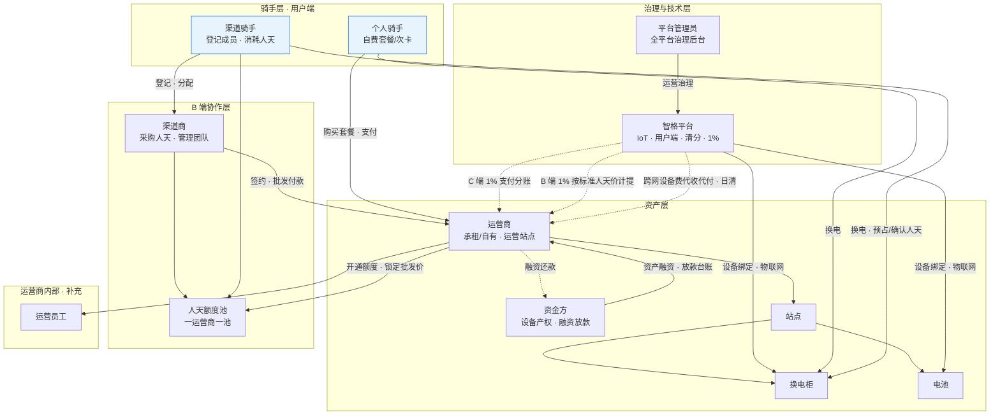
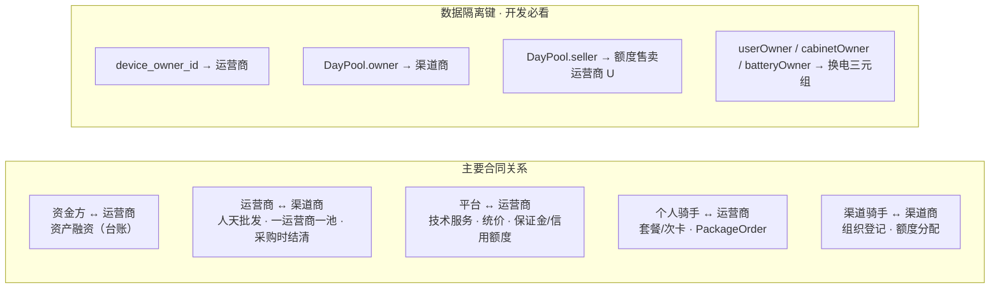
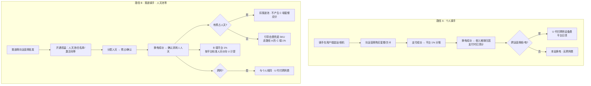
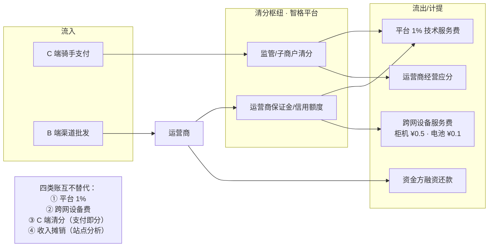
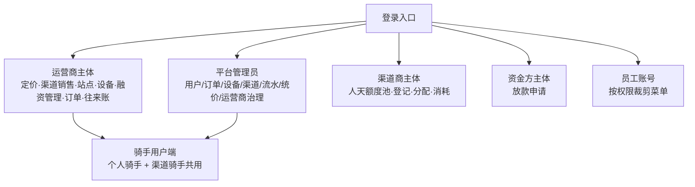
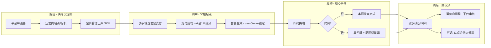

# 业务整体预览图

> 面向**业务评审**与**开发落地**的一页式关系说明。  
> 配套：[PRD.md](./PRD.md) · [功能结构与业务流程.md](./功能结构与业务流程.md) · [合作模式与分账.md](./合作模式与分账.md) · [换电场景与运营商结算.md](./换电场景与运营商结算.md) · [decision-016](../decisions/decision-016.md)

**原型入口**：`prototype/index.html`（后台） · `prototype/mobile/index.html`（骑手端）

**评审默认讲法**：先走 **§6 脊柱 8 步**（从个人骑手购买套餐串起），再按需展开渠道/融资/合伙人支线。

---

## 0. 角色清单（你列出的 + 建议一并讲清的）

| 角色 | 是否后台登录 | 一句话定位 |
|------|--------------|------------|
| **资金方** | 是 | 柜机/电池**产权方**，与运营商**资产融资**协作（放款申请） |
| **智格平台** | 不直接登录 | 物联网 + 骑手用户端 + 规则引擎 + 支付清分能力；收 **1% 技术服务费** |
| **平台管理员** | 是 | 智格超能运营方；**全平台治理**（用户/订单/设备绑定/统价/流水/KPI） |
| **运营商** | 是 | 换电**运营主体**；可自有或租赁设备；C 端收款 + B 端批发人天 |
| **渠道商** | 是 | B 端**人天采购方**；登记团队、分配额度；不持设备 |
| **站点合伙人** | 是 | 场地方/物业等**场地分润方**；只读查看绑定站点分润，向运营商申请提现 |
| **个人骑手** | 用户端 | 自费买套餐/次卡，在柜机换电 |
| **渠道骑手** | 用户端 | 渠道商登记成员；消耗**人天额度池**换电，可跨网 |
| **运营员工**（补充） | 是（受限） | 运营商/渠道商/资金方内部账号，按权限看子集菜单 |
| **站点 / 柜机 / 电池**（补充） | — | 物理资产与换电触点；换电时形成 **U/C/B 三元组** |
| **人天额度池**（补充） | — | 渠道商向运营商采购后的**额度账本**（非现金池） |
| **监管账户 / 支付通道**（补充） | — | 架构 B：骑手款进运营商子商户，平台 1% 分账 |

---

## 1. 业务整体关系图（主图 · 讲解用）

**读图说明**

- **实线箭头**：合同 / 归属 / 服务关系  
- **虚线箭头**：资金、清分、技术服务  
- 渠道骑手与个人骑手 C 端清分默认 **平台 1% + 运营商 99%**；有站点合伙人时，合伙人 R% 从运营商份额按站切出（见 [站点合伙人.md](./站点合伙人.md)）

---

## 2. 合同与数据归属（谁管什么）

| 对象 | 归属 / 售卖方 | 备注 |
|------|---------------|------|
| 柜机、电池（运营侧） | 运营商（租赁时产权在资金方） | **绑定**仅平台管理员可操作 |
| 个人套餐订单 | 售卖运营商 | C 端收款主体 = 运营商子商户 |
| 人天额度池 | 归属渠道商，**售卖方 U = 签约运营商** | 渠道商向 U 付款采购 |
| 渠道骑手换电 | `userOwner = U`（额度售卖方） | 与个人骑手跨网清分规则相同 |

---

## 3. 两条骑手路径对比（业务最常问）

| 对比项 | 个人骑手 | 渠道骑手 |
|--------|----------|----------|
| 谁付钱 | 骑手本人 | 渠道商（批发）→ 再分配给骑手 |
| 权益载体 | `PackageOrder` | `DayPool` + 分配 → 激活 `PackageOrder` |
| 平台 1% | 支付成功分账 | 确认消耗计提（基数 = **平台标准人天价**） |
| 运营商批发价 | — | 默认 = 标准日价，**运营商可改**；计提仍按标准价 |
| 跨网换电 | 允许（运营商可关） | **允许**（规则与个人一致） |
| 预占失败 | — | 人天池：可转自费兜底；**不扣渠道池** |

---

## 3.5 渠道商四种结算模式（B 端）

> 详规：[渠道结算模式规则.md](./渠道结算模式规则.md) · 演示账号见 [角色与功能清单.md](./角色与功能清单.md) §9

| 模式 | 演示 | 用户获权益 | B2B 订单 | 平台 1% |
|------|------|------------|----------|---------|
| **人天池** | `CH-SF` | 登记 + 分配人天 | PO | 确认消耗 |
| **渠道分销** | `CH-CARD` | 链接/二维码购套餐 | — | 支付成功 |
| **设备租赁** | `CH-RENT` | 白名单购渠道套餐 | MO | 月租 MO + 购套餐 |
| **激活码** | `CH-ACT` | 输入码核销 | AC | 码核销 |

路径 B 上图为**人天池**典型流程；分销用户走路径 A 并带渠道标记；**设备租赁**白名单用户购渠道套餐（款进渠道）；激活码用户不经 C 端支付。

---

## 4. 资金流总览（三类账并行）

| 账目类型 | 触发 | 方向 | 后台菜单（运营商） |
|----------|------|------|-------------------|
| C 端 1% | 个人支付成功 | 子商户 → 平台 | 平台服务费 / 流水 |
| C 端运营商 99% | 个人支付成功 | **实时清分**至运营商子商户 | 清分明细 / 提现明细 |
| B 端 1% | 渠道人天确认消耗 | 向额度售卖方 U 代扣 | 平台服务费 |
| B 端 1% · 激活码 | 码核销成功 | 标准人天价×服务人天×B 端费率 | 平台服务费 |
| B 端 · 分销 | 用户经链接购套餐 | 支付成功 C 端 1% + 佣金线下结 | 平台服务费 / 佣金对账 |
| B 端 · 设备租赁 | 月租 MO 支付 | 运营商收款 | 渠道管理 · 渠道订单 |
| 跨网设备费 | 换电成功且 U≠C 或 U≠B | U 经平台代付 | 运营商往来账 |
| 收入摊销 | 包月按日 / 次卡当笔 | 运营商主体（不按站点） | 内部报表 |
| 站点繁忙度 | 实时快照 | 格口/电池/等待 | 总览 · 站点繁忙度分析 |
| 柜机用电 | 日上报增量 | kWh / 站点 / 单柜 | 总览 · 用电量统计（模块内时间筛选） |
| C 端退款 | 中途退订/完结 | **运营商子商户原路退** | 资金实收 / 退款管理 |
| 融资还款 | 按借据计划 | 运营商 → 资金方 | 融资管理 / 放款申请 |

---

## 5. 后台登录身份地图（开发菜单边界）

---

## 6. 评审脊柱：从「购买套餐」串功能（8 步）

> **用途**：需求/设计评审默认演示稿。侧栏功能多，**不要按菜单讲**，按本脊柱把菜单挂到「购前 / 购中 / 履约 / 购后」。
> **决策依据**：[decision-016](../decisions/decision-016.md)
> **开场 30 秒**：本系统有两条骑手路径（§3）；今天默认跑透 **路径 A · 个人购套餐**，渠道等支线问到再展开。

### 6.1 脊柱总览

| 层级 | 内容 | 评审是否必讲 |
|------|------|:------------:|
| **脊柱** | 定价上架 → 购套餐支付 → 清分 1% → 扫码换电 →（可选跨网）→ 提现审核 | ✓ 默认 |
| **支线 B** | 渠道四模式（人天/分销/租赁/激活码）——与脊柱汇合于「换电」 | 问到再讲 |
| **支线 C** | 融资/放款 —— 挂在购前「有设备可换」 | 问到再讲 |
| **支线 D** | 站点合伙人分润 —— 挂在购后收入分配 | 问到再讲 |

### 6.2 八步勾稽清单（个人路径 · 边点原型边勾）

| 步 | 登录身份 | 操作入口 | 预期可见 / 勾稽点 | 空态·异常 |
|:--:|----------|----------|-------------------|-----------|
| **1** | 运营商 · 绿色出行 | **平台设置 → 个人套餐定价** | 强制上架含 1 天畅换、单次等；城市底价 + 价格分区可调价 | 无默认套餐则 C 端无可买项 |
| **2** | 骑手端 | **服务购买** → 选套餐 → Mock 支付 | 支付成功；服务卡变为个人套餐生效 | 未实名/无定位选 OP 时阻断（方案乙） |
| **3** | 运营商 | **订单与服务 → 套餐购买订单** + **我的流水** | 订单「已清分」；流水可见平台 1% + 运营商净额 | 退款走退款管理，非本步 |
| **4** | 骑手端 | **首页扫一扫**（选本网站点） | 换电成功；服务中可再次换电 | 持电申请冻结须先还电 |
| **5** | 运营商 | **订单与服务 → 换电订单** → 详情 | 三元组、过程日志；平台侧详情可看 SOH | 列表不展示 SOH（运营商侧） |
| **6** | 骑手端（可选） | 演示身份切 **个人跨网·案例3** → 滨江站扫码 | 与后台 `SW-CROSS-DEMO` 一致：U≠C≠B，跨网费合计 **¥0.6** | 运营商关跨网则拦截 |
| **7** | 运营商 | **我的流水** → **提现申请** | 可提现 = 已清分 − 已提现 − 待审（一期）；融资待还预留为二期 | 已有待审单不可重复提交 |
| **8** | 平台管理员 | **流水管理** → **运营商提现审核** | 通过/驳回；通过后状态「已提现」 | 设备租赁渠道收款不经本审核 |

**建议时长**：脊柱 8 步约 **10～12 分钟**；加步 6 跨网约 **+3 分钟**。

### 6.3 侧栏挂靠表（防散）

| 侧栏 / 模块 | 挂在脊柱哪一段 | 备注 |
|-------------|----------------|------|
| 定价管理 / 渠道管理 | 购前 · 可卖什么 | 渠道四模式见 §3.5 |
| 设备 / 站点 / 融资管理 | 购前 · 供给 | 设备绑定仅平台可操作 |
| 套餐购买订单 / 骑手「服务购买」 | **脊柱中枢** | 步 2～3 |
| 换电订单 / 服务冻结 / 退款管理 | 履约与售后 | 步 4～5；退款另开小节 |
| 流水 / 提现 / **平台服务（服务费/往来）** | 购后账 | 步 7～8；跨网见步 6 |
| 保证金 / 信用评估 / 跨网统价 | 跨网与风控护栏 | 支撑步 6，非脊柱节点 |
| 站点合伙人 | 购后分润 | 支线 D；仅个人用户收入 |
| 总览 · 繁忙度 / 用电量 | 经营观察 | **非交易链**，脊柱讲完再扫一眼即可 |
| 平台营销 | 购套餐获客变体 | 仍汇合于支付/激活，不另起主业 |

### 6.4 支线一句话（评审备用）

| 支线 | 一句话 | 演示入口（可选） |
|------|--------|------------------|
| B 渠道人天 | 渠道批发额度 → 分配 → 换电扣天；**不买 C 端套餐**，终点同为换电 | `CH-SF` + 骑手 `channel_*` |
| B 骑士卡 | 链接归因 24h → **仍是购套餐** + 佣金 | `CH-CARD` + `card_link_attr` |
| B 设备租赁 / 激活码 | 换开权益方式，汇合于扫码 | `CH-RENT` / `CH-ACT` |
| C 融资 | 没设备/没放款则无柜可换 | 运营商融资管理 ↔ 资方放款申请 |
| D 合伙人 | 个人确认收入后按站切 R% | 站点「合伙人」抽屉 / 合伙人登录 |

**渠道 Mock 串联**（与脊柱对照，不替换脊柱）：采购 `PO-202601-088` → 池 `QP-2601` → 骑手 `U2101` 换电 `SW2606090830` → B 端计提 `PF-001`（标准价 ¥8.5 × 1%）。

### 6.5 评审禁止事项

- 不要从平台管理员「总览」开始点完全部菜单
- 不要一次讲完四渠道 + 融资 + 合伙人（除非评审议题就是该支线）
- 不要把「站点繁忙度 / 用电量」当成交易闭环必要条件

---

## 7. 建议讲解顺序（15 分钟版）

| 顺序 | 讲什么 | 指着哪张图 |
|------|--------|------------|
| 1 | 行业里六类「人」+ 补充（员工、站点设备） | §0 表格 |
| 2 | **脊柱 8 步：从购套餐串到提现**（本场核心） | **§6** + 原型 |
| 3 | 谁租设备、谁运营、谁买人天、谁换电（收束） | §1 主图 |
| 4 | 个人 vs 渠道骑手：付款、1%、跨网差异 | §3 |
| 5 | 钱怎么走：三类账不要混 | §4 |
| 6 | （可选）数据隔离键 / 登录边界 | §2、§5 |
| 7 | （问到再讲）渠道 Mock 串联或支线 | §6.4 |

---

## 8. 与详细流程文档的分工

| 本文 | 详细版 |
|------|--------|
| **评审脊柱 8 步与菜单挂靠** | 本文 §6；决策 [decision-016](../decisions/decision-016.md) |
| 角色关系、两条骑手路径、资金分类 | [功能结构与业务流程.md](./功能结构与业务流程.md) §4 逐步状态机 |
| 1% 与标准人天价 | [PRD.md](./PRD.md) §2.2、§5.5 |
| 人天池规则 | [天数池.md](./天数池.md) |
| 四渠道结算模式 | [渠道结算模式规则.md](./渠道结算模式规则.md) §6 |
| 跨网 U/C/B 与日清 | [换电场景与运营商结算.md](./换电场景与运营商结算.md) |
| 支付架构 B、应分台账 | [合作模式与分账.md](./合作模式与分账.md) |
| 融资台账与放款 | [融资管理-PRD.md](./融资管理-PRD.md) |
| 站点合伙人 | [站点合伙人.md](./站点合伙人.md) |
| 验收勾稽 | [acceptance-criteria.md](./acceptance-criteria.md) |

---

## 9. 修订记录

| 版本 | 日期 | 说明 |
|------|------|------|
| **1.3** | 2026-07-16 | **§6 评审脊柱**：从购买套餐串功能 8 步 + 挂靠表 + 支线/禁止项；§7 讲解顺序改为脊柱优先 |
| **1.1** | 2026-07-02 | I6-5：资金方协作改为「放款申请」；运营商侧「融资管理」 |
| **1.2** | 2026-07-03 | §3.5 四渠道结算模式；资金流补激活码/分销/设备租赁 B 端行 |
| 1.0 | 2026-06-12 | 初版：角色关系、两条骑手路径、资金分类、登录身份地图 |
