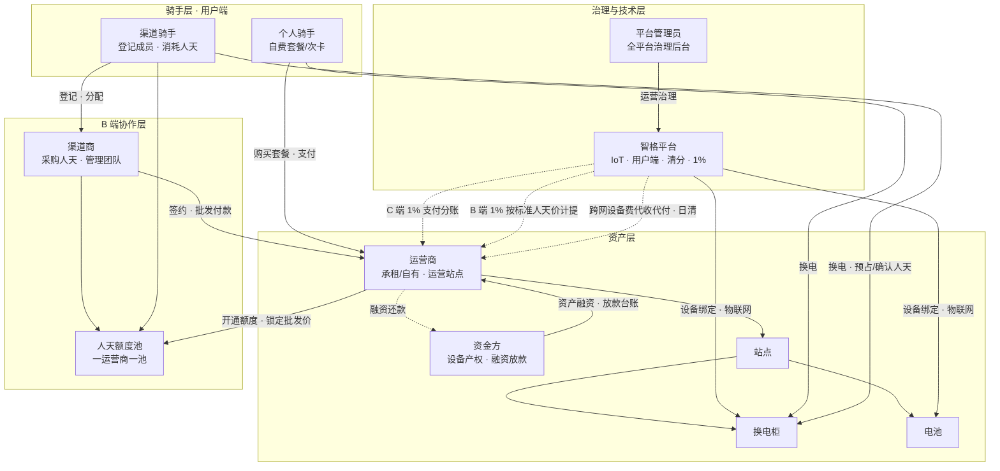
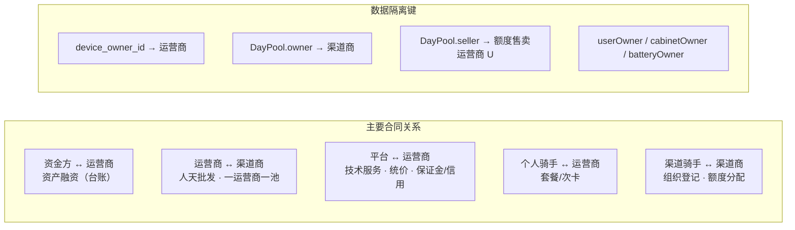
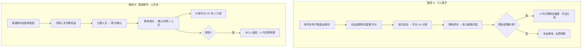
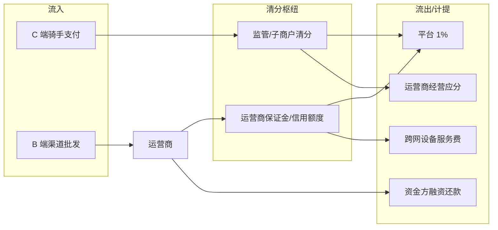
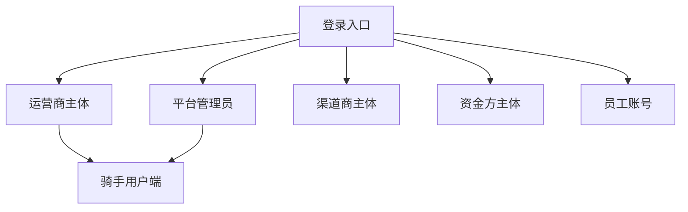
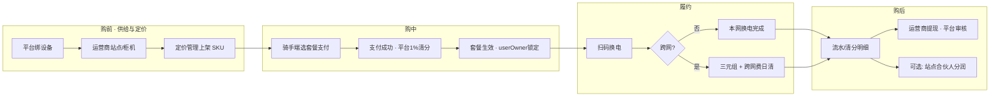

# 业务整体预览图

> **这是什么**：给业务评审与开发落地用的一页式关系说明——角色、两条骑手路径、资金分类、登录边界，以及默认演示用的「购套餐 8 步脊柱」。  
> **依据/关联**：[PRD.md](./PRD.md) · [功能结构与业务流程.md](./功能结构与业务流程.md) · [合作模式与分账.md](./合作模式与分账.md) · [换电场景与运营商结算.md](./换电场景与运营商结算.md) · 决策索引见文末  
> **写法**：[业务文档写作规范](./业务文档写作规范.md)

---

## 业务设定

### 一句话

先记住六类人怎么协作，再按「购前供给 → 购套餐清分 → 扫码换电 → 提现」串一遍；渠道、融资、合伙人是支线，问到再展开。

### 怎么读 / 怎么讲

1. **评审默认**：走下方「脊柱 8 步」（个人骑手买套餐），边点原型边勾。  
2. **不要**从平台总览把菜单点完；不要一次讲完四渠道+融资+合伙人。  
3. 站点繁忙度/用电量是经营观察，不是交易闭环必要条件。  
4. 图与逐步勾稽表在附录；这里用白话能力地图。

原型：后台 `prototype/index.html` · 骑手端 `prototype/mobile/index.html`。

### 角色清单（白话）

| 角色 | 是否后台登录 | 一句话定位 |
|------|--------------|------------|
| 资金方 | 是 | 柜机/电池产权方，与运营商做资产融资（放款申请） |
| 智格平台 | 不直接登录 | 物联网 + 用户端 + 规则 + 清分；收约 1% 技术服务费 |
| 平台管理员 | 是 | 全平台治理（用户/订单/设备绑定/统价/流水） |
| 运营商 | 是 | 换电运营主体；C 端收款 + B 端批发人天 |
| 渠道商 | 是 | B 端人天（或链接/租赁/激活码）采购与团队管理；不持设备 |
| 站点合伙人 | 是 | 场地分润方；只读绑定与明细，向运营商提现 |
| 个人骑手 | 用户端 | 自费买套餐/次卡换电 |
| 渠道骑手 | 用户端 | 登记成员；消耗人天额度换电，可跨网 |
| 运营员工 | 是（受限） | 按权限看子集菜单 |
| 站点 / 柜机 / 电池 | — | 物理触点；换电时形成用户/柜机/电池三方归属 |
| 人天额度池 | — | 渠道采购后的额度账本（不是现金池） |
| 监管账户 / 支付通道 | — | 骑手款进运营商收款账户，平台约 1% 分账 |

### 关系怎么读图（白话）

- **实线**：合同 / 归属 / 服务。  
- **虚线**：资金、清分、技术服务。  
- 个人与渠道骑手默认都是「平台约 1% + 运营商约 99%」；有站点合伙人时，合伙人比例从运营商份额按站切出。

主层：治理（平台管理员 + 智格能力）→ 资产（资金方融资、运营商运站柜电）→ B 端（渠道买人天、一运营商一池）→ 骑手（个人自费 / 渠道消耗人天）。

### 谁管什么（白话）

| 对象 | 归属 / 售卖方 | 备注 |
|------|---------------|------|
| 柜机、电池（运营侧） | 运营商（租赁时产权可在资金方） | **绑定设备只有平台能做** |
| 个人套餐订单 | 售卖运营商 | 收款主体 = 运营商收款账户 |
| 人天额度池 | 归属渠道商，售卖方 = 签约运营商 | 渠道向售卖方付款采购 |
| 渠道骑手换电 | 归属 = 额度售卖方 | 跨网规则与个人相同 |

### 两条骑手路径对比

| 对比项 | 个人骑手 | 渠道骑手（人天池典型） |
|--------|----------|------------------------|
| 谁付钱 | 骑手本人 | 渠道批发，再分配给人 |
| 权益载体 | 自己的套餐单 | 池里分配出的天数 |
| 平台约 1% | 支付成功分账 | 确认消耗计提（基数 = 平台标准人天价） |
| 运营商批发价 | — | 可改；计提仍按标准价 |
| 跨网 | 允许（运营商可关） | 允许（规则同个人） |
| 额度不够 | — | 不能换电；无自费应急兜底（已取消） |

路径简述：

- **个人**：选站购套餐 → 支付清分 → 换电 → 若跨网则售卖方代付设备费日清。  
- **渠道人天**：批发进池 → 分配 → 换电确认扣天 → B 端 1% 向售卖方计提；跨网规则同个人。

### 渠道四种结算模式（一眼）

| 模式 | 用户怎么获权益 | B2B 订单 | 平台约 1% |
|------|----------------|----------|-----------|
| 人天池 | 登记 + 分配人天 | 有 | 确认消耗 |
| 渠道分销 | 链接/二维码购套餐 | 无 | 支付成功 |
| 设备租赁 | 白名单购渠道套餐 | 月租 | 月租 + 购套餐 |
| 激活码 | 输入码核销 | 有 | 码核销 |

分销用户实际走个人购套餐路径并带渠道标记；租赁款进渠道收款账户。

### 资金流：四类账不要混

| 账目类型 | 何时发生 | 方向 | 运营商大概在哪看 |
|----------|----------|------|------------------|
| C 端约 1% | 个人支付成功 | 收款账户 → 平台 | 平台服务费 / 流水 |
| C 端运营商约 99% | 个人支付成功 | 实时清分至运营商 | 清分明细 / 提现 |
| B 端约 1% | 人天确认消耗等 | 向额度售卖方计提 | 平台服务费 |
| 跨网设备费 | 换电且柜/电非己方 | 售卖方经平台代付 | 运营商往来账 |
| 收入摊销 | 包月按日 / 次卡当笔 | 运营商主体（不按站） | 内部报表 |
| 退款 | 中途退订等 | 运营商原路退 | 资金实收 / 退款管理 |
| 融资还款 | 按借据 | 运营商 → 资金方 | 融资管理（二期） |

另有：分销佣金线下结、设备月租 B2B、激活码核销计提等，见渠道规则文档。

### 登录身份地图（白话）

登录后按身份进：平台管理员 / 运营商 / 渠道商 / 资金方 / 员工（裁菜单）。骑手在用户端，个人与渠道共用。站点合伙人另有独立登录门户。

### 评审脊柱：8 步（必讲）

**开场 30 秒**：两条骑手路径；今天默认跑透个人购套餐。

| 步 | 谁登录 | 做什么 | 预期看见 |
|:--:|--------|--------|----------|
| 1 | 运营商 | 平台设置 → 个人套餐定价 | 有可卖 SKU（含 1 天畅换、单次等） |
| 2 | 骑手端 | 服务购买 → 选套餐 → 支付 | 支付成功，个人套餐生效 |
| 3 | 运营商 | 套餐购买订单 + 我的流水 | 订单已清分；可见平台约 1% + 运营商净额 |
| 4 | 骑手端 | 首页扫一扫（本网站点） | 换电成功 |
| 5 | 运营商 | 换电订单 → 详情 | 三方归属、过程日志 |
| 6 | 骑手端（可选） | 切跨网演示身份扫码 | 跨网费合计演示一致；关跨网则拦 |
| 7 | 运营商 | 提现申请 | 可提现 = 已清分 − 已提现 − 待审（一期） |
| 8 | 平台管理员 | 运营商提现审核 | 通过/驳回；通过后已提现 |

建议时长：脊柱约 10～12 分钟；加跨网约 +3 分钟。

**侧栏挂靠**：定价/渠道 → 购前可卖什么；设备/站点/融资 → 购前供给；套餐单与骑手购买 → 脊柱中枢；换电/冻结/退款 → 履约售后；流水/提现/平台服务 → 购后账；保证金/统价 → 跨网护栏；合伙人 → 购后分润支线；繁忙度/用电 → 讲完脊柱再扫一眼。

**支线一句话**

| 支线 | 一句话 |
|------|--------|
| 渠道人天 | 批发额度 → 分配 → 换电扣天；终点同为换电 |
| 骑士卡 | 链接归因后仍是购套餐 + 佣金 |
| 设备租赁 / 激活码 | 换开权益方式，汇合于扫码 |
| 融资 | 没设备/没放款则无柜可换 |
| 合伙人 | 个人确认收入后按站切比例 |

### 15 分钟讲解顺序建议

1. 角色表（谁是谁）  
2. 脊柱 8 步 + 原型（本场核心）  
3. 主关系收束（谁租设备、谁运营、谁买人天）  
4. 个人 vs 渠道差异  
5. 四类账不要混  
6. （可选）登录边界  
7. （问到再讲）渠道串联或支线  

### 与详细文档怎么分工

| 想深入什么 | 去哪 |
|------------|------|
| 逐步状态机 / 功能结构 | [功能结构与业务流程.md](./功能结构与业务流程.md) |
| 1% 与标准人天价 | [PRD.md](./PRD.md) |
| 人天池 | [天数池.md](./天数池.md) |
| 四渠道 | [渠道结算模式规则.md](./渠道结算模式规则.md) |
| 跨网 | [换电场景与运营商结算.md](./换电场景与运营商结算.md) |
| 支付架构与应分 | [合作模式与分账.md](./合作模式与分账.md) |
| 融资 | [融资管理-PRD.md](./融资管理-PRD.md) |
| 站点合伙人 | [站点合伙人.md](./站点合伙人.md) |
| 验收 | [acceptance-criteria.md](./acceptance-criteria.md) |

---

## 实现附录（开发用）

> 业务读者可跳过。下列为 Mermaid 图、勾稽细节、Mock 单号、决策索引。

### A. 业务整体关系图

```mermaid
flowchart TB
  subgraph gov [治理与技术层]
    Admin["平台管理员<br/>全平台治理后台"]
    Plat["智格平台<br/>IoT · 用户端 · 清分 · 1%"]
    Admin -->|运营治理| Plat
  end
  subgraph asset [资产层]
    Lease["资金方<br/>设备产权 · 融资放款"]
    OP["运营商<br/>承租/自有 · 运营站点"]
    Site["站点"]
    Cab["换电柜"]
    Bat["电池"]
    Lease -->|资产融资 · 放款台账| OP
    OP --> Site
    Site --> Cab
    Site --> Bat
    Plat -->|设备绑定 · 物联网| Cab
    Plat -->|设备绑定 · 物联网| Bat
  end
  subgraph b2b [B 端协作层]
    CH["渠道商<br/>采购人天 · 管理团队"]
    Pool["人天额度池<br/>一运营商一池"]
    CH -->|签约 · 批发付款| OP
    CH --> Pool
    OP -->|开通额度 · 锁定批发价| Pool
  end
  subgraph riders [骑手层 · 用户端]
    R1["个人骑手<br/>自费套餐/次卡"]
    R2["渠道骑手<br/>登记成员 · 消耗人天"]
  end
  R1 -->|购买套餐 · 支付| OP
  R1 -->|换电| Cab
  R2 -->|登记 · 分配| CH
  R2 -->|换电 · 预占/确认人天| Cab
  R2 --> Pool
  Plat -.->|C 端 1% 支付分账| OP
  Plat -.->|B 端 1% 按标准人天价计提| OP
  Plat -.->|跨网设备费代收代付 · 日清| OP
  OP -.->|融资还款| Lease
```

### B. 合同与数据归属键

```mermaid
flowchart LR
  subgraph contracts [主要合同关系]
    L1["资金方 ↔ 运营商<br/>资产融资（台账）"]
    L2["运营商 ↔ 渠道商<br/>人天批发 · 一运营商一池"]
    L4["平台 ↔ 运营商<br/>技术服务 · 统价 · 保证金/信用"]
    L5["个人骑手 ↔ 运营商<br/>套餐/次卡"]
    L6["渠道骑手 ↔ 渠道商<br/>组织登记 · 额度分配"]
  end
  subgraph data_owner [数据隔离键]
    D1["device_owner_id → 运营商"]
    D2["DayPool.owner → 渠道商"]
    D3["DayPool.seller → 额度售卖运营商 U"]
    D4["userOwner / cabinetOwner / batteryOwner"]
  end
```

### C. 两条路径流程图

```mermaid
flowchart TB
  subgraph path_c [路径 A · 个人骑手]
    A1[骑手在用户端选站/柜机] --> A2[向运营商购买套餐/次卡]
    A2 --> A3[支付成功 → 平台 1% 分账]
    A3 --> A4[换电成功 → 收入摊销归因]
    A4 --> A5{跨运营商柜/电?}
    A5 -->|是| A6[U 代付跨网设备费 · 平台日清]
    A5 -->|否| A7[本站换电 · 无跨网费]
  end
  subgraph path_b [路径 B · 渠道骑手 · 人天池]
    B1[渠道商向运营商批发] --> B2[开通人天池等权益]
    B2 --> B3[分配人天 → 预占/确认]
    B3 --> B4[换电成功 → 确认消耗 1 人天]
    B4 --> B8[B 端平台 1% 向 U 计提]
    B4 --> B9{跨网?}
    B9 -->|是| B10[与个人相同 · U 代付跨网费]
  end
```

演示账号对照：[角色与功能清单.md](./角色与功能清单.md)。`CH-SF` / `CH-CARD` / `CH-RENT` / `CH-ACT`。

### D. 资金流图

```mermaid
flowchart LR
  subgraph in [流入]
    Cpay["C 端骑手支付"]
    Bpay["B 端渠道批发"]
  end
  subgraph hub [清分枢纽]
    Reg["监管/子商户清分"]
    Dep["运营商保证金/信用额度"]
  end
  subgraph out [流出/计提]
    P1["平台 1%"]
    P2["跨网设备服务费"]
    P3["运营商经营应分"]
    P5["资金方融资还款"]
  end
  Cpay --> Reg
  Bpay --> OP2["运营商"]
  Reg --> P1
  Reg --> P3
  OP2 --> Dep
  Dep --> P1
  Dep --> P2
  OP2 --> P5
```

### E. 登录身份图

```mermaid
flowchart TB
  Login[登录入口]
  Login --> AdminM[平台管理员]
  Login --> OPM[运营商主体]
  Login --> CHM[渠道商主体]
  Login --> LM[资金方主体]
  Login --> Emp[员工账号]
  OPM --> Mobile[骑手用户端]
  AdminM --> Mobile
```

### F. 脊柱总览图

```mermaid
flowchart LR
  subgraph before [购前 · 供给与定价]
    P1[平台绑设备] --> P2[运营商站点/柜机]
    P2 --> P3[定价管理上架 SKU]
  end
  subgraph buy [购中]
    P3 --> B1[骑手端选套餐支付]
    B1 --> B2[支付成功 · 平台1%清分]
    B2 --> B3[套餐生效 · userOwner锁定]
  end
  subgraph swap [履约]
    B3 --> S1[扫码换电]
    S1 --> S2{跨网?}
    S2 -->|否| S3[本网换电完成]
    S2 -->|是| S4[三元组 + 跨网费日清]
  end
  subgraph after [购后]
    S3 --> A1[流水/清分明细]
    S4 --> A1
    A1 --> A2[运营商提现 · 平台审核]
    A1 --> A3[可选: 站点合伙人分润]
  end
```

### G. 八步空态与演示细节

| 步 | 空态·异常 |
|:--:|-----------|
| 1 | 无默认套餐则 C 端无可买项 |
| 2 | 未实名/无定位选 OP 时阻断 |
| 3 | 退款走退款管理，非本步 |
| 4 | 持电申请冻结须先还电 |
| 5 | 列表不展示 SOH（运营商侧） |
| 6 | 与后台 `SW-CROSS-DEMO` 一致：跨网费合计 ¥0.6；关跨网拦截 |
| 7 | 已有待审单不可重复提交；融资待还预留二期 |
| 8 | 设备租赁渠道收款不经本审核 |

渠道 Mock 串联（对照脊柱，不替换）：采购 `PO-202601-088` → 池 `QP-2601` → 骑手 `U2101` 换电 `SW2606090830` → B 端计提 `PF-001`（标准价 ¥8.5 × 1%）。

### H. 决策索引 · 修订记录

| 决策 | 要点 |
|------|------|
| decision-016 | 评审脊柱 8 步与菜单挂靠 |

| 版本 | 日期 | 说明 |
|------|------|------|
| 1.3 | 2026-07-16 | §6 评审脊柱 8 步 + 挂靠表 |
| 1.2 | 2026-07-03 | 四渠道；资金流补 B 端行 |
| 1.1 | 2026-07-02 | I6-5：放款申请 / 融资管理 |
| 1.0 | 2026-06-12 | 初版 |
