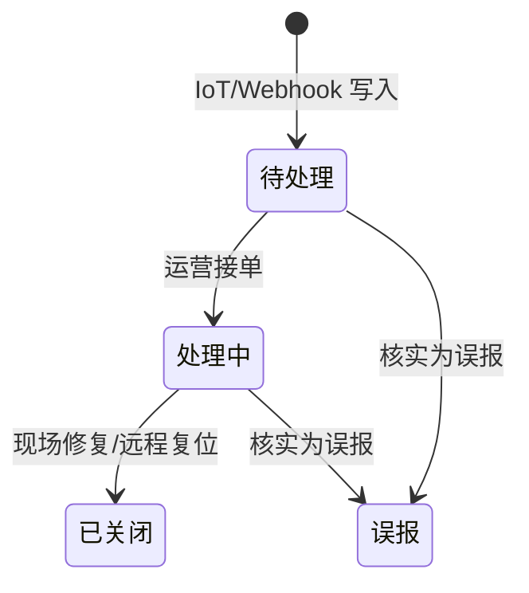

# 任务：设备告警与 ICCID 管理（详设）

> **状态**：详设完成，待开发排期  
> **决策来源**：[竞品借鉴决策记录.md](./竞品借鉴决策记录.md) C-03  
> **竞品参考**：IOT Platform · 电池/换电柜管理 → 故障告警、柜门清单、ICCID 变动记录  
> **关联**：[PRD.md](./PRD.md) · [角色与功能清单.md](./角色与功能清单.md) · 智格 IoT 平台（数据源）

---

## 1. 目标

在**不复制第二套设备管理**的前提下，为运营商/平台补齐三类 IoT 运维可见性：

| 能力 | 价值 |
|------|------|
| **柜级告警** | 离线、过温、门禁异常可发现、可跟进 |
| **未正常弹电池** | 客诉「没弹出电池」有据可查，关联换电单 |
| **ICCID 台账** | 物联网卡到期/欠费预警，变更可追溯 |

**原则**：IoT 上报为准；后台只做展示、筛选、处置登记与跳转，不重复采集。

---

## 2. 角色与权限

| 能力 | 平台管理员 | 运营商 | 渠道商 | 资金方 |
|------|:----------:|:------:|:------:|:------:|
| 全平台告警列表 | ✅ 只读 | — | — | — |
| 本主体告警 | — | ✅ | — | 承租设备只读 |
| 告警处置登记 | — | ✅ | — | — |
| ICCID 全平台台账 | ✅ 维护 | — | — | — |
| ICCID 本主体 | — | ✅ 只读 | — | ✅ 只读（租赁设备） |

---

## 3. 告警模型

### 3.1 告警类型枚举

| code | 名称 | 来源 | 默认等级 |
|------|------|------|----------|
| `cabinet_offline` | 换电柜离线 | IoT 心跳超时 | 高 |
| `cabinet_overtemp` | 柜体过温 | IoT 传感器 | 高 |
| `door_fault` | 门禁/仓门异常 | IoT | 中 |
| `eject_fail` | **未正常弹电池** | IoT 换电结果 | 高 |
| `eject_wrong_slot` | 弹错格口 | IoT | 高 |
| `iccid_overdue` | ICCID 套餐逾期 | ICCID 台账定时任务 | 中 |
| `battery_low_soc` | 仓内电池低电量长期 | IoT（可选） | 低 |

### 3.2 告警实体 `DeviceAlert`

| 字段 | 类型 | 说明 |
|------|------|------|
| id | string | 如 `AL-20260620-001` |
| alertType | enum | 见上表 |
| severity | enum | 高 / 中 / 低 |
| deviceType | enum | cabinet / battery |
| deviceSn | string | 柜机 SN 或电池 SN |
| operatorId | string | 设备归属运营商 |
| siteName | string | 站点 |
| status | enum | 待处理 / 处理中 / 已关闭 / 误报 |
| message | string | IoT 原文摘要 |
| swapOrderId | string? | 未正常弹电池时关联换电单 |
| iccid | string? | ICCID 类告警 |
| raisedAt | datetime | 首次上报 |
| updatedAt | datetime | 最近更新 |
| handledBy | string? | 处置人 |
| handleNote | string? | 处置说明 |
| closedAt | datetime? | 关闭时间 |

### 3.3 处置流程

- **自动关闭**：同设备同类型告警 24h 无复现且 IoT 状态正常 → 可自动关闭（可配置，默认关）
- **重复合并**：同 SN + 同 alertType 未关闭 → 更新 `updatedAt`，不新增行

---

## 4. 未正常弹电池（eject_fail）

### 4.1 触发条件（IoT → 平台）

| 条件 | 说明 |
|------|------|
| 换电流程结束 | `swap_result != success_eject` |
| 或 | 应弹格口为空 / 超时未弹出 |

### 4.2 页面展示

- **我的设备 → 设备告警** Tab：列表默认筛 `eject_fail` / `eject_wrong_slot`
- 列：时间、柜机、站点、骑手手机、换电单号、格口、状态、操作
- 操作：**查看换电单**、**标记处理中**、**关闭（填说明）**

### 4.3 与换电订单关系

- 不在换电列表重复记账；告警行 **引用** `swapOrderId`
- 换电单详情增加「关联告警」区块（若有）

---

## 5. ICCID 管理

### 5.1 实体 `IccidProfile`

| 字段 | 说明 |
|------|------|
| iccid | 卡号（唯一） |
| msisdn | 物联网号码（可选） |
| carrier | 运营商（移动/联通/电信） |
| packageName | 套餐名 |
| expireDate | 到期日 |
| status | 正常 / 即将到期(≤30d) / 已逾期 / 已注销 |
| boundDeviceType | cabinet / battery |
| boundDeviceSn | 绑定设备 SN |
| operatorId | 设备归属运营商 |
| lastTrafficAt | 最近流量时间（IoT 同步） |

### 5.2 变更记录 `IccidChangeLog`

| 字段 | 说明 |
|------|------|
| iccid | 卡号 |
| changeType | 绑定 / 解绑 / 换绑 / 续费 / 套餐变更 |
| fromDeviceSn | 原设备 |
| toDeviceSn | 新设备 |
| operatorId | 主体 |
| by | 操作人（平台财务 / 系统） |
| at | 时间 |
| remark | 备注 |

### 5.3 可见范围（已拍板建议）

| 角色 | 范围 |
|------|------|
| 平台管理员 | 全平台 ICCID；可编辑套餐/到期、手工续费登记 |
| 运营商 | **仅本主体**绑定设备的 ICCID；只读 + 导出 |
| 资金方 | 仅租赁协议内设备 ICCID；只读 |

### 5.4 ICCID 逾期是否联动换电准入（待产品最终确认）

| 选项 | 说明 | 建议 |
|------|------|------|
| **A 仅预警** | 逾期只告警，不停服 | 一期默认 |
| **B 停该柜** | 逾期 ICCID 所在柜机禁止新换电 | 二期可选 |
| **C 停该运营商** | 任一关键卡逾期停全主体 | 不建议 |

**产品建议**：一期 **A**；二期按资方/平台协议选 B。

---

## 6. 告警等级与推送（已详设）

| 等级 | 站内通知 | 短信 | 邮件 |
|------|:--------:|:----:|:----:|
| 高 | ✅ 默认 | 可配置 | 二期 |
| 中 | ✅ | 否 | 否 |
| 低 | 汇总日报 | 否 | 否 |

- **站内**：运营商总览横幅 + 「设备告警」Tab 角标 `!`
- **短信**：仅 `cabinet_offline`、`eject_fail` 且持续 >15min；需运营商配置接收手机号（员工权限 `alerts.notify`）
- **平台管理员**：高等级告警抄送监管视图（只读）

---

## 7. 后台入口

| 页面 | 路径 | Tab/区块 |
|------|------|----------|
| 运营商 · 我的设备 | `devices` | Tab：**换电柜 / 电池 / 设备告警 / ICCID** |
| 平台 · 设备管理 | `platformDevices` | Tab：**台账 / 待绑定 / 全平台告警 / ICCID 台账** |
| 换电柜详情抽屉 | — | 最近 5 条告警 + ICCID 摘要 |

---

## 8. 接口（IoT → 后台）

| 接口 | 方法 | 说明 |
|------|------|------|
| `/api/v1/iot/alerts/webhook` | POST | 告警上报；验签 + 幂等 `alertKey` |
| `/api/v1/iot/iccid/sync` | POST | 批量同步 ICCID 状态（定时） |
| `/api/v1/alerts` | GET | 列表筛选 |
| `/api/v1/alerts/{id}/handle` | POST | 状态变更 + 备注 |
| `/api/v1/iccid` | GET/PUT | 台账查询 / 平台维护 |

---

## 9. 一期范围

| 项 | 一期 |
|----|------|
| 告警列表 + 状态处置 | ✅ |
| 未正常弹电池关联换电单 | ✅ |
| ICCID 台账 + 变更留痕 | ✅ |
| 站内角标/横幅 | ✅ |
| 短信推送 | Mock / 二期 |
| ICCID 逾期停服 | ❌（仅预警） |

---

## 10. 验收要点

- [ ] 运营商「设备告警」可见本主体告警，可关闭并留痕
- [ ] `eject_fail` 可跳转换电单
- [ ] 平台可查看全平台告警与 ICCID 台账
- [ ] ICCID 换绑写入变更记录
- [ ] 即将到期 ICCID 在列表高亮

---

## 11. 原型 Mock（已落地）

- 运营商 **我的设备** → **设备告警** / **ICCID** Tab
- Mock：`AL-001` 未正常弹电池、`AL-002` 柜机离线、`ICCID-001` 即将到期

---

## 修订记录

| 版本 | 日期 | 说明 |
|------|------|------|
| 1.0 | 2026-06-12 | C-03 详设闭合；告警/ICCID 模型、权限、推送、接口 |
