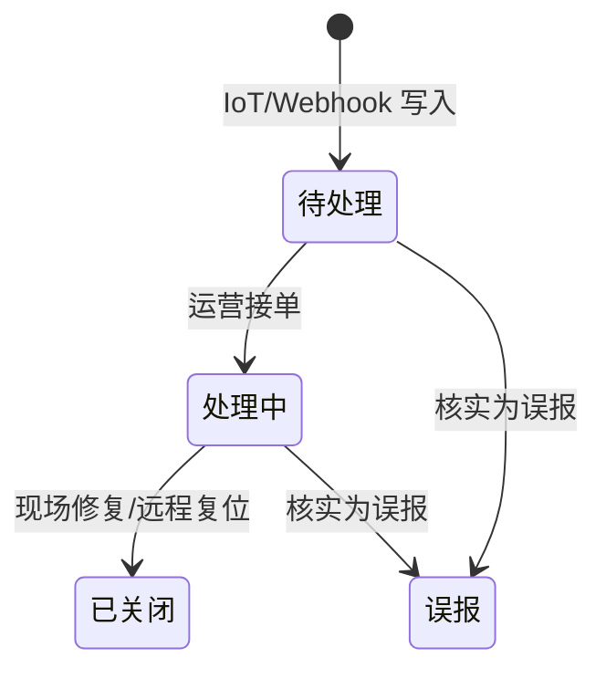

# 任务：设备告警与 ICCID 管理

> **这是什么**：在现有设备台账之上，补齐柜机告警、未正常弹电池、物联网卡（ICCID）到期与换绑的可见性与处置。  
> **状态**：详设完成，待开发排期；原型已有 Mock Tab。  
> **依据**：[竞品借鉴决策记录.md](./竞品借鉴决策记录.md) C-03 · [PRD.md](./PRD.md)  
> **写法**：[业务文档写作规范](./业务文档写作规范.md)

---

## 业务设定

### 一句话

IoT 上报为准，后台只做「看见、筛选、登记处置、跳转换电单」——不另建第二套设备管理系统。

### 要解决什么

| 能力 | 业务价值 |
|------|----------|
| 柜级告警 | 离线、过温、门禁异常能发现、能跟进 |
| 未正常弹电池 | 客诉「没弹出电池」有据可查，能关联到换电单 |
| 物联网卡台账 | 卡到期 / 欠费能预警，换绑能追溯 |

### 谁能做什么

| 能力 | 平台 | 运营商 | 渠道 | 资金方 |
|------|:----:|:------:|:----:|:------:|
| 全平台告警列表 | 只读 | — | — | — |
| 本主体告警 | — | 可看可处置 | — | 承租设备只读 |
| 告警处置登记 | — | 可以 | — | — |
| 全平台 ICCID 台账 | 可维护 | — | — | — |
| 本主体 ICCID | — | 只读 + 导出 | — | 租赁设备只读 |

### 常见告警（白话）

| 名称 | 大概意思 | 默认等级 |
|------|----------|----------|
| 换电柜离线 | 心跳超时 | 高 |
| 柜体过温 | 传感器过温 | 高 |
| 门禁 / 仓门异常 | 门状态异常 | 中 |
| 未正常弹电池 | 换电结束但电池没弹出 | 高 |
| 弹错格口 | 弹出格口不对 | 高 |
| 物联网卡套餐逾期 | 卡到期未续 | 中 |
| 仓内电池长期低电（可选） | 仓内电量长期偏低 | 低 |

### 处置怎么走

1. IoT / 定时任务写入 → **待处理**  
2. 运营接单 → **处理中**  
3. 现场修好或远程复位 → **已关闭**；核实误报 → **误报**  
4. 同一台设备、同一类告警若未关闭，只更新时间，不另开一行。  
5. （可配置）同设备同类型 24 小时无复现且 IoT 正常 → 可自动关闭；默认关闭该自动能力。

### 未正常弹电池

换电流程结束但未成功弹出，或应弹格口为空 / 超时。运营商在「我的设备 → 设备告警」里看列表，可跳转换电单、标记处理中、关闭并写说明。告警**引用**换电单，不在换电列表重复记账。

### 物联网卡（ICCID）

平台维护全网卡号、套餐、到期日、绑定设备；运营商只看本主体设备上的卡；资金方只看租赁协议内设备。换绑 / 续费等写入变更留痕。

**逾期是否停换电**（建议）：

| 选项 | 含义 | 建议 |
|------|------|------|
| 仅预警 | 逾期只告警，不停服 | **一期默认** |
| 停该柜 | 逾期卡所在柜禁止新换电 | 二期可选 |
| 停该运营商 | 任一关键卡逾期停全主体 | 不建议 |

### 通知怎么发

- 高等级：站内通知默认开；短信可配（如离线、未弹电池持续超过约 15 分钟）。  
- 中等级：站内。  
- 低等级：汇总日报即可。  
- 运营商总览可有横幅；「设备告警」Tab 可有角标。邮件二期。

### 后台落在哪

| 端 | 位置 |
|----|------|
| 运营商 · 我的设备 | Tab：换电柜 / 电池 / **设备告警** / **ICCID** |
| 平台 · 设备管理 | Tab：台账 / 全平台告警 / ICCID 台账 等 |
| 换电柜详情 | 最近告警 + ICCID 摘要（部分为二期） |

### 一期做什么、不做什么

| 项 | 一期 |
|----|------|
| 告警列表 + 状态处置 | ✅ |
| 未正常弹电池关联换电单 | ✅ |
| ICCID 台账 + 变更留痕 | ✅ |
| 站内角标 / 横幅 | ✅ |
| 短信推送 | Mock / 二期 |
| ICCID 逾期停服 | ❌（仅预警） |

### 验收（白话）

运营商能看本主体告警并关闭留痕；未正常弹电池能跳转换电单；平台能看全平台告警与 ICCID；换绑有变更记录；即将到期卡在列表高亮。原型已有演示数据可点。

---

## 实现附录（开发用）

> 业务读者可跳过。

### A. 告警类型 code

| code | 名称 | 来源 | 默认等级 |
|------|------|------|----------|
| `cabinet_offline` | 换电柜离线 | IoT 心跳超时 | 高 |
| `cabinet_overtemp` | 柜体过温 | IoT 传感器 | 高 |
| `door_fault` | 门禁/仓门异常 | IoT | 中 |
| `eject_fail` | 未正常弹电池 | IoT 换电结果 | 高 |
| `eject_wrong_slot` | 弹错格口 | IoT | 高 |
| `iccid_overdue` | ICCID 套餐逾期 | ICCID 台账定时任务 | 中 |
| `battery_low_soc` | 仓内电池低电量长期 | IoT（可选） | 低 |

### B. 实体字段（摘要）

**DeviceAlert**：id、alertType、severity、deviceType、deviceSn、operatorId、siteName、status（待处理/处理中/已关闭/误报）、message、swapOrderId?、iccid?、raisedAt、updatedAt、handledBy?、handleNote?、closedAt?

**IccidProfile**：iccid、msisdn?、carrier、packageName、expireDate、status（正常/即将到期≤30d/已逾期/已注销）、boundDeviceType、boundDeviceSn、operatorId、lastTrafficAt

**IccidChangeLog**：iccid、changeType（绑定/解绑/换绑/续费/套餐变更）、from/toDeviceSn、operatorId、by、at、remark

### C. 状态机

```mermaid
stateDiagram-v2
  [*] --> 待处理: IoT/Webhook 写入
  待处理 --> 处理中: 运营接单
  处理中 --> 已关闭: 现场修复/远程复位
  待处理 --> 误报: 核实为误报
  处理中 --> 误报: 核实为误报
```

### D. 接口

| 接口 | 方法 | 说明 |
|------|------|------|
| `/api/v1/iot/alerts/webhook` | POST | 告警上报；验签 + 幂等 `alertKey` |
| `/api/v1/iot/iccid/sync` | POST | 批量同步 ICCID 状态（定时） |
| `/api/v1/alerts` | GET | 列表筛选 |
| `/api/v1/alerts/{id}/handle` | POST | 状态变更 + 备注 |
| `/api/v1/iccid` | GET/PUT | 台账查询 / 平台维护 |

### E. 页面路径代号

| 页面 | 路径代号 | Tab |
|------|----------|-----|
| 运营商 · 我的设备 | `devices` | 换电柜 / 电池 / 设备告警 / ICCID |
| 平台 · 设备管理 | `platformDevices` | 台账 / 全平台告警 / ICCID 台账 等 |

### F. 原型 Mock

- `AL-001` 未正常弹电池、`AL-002` 柜机离线、`ICCID-001` 即将到期  
- 短信权限示例：`alerts.notify`

### G. 修订记录

| 版本 | 日期 | 说明 |
|------|------|------|
| 1.0 | 2026-06-12 | C-03 详设闭合 |
| 1.1 | 2026-07-28 | 按 decision-088 分层改写 |
