# 功能结构图与业务流程图

> 骑手换电 · 运营商 / 渠道商 / 资金方后台  
> 与 [PRD.md](./PRD.md)、[合作模式与分账.md](./合作模式与分账.md)、[换电场景与运营商结算.md](./换电场景与运营商结算.md) 配套阅读。  
> **业务整体关系预览（角色/资金/两条骑手路径）** → [业务整体预览图.md](./业务整体预览图.md)

---

## 1. 系统边界

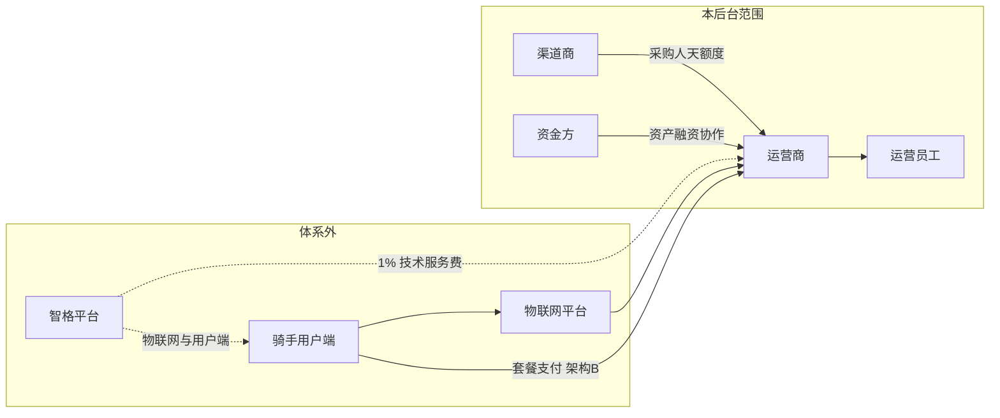

---

## 2. 组织与角色关系

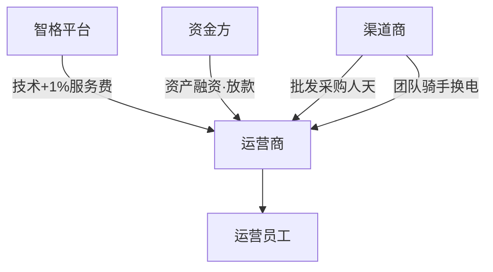

---

## 3. 功能结构图

### 3.1 后台总览（按登录身份）

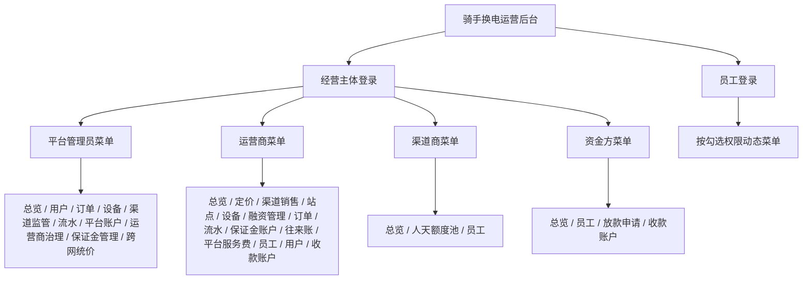

### 3.2 运营商功能结构（主体账号）

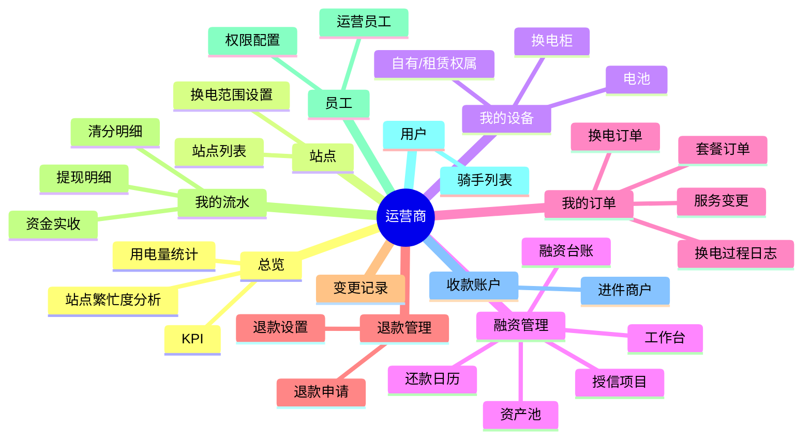

### 3.3 员工模块结构

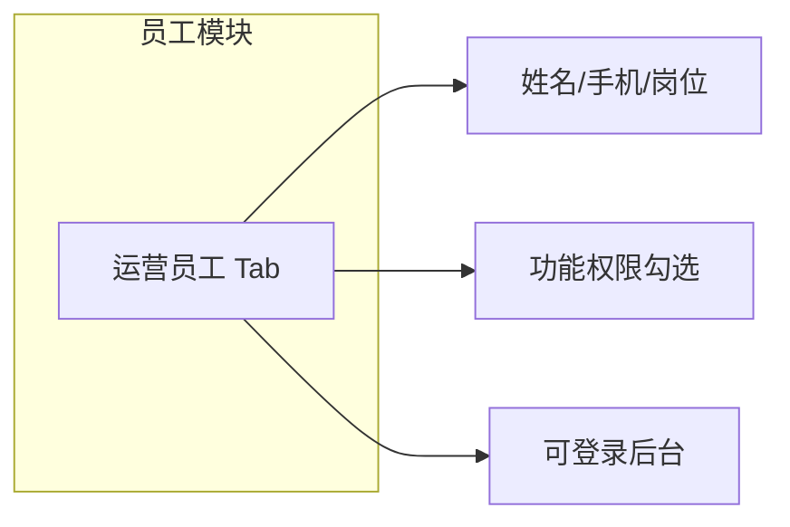

> **站点合伙人**员工类型与分润菜单已移出本期，见 [站点合伙人-待定.md](./站点合伙人-待定.md)。

---

## 4. 核心业务流程

本章在流程图之外补充：**参与方、步骤、后台菜单、状态字段、异常分支**。金额与比例细则见 [合作模式与分账.md](./合作模式与分账.md)、[换电场景与运营商结算.md](./换电场景与运营商结算.md)。清分渠道对比与选型见 [合作模式与分账.md §8.7](./合作模式与分账.md#87-清分渠道选型附录对比与推介)。

### 4.0 流程索引

| 编号 | 流程 | 关键结论 |
|------|------|----------|
| 4.1 | 架构 B：支付 → 实时清分 → 收入摊销 | 支付成功即清分（1B）；包月按日摊销仅作站点分析 |
| 4.2 | 换电与收入归因 | 换电成功记事实与过程日志；收入按摊销/当笔归因，**不触发二次打款** |
| 4.3 | 跨运营商清分 | 跨网设备服务费平台代收/代付；保证金优先 |
| 4.3b | 保证金对公充值 | 运营商申请 → 平台确认入账 → 恢复保证金扣款 |
| 4.4 | 站点合伙人分佣 | **非本期 · 待定** → [站点合伙人-待定.md](./站点合伙人-待定.md) |
| 4.4b | 换电范围策略 | 运营商可关跨网/跨站 |
| 4.5 | 员工登录 | 菜单与数据范围按权限裁剪 |
| 4.6 | 套餐服务生命周期 | 冻结停确认；中途完结冲正应分 |
| 4.7 | 融资管理与放款申请 | 运营商 ↔ 租赁公司**仅融资台账**；已移除直租轨道（协议与设备/月租金/租金收缴） |
| 4.8 | 次卡/超次 | 当笔确认、当笔分账（与包月摊销并存） |
| 4.9 | 三台账（对账主线） | 资金实收 / 清分明细 / 提现明细不可混列 |

---

### 4.1 架构 B：骑手支付 → 实时清分 → 收入摊销

**业务目标**：骑手资金进入**持牌监管体系**下**运营商**二级商户；**支付成功时实时清分**（1B）；收入台账按日摊销归属**运营商主体**，与清分/站点繁忙度解耦。

**参与方**：骑手、用户端、物联网、运营商收款商户、监管清分、平台商户、本后台。

**前置条件**：站点已绑定 `device_owner_id`；收款账户进件完成。

| 阶段 | 步骤 | 后台可见（运营商） | 资金侧 |
|------|------|-------------------------|--------|
| ① 收款+清分 | 骑手购买包月/次卡，支付成功 | **资金实收**（+实收）；**清分明细**（`已清分`） | 平台 1% + 运营商 99% **实时分出** |
| ② 服务期 | 按日（包月）或当笔（次卡）确认收入 | 运营商内部收入台账 | 无二次打款 |
| ③ 换电 | 每次成功换电写入换电单 | **我的订单 → 换电** | 无 |
| ④ 提现 | 运营商从已清分余额提现 | **提现明细** | 是 |
| ⑤ 退款 | 中途退款：**运营商子商户原路退** R | 资金实收 −R；清分冲正 | 平台 1% 不退；已提现 → **须垫付** |

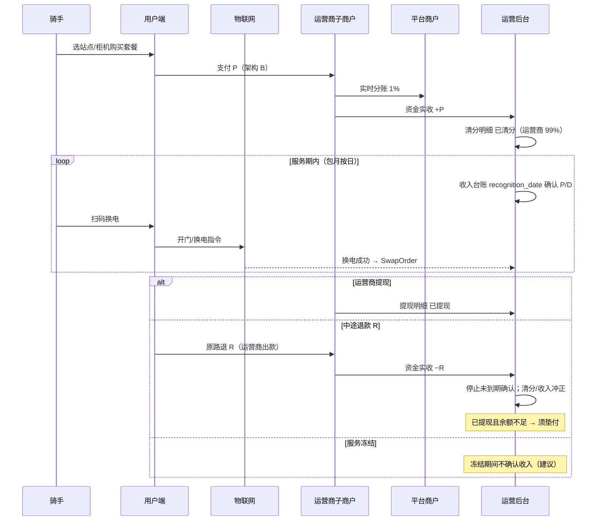

**异常分支**

| 场景 | 处理 |
|------|------|
| 支付成功但设备未入网 | 不计费；待物联网认证后人工补记或拒单 |
| 有效站/SLA 未达标 | 可冻结**提现**或新订单清分（政策可选） |
| 平台 SaaS 费 | 与运营清分**分表**；不向骑手套餐池计提 |

---

### 4.2 换电订单与收入归因（不二次打款）

**业务目标**：记录每次换电事实与过程日志；包月收入已在支付时清分，换电仅驱动**收入台账摊销归因**与跨网设备费，**不触发向运营商二次划款**。

**主流程**

1. 骑手在**服务中**且未冻结套餐下，于己方站点柜机扫码。
2. 用户端校验套餐有效性 → 物联网执行开门/换电 → 返回成功/失败。
3. 成功：生成 `SwapOrder`（关联套餐/额度池、`cabinet_id`、格口、电池 SOC；写入 **userOwner / cabinetOwner / batteryOwner** 三元组）。
4. 计算 **跨网设备服务费**：userOwner 向 cabinetOwner 付柜机费（C≠U）、向 batteryOwner 付电池费（B≠U）；相同则不产生该项；经平台代收/代付日清。
5. 包月：当日摊销份额已计入收入台账（与换电笔数关联展示）；次卡：当笔已在支付时清分。
6. 退款时：**运营商子商户**原路退；清分/收入台账冲正。

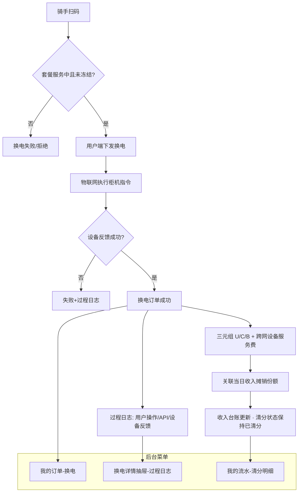

**与套餐订单关系**

| 对象 | 字段/规则 |
|------|-----------|
| 套餐单 | `valid_from` / `valid_to`、`swap_used`、`accrued`、`payout=已清分` |
| 换电单 | 必须 `package_order_id`；`pay` 常为 0（包月内含） |
| 清分 | **支付成功即已清分**；换电不触发额外打款 |

---

### 4.3 跨运营商清分（运营商往来账）

**业务目标**：个人用户或渠道成员跨站换电时，跨网设备服务费经平台代收/代付；**平时划扣保证金**，保证金为 0 才启用信用额度。

详见 [换电场景与运营商结算.md](./换电场景与运营商结算.md)。

**后台菜单**：运营商 → **运营商往来账**、**平台服务费**（B 端 1% 确认消耗）、**保证金账户**（对公充值）；平台 → **保证金管理**。

---

### 4.3b 保证金对公充值

**业务目标**：运营商向平台清分专户对公打款，平台财务确认后增加 `depositBalance`，恢复「保证金优先」扣款路径。

| 步骤 | 操作方 | 动作 | 后台位置 |
|------|--------|------|----------|
| 1 | 运营商财务 | 对公转账（附言含运营商 ID） | 银行 |
| 2 | 运营商财务 | 提交充值申请 | 运营商 → **保证金账户** |
| 3 | 平台财务 | 核对到账，确认或驳回 | 平台 → **保证金管理 → 充值确认** |
| 4 | 系统 | 更新余额、写入账本 | 双方变动明细 |

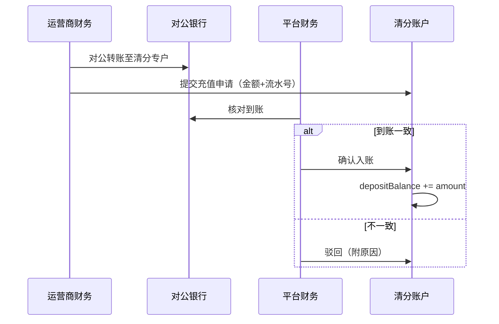

---

### 4.4 站点合伙人分佣（非本期 · 待定）

> **本期不实现**。C 端清分固定 **平台 1% + 运营商 99%**；无「合作伙伴分润」菜单与合伙人登录。  
> 说明 → [站点合伙人-待定.md](./站点合伙人-待定.md) · 历史规则 → [合伙人站点分佣.md](./合伙人站点分佣.md)

---

### 4.4b 换电范围策略

**业务目标**：运营商自主控制用户换电地理/主体范围，与平台信用额度停跨网叠加。

| 开关 | 关闭效果 |
|------|----------|
| **跨网换电** | 关闭后双向封闭（见 [换电范围策略.md](./换电范围策略.md)） |

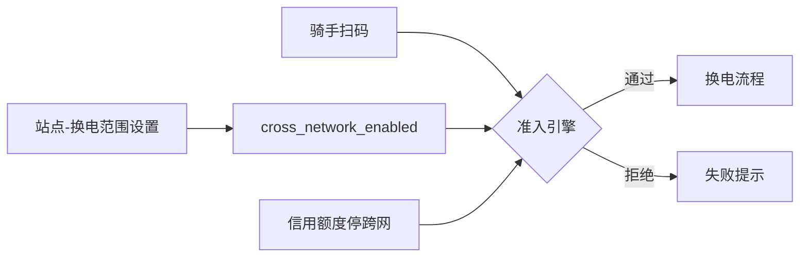

**同运营商**：任意站点可购可换，**无**跨站开关、**无**用户绑定站。

**后台位置**：运营商 → **站点** → 换电范围设置。  
细则见 [换电范围策略.md](./换电范围策略.md)。

---

### 4.5 员工登录与权限

**业务目标**：同一后台支持经营主体、运营员工两类身份；菜单与数据最小化暴露。

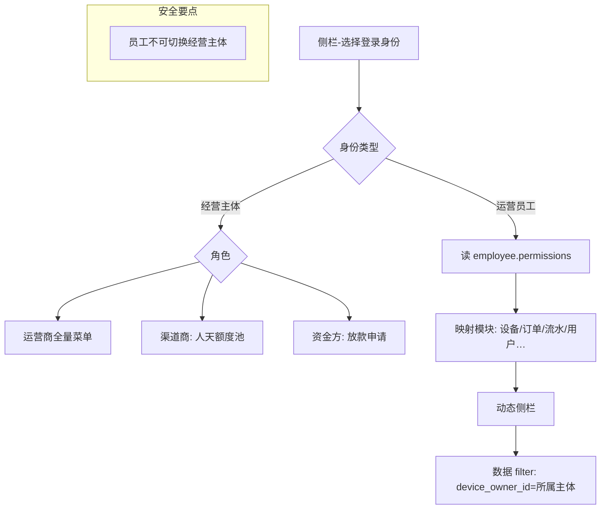

| 权限项（示例） | 运营员工 |
|----------------|:--------:|
| 我的设备/订单 | 勾选可见 |
| 运营商往来账/平台服务费 | 勾选可见 |

> 站点合伙人登录与分润权限见 [站点合伙人-待定.md](./站点合伙人-待定.md)（非本期）。

---

### 4.6 套餐服务生命周期（后台可见）

**业务目标**：支持冻结、中途完结退款、到期完结；各状态驱动**是否继续确认收入**与**退款/清分冲正**。

| 状态 | 骑手侧 | 持有电池 | 收入确认 | 换电 | 清分/退款 |
|------|--------|----------|----------|------|-----------|
| 服务中 | 可换电 | 换电后持有；冻结申请前须还电 | 按日确认 | 正常 | `payout=已清分` |
| 已冻结 | 不可换电 | **不持有**（冻结前须还电） | **建议暂停**确认 | 拒绝新换电 | 已清分维持 |
| 待领取电池 | 须扫码领取 | **不持有**（解冻后首服） | 按日确认 | 仅出电（非换电） | 已清分维持 |
| 中途完结 | 服务终止 | **不持有**（退款前提已还电） | 停止未到期确认；冲已确认 | 停止 | **运营商原路退** + 清分冲正 |
| 待首换开通 | 未首换 | **不持有** | — | 首次换电后开通 | 支付时已清分 |
| 已完结 | 到期 | 须已还电 | 确认至 valid_to | — | 已清分；无二次结算 |

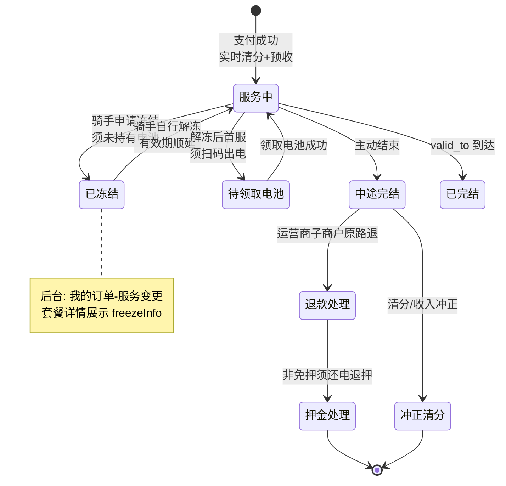

**中途完结退款拆分（后台「服务变更」）**

1. 骑手发起 → 运营商审核（演示可简化）。
2. 计算应退套餐费 R（剩余天数法等）。
3. **运营商子商户**原路退 R；清分明细冲正；收入台账冲减。
4. 若有电池押金且非信用免押：还电验收后押金原路退。

---

### 4.7 融资管理与放款申请

**业务目标**：运营商以换电资产向设备租赁公司申请**资产融资放款**，跟踪借据与还款；资方确认批次与预还款计划。详见 [融资管理-PRD.md](./融资管理-PRD.md)。

**架构决策（2026-07-02 · I6-5）**：移除原「设备直租」轨道（协议与设备 / 月租金 / 租金收缴）；运营商 ↔ 租赁公司**仅保留融资台账**一条线上协作链路。

**主流程**

1. **平台**：建立租赁公司与运营商绑定关系。
2. **运营商**：「融资管理」维护授信项目、资产池；创建放款批次 → 提交资方。
3. **资方**：「放款申请」确认金额与预还款计划 → 状态「资方已确认」。
4. **运营商/资方**：演示录入借据；「还款日历」登记还款。
5. **线下**：实际放款、银行流水、发票等不在首期系统范围。

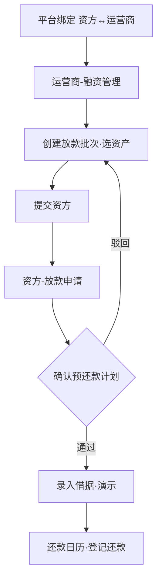

**与订单关系**：资产 `device_owner_id` 仍为承租运营主体；骑手 C 端订单归属与清分规则不变。融资还款为 B 端台账，不与骑手套餐订单混列。

---

### 4.8 次卡 / 包月外超次（当笔确认）

| 对比项 | 包月套餐 | 次卡 / 超次另付 |
|--------|----------|-----------------|
| 收入确认 | 按日摊销 `P/D` | **换电成功当笔** |
| 清分时机 | **支付成功实时清分**（1B） | **支付成功实时清分** |
| 订单号 | `PackageOrder` | **独立订单号**，不并入包月摊销表 |
| 后台 | 套餐 Tab + 清分 `已清分` | 套餐/换电列表均可关联查看 |

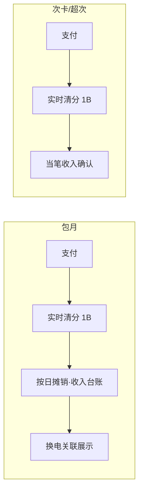

---

### 4.9 三台账（对账主线）

**切勿混列**：骑手「付了多少钱」≠「支付成功分给各方多少钱」≠「运营商提现了多少钱」≠「按日摊销确认了多少收入」。

| 台账 | 含义 | 典型条目 | 菜单 |
|------|------|----------|------|
| 资金实收 | 子商户实收实付 | 套餐支付 +、**运营商原路退** −、押金收退 | 我的流水 → 资金实收 |
| 清分明细 | 支付分账与退款冲正 | 平台 1%、运营商 99%；`已清分` / 冲正 | 我的流水 → 清分明细 |
| 提现明细 | 运营商提现记录 | 提现单号、关联订单、已提现金额 | 我的流水 → 提现明细 |
| 收入台账（内部） | 运营商主体摊销 | 按日摊销 `recognized_amount` | 内部报表 |

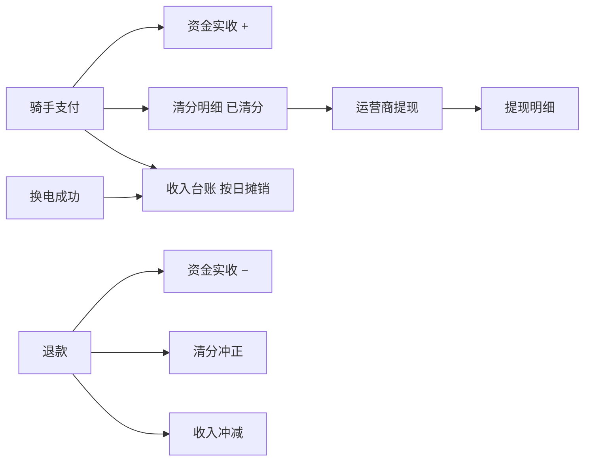

**退款规则（C 端套餐）**

1. **出款主体**：运营商收款子商户统一原路退。  
2. **平台 1% 不退**。  
3. 已提现、可退余额不足 → 标记**须垫付**。  
4. 收入台账同步停止未到期摊销并冲减已确认部分。

---

### 4.10 企业天数池

**业务目标**：渠道向一家或多家签约运营商批量买人天（**一运营商一池**）→ 团队登记骑手 → 换电消耗（**可跨网**）→ 离职回池。细则见 **[天数池.md](./天数池.md)** §10。

**首版配置（拍板 2026-06-12）**

| 配置 | 首版 | 运行要点 |
|------|------|----------|
| `deduct_mode` | 自然日 | 冻结日不计 |
| `billing_mode` | 预占确认 | 00:00 预占 → 换电或持电池确认 → 否则日终释放 |
| `activation_mode` | 分配即开通 | 首换开通第二期 |
| `pool_expiry_refund_policy` | 允许部分过期可退 | B2B 退款协商后运营商扣减 |
| B2B 资金 | 采购时结清 | 渠道采购款到账即运营商收入；**消耗不向运营商二次打款** |
| B2B 确认 | 运营商确认 | 线下 PO 由售卖运营商确认到账；在线支付回调自动完成；平台订单页只读 |
| 平台 1% | 确认消耗计提 | 标准人天价 × 1% 代扣额度售卖方 U |

**硬性规则**：骑手**离职** → 终止池来源 `PackageOrder` → **剩余天数强制回池**（不退骑手）。

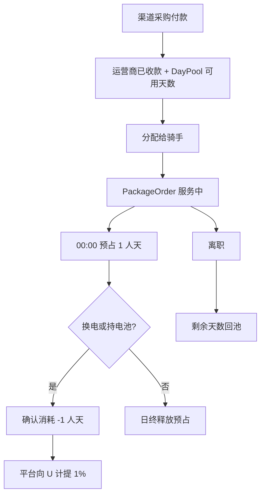

与 §4.2 换电、§4.6 冻结/中途完结、§4.9 退款规则共用。**清分/提现（§4.9）仅适用于 C 端个人套餐**，不适用于渠道人天池消耗（B2B 采购时结清）。B 端退款对象为企业而非骑手。

---

## 5. 数据隔离与菜单关系

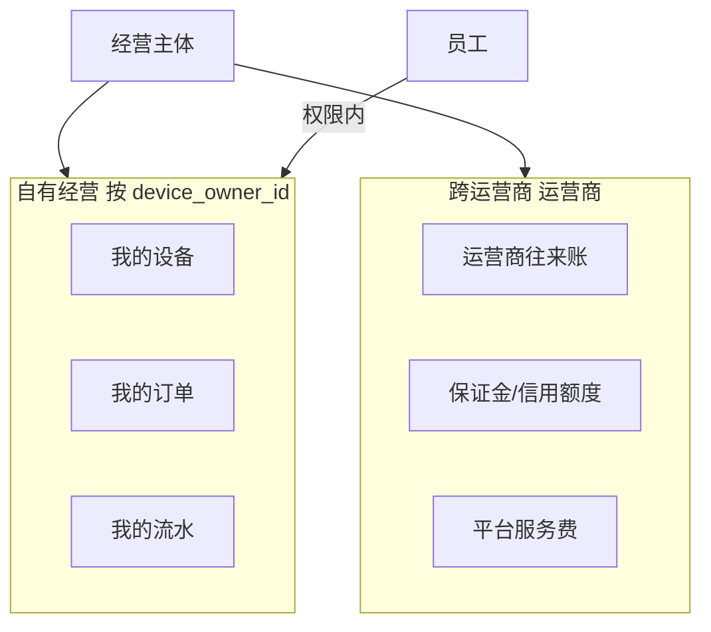

---

## 6. 渠道四种结算模式（B 端）

> 完整规则与对照表见 [渠道结算模式规则.md](./渠道结算模式规则.md) §6。原型四账号：`CH-SF` / `CH-CARD` / `CH-RENT` / `CH-ACT`。

| 模式 | 采购标的 | 用户获权益 | 平台 1% 触发 | 运营商「渠道管理」 |
|------|----------|------------|--------------|-------------------|
| **人天池** | 人天额度 PO | 登记 + 分配人天 | 确认消耗 | 签约 · PO · 已售额度池 |
| **渠道分销** | —（无 B2B 购卡） | 推广链接/二维码购套餐 | 支付成功 | 签约 · 分销成交概况 |
| **设备租赁** | 统一月租 MO | 白名单；免 C 端购套餐 | 月租支付 | 签约 · MO · 租赁清单 |
| **激活码** | 激活码 AC | 输入码核销 | 码核销 | 签约 · AC · 码库存概况 |

**设备租赁·停服（C-10）**：渠道「已停用」→ 白名单不出电、可还电；提示续费。

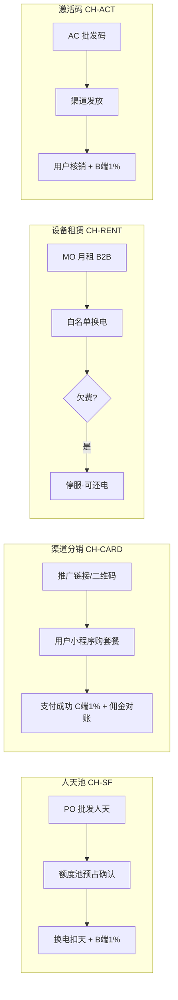

---

## 7. 菜单与角色对照（速查）

| 模块 | 平台管理员 | 运营商 | 渠道商 | 资金方 | 运营员工 |
|------|:----------:|:------:|:------:|:------:|:--------:|
| 总览 | ✓ | ✓ | ✓ | ✓ | 按权限 |
| 用户管理 | ✓ | — | — | — | — |
| 订单管理（全平台） | ✓ | — | — | — | — |
| 设备管理（全平台） | ✓ | — | — | — | — |
| 渠道商管理 | ✓ 只读 | — | — | — | — |
| 流水管理（全平台） | ✓ | — | — | — | — |
| 平台账户 | ✓ | — | — | — | — |
| 运营商管理 / 跨网统价 | ✓ | — | — | — | — |
| 定价/渠道销售 | — | ✓ 四模式签约+B2B | — | — | 按权限 |
| 人天额度池 | — | — | ✓ 人天池 | — | 按权限 |
| 套餐与链接/佣金对账 | — | — | ✓ 渠道分销 | — | 按权限 |
| 月租/白名单/租赁设备 | — | — | ✓ 设备租赁 | — | 按权限 |
| 激活码/核销记录 | — | — | ✓ 激活码 | — | 按权限 |
| 员工 | — | ✓ | ✓ | ✓ | 按权限 |
| 站点/我的设备/我的订单/我的流水 | — | ✓ | — | — | 按权限 |
| 运营商往来账/平台服务费 | — | ✓ | — | — | 按权限 |
| 融资管理 | — | ✓ | — | — | 按权限 |
| 放款申请 | — | — | — | ✓ | 按权限 |
| 用户（本站） | — | ✓ | — | — | 按权限 |
| 收款账户 | — | ✓ | — | ✓ | 按权限 |

> 站点合伙人分润菜单已移出本期，见 [站点合伙人-待定.md](./站点合伙人-待定.md)。

---

## 8. 修订记录

| 版本 | 日期 | 说明 |
|------|------|------|
| **1.9** | 2026-07-02 | **I6-5 移除直租轨道**：§3/§4.7/§7 改为融资管理 + 放款申请 |
| **1.10** | 2026-07-03 | **§6 四渠道模式**：对齐激活码；设备租金池→设备租赁；渠道分销替代旧卡差价 CO 模型 |
| **1.1** | 2026-06-12 | **移出本期站点合伙人**；§3/§4.4/§4.5/§7 同步；C 端 1B 实时清分 |
| 1.0 | 2026-05-24 | 初版：功能结构图、架构B分账、员工登录、租赁与套餐生命周期 |
| 1.1 | 2026-05-27 | §4 细化：分阶段步骤表、异常分支、换电/合作方/冻结/租赁/次卡/三台账与打款条件 |
| 1.3 | 2026-06-10 | 移除代理层级；三角色（运营商/渠道商/资金方）；§4.3 改为跨运营商清分 |
| 1.5 | 2026-06-10 | 渠道商主体改由运营商在「渠道销售 → 签约渠道」新增/编辑；平台「渠道商管理」只读监管 |
| 1.2 | 2026-06-01 | 新增 §4.10 企业天数池（四项可配置 + 离职强制回池） |
| 1.6 | 2026-06-12 | §3.1 补平台管理员菜单；§4.10 对齐拍板：B2B采购结清/消耗仅平台1% |
| 1.7 | 2026-06-12 | 新增 §4.3b 保证金对公充值；§3.1 补保证金管理/保证金账户菜单 |
| 1.8 | 2026-06-12 | 新增 §6 三渠道结算模式；运营商渠道销售三模式 B2B 订单/卖方资产 |
