# 功能结构图与业务流程图

> **这是什么**：骑手换电后台（平台 / 运营商 / 渠道 / 资金方 / 站点合伙人）的**能力地图**与**主流程怎么串**——先弄清边界与钱怎么走，再下钻菜单与状态机。  
> **依据/关联**：[PRD.md](./PRD.md) · [合作模式与分账.md](./合作模式与分账.md) · [换电场景与运营商结算.md](./换电场景与运营商结算.md) · [业务整体预览图.md](./业务整体预览图.md) · [天数池.md](./天数池.md) · [站点合伙人.md](./站点合伙人.md) · [融资管理-PRD.md](./融资管理-PRD.md)  
> **写法**：[业务文档写作规范](./业务文档写作规范.md)

---

## 业务设定

### 一句话

本后台管运营主体与账，不管物联网硬件本身：骑手在用户端付钱/用人天换电；钱进运营商收款账户，平台拿约 1% 技术服务费；渠道批发人天、合伙人按站分润、融资放款是支线。

### 怎么读本文

1. 先看「系统边界」与「谁跟谁有关系」。  
2. 再看「按登录身份有哪些能力」（能力地图）。  
3. 核心流程用白话记住目标与异常，细则与图放附录。  
4. 评审演示更建议跟 [业务整体预览图.md](./业务整体预览图.md) 的「购套餐 8 步脊柱」。

### 系统边界（白话）

| 在体系外 / 由平台能力承接 | 本后台经营主体 |
|---------------------------|----------------|
| 骑手用户端、物联网、智格平台清分能力 | 运营商、渠道商、资金方、运营员工、站点合伙人 |

骑手支付进运营商；渠道向运营商采购人天；资金方与运营商做资产融资协作；平台向运营商收约 1% 技术服务费。

### 组织关系（白话）

- 智格平台：技术 + 约 1% 服务费。  
- 资金方：资产融资放款（台账）。  
- 渠道：批发采购人天，团队骑手来运营商柜子换电。  
- 运营商：按站给站点合伙人分润；内部有运营员工。

### 能力地图（按登录身份）

**经营主体登录**可进入：平台管理员、运营商、渠道商、资金方、站点合伙人各自菜单。  
**员工登录**：按勾选权限裁出菜单，数据只见所属主体。

| 身份 | 大致能管什么 |
|------|----------------|
| 平台管理员 | 总览、用户、订单、设备、渠道监管、流水、平台账户、运营商治理、保证金、跨网统价 |
| 运营商 | 总览、定价、渠道销售、站点与合伙人、设备、融资、订单、流水、平台服务、员工、用户、收款账户 |
| 渠道商 | 总览、人天额度池（或按模式：链接/租赁/激活码）、员工 |
| 资金方 | 总览、员工、放款申请、收款账户 |
| 站点合伙人 | 总览、我的站点、分润明细、提现结算、收款账户（只读配置） |

运营商侧常见模块：平台设置（城市底价、换电范围）、站点（信息、场费电费、合伙人）、设备、融资、订单与服务（套餐/换电/冻结/退款）、流水三台账、平台服务（保证金/服务费/往来）、员工、用户、收款账户。

### 核心流程索引（白话结论）

| 流程 | 记住什么 |
|------|----------|
| 支付 → 清分 → 摊销 | 支付成功就清分；包月按日摊销只给站点/收入分析用，不再打第二笔款 |
| 换电与归因 | 换电记事实与过程；收入按摊销/当笔归因，**不二次打款** |
| 跨网清分 | 跨网设备费平台代收代付；平时先扣保证金 |
| 保证金充值 | 运营商对公打款 → 平台确认 → 恢复「保证金优先」 |
| 站点合伙人分佣 | 按站绑定；同人多站可不同比例 |
| 换电范围 | 运营商可关跨网（双向封闭） |
| 员工登录 | 菜单与数据按权限裁 |
| 套餐生命周期 | 冻结停确认；中途完结要冲正应分 |
| 融资 | 仅融资台账；已无「设备直租」租金轨道 |
| 次卡/超次 | 当笔确认、当笔分账（与包月摊销并存） |
| 三台账 | 资金实收 ≠ 清分 ≠ 提现 ≠ 收入摊销，不可混列 |
| 企业天数池 | 渠道批发 → 分配 → 消耗扣天；采购时结清，消耗不再给运营商打款 |

### 支付成功后钱怎么走（白话）

1. 骑手买包月/次卡，款进运营商收款账户；同时平台约 1% + 运营商约 99% 实时分出。  
2. 服务期内：包月按日确认收入（台账）；每次成功换电写换电单。  
3. 提现：运营商申请 → 平台审核 → 打到绑定账户（一期提现不扣融资待还，预留二期）。  
4. 中途退款：运营商原路退；平台 1% 一般不退；若已提现且余额不够 → 须垫付。

### 换电成功后发生什么（白话）

套餐须在服务中且未冻结。成功后记用户归属运营商、柜机归属、电池归属；若柜机或电池不是用户归属方的，产生跨网设备费，经平台日清。包月不因换电再打款；次卡则当笔已在支付时清分。

### 套餐状态（白话）

| 状态 | 骑手 | 电池 | 收入确认 | 换电 |
|------|------|------|----------|------|
| 服务中 | 可换电 | 换电后可持有；申请冻结前须还电 | 按日确认 | 正常 |
| 已冻结 | 不可换电 | 不持有 | 建议暂停确认 | 拒新换电 |
| 待领取电池 | 须扫码领电 | 不持有 | 按日确认 | 仅出电 |
| 中途完结 | 服务终止 | 不持有（退款前已还电） | 停未到期并冲已确认 | 停止 |
| 待首换开通 | 未首换 | 不持有 | — | 首次换电后开通 |
| 已完结 | 到期 | 须已还电 | 确认至服务末日 | — |

### 渠道四种结算模式（一眼）

| 模式 | 渠道买什么 | 用户怎么获得权益 | 平台约 1% 何时计 |
|------|------------|------------------|------------------|
| 人天池 | 人天额度 | 登记并分配人天 | 确认消耗 |
| 渠道分销 | 无批发购卡 | 推广链接/二维码购套餐 | 支付成功 |
| 设备租赁 | 统一月租 | 白名单购渠道套餐 | 月租 + 购套餐 |
| 激活码 | 激活码 | 输入码核销 | 码核销 |

设备租赁欠费停服：白名单可还电、不可出电，提示续费。

### 菜单与角色速查（白话）

平台独有：用户/订单/设备/渠道监管/全平台流水/平台账户/运营商治理/保证金/统价。  
运营商独有：定价与渠道销售、站点与合伙人配置、设备、订单流水、往来与保证金、融资、本站用户、收款账户。  
渠道：按模式看人天池或链接/租赁/激活码。  
资金方：放款申请。  
站点合伙人：门户只读 + 提现申请。  
员工：按权限。

---

## 实现附录（开发用）

> 业务读者可跳过。下列为结构图、时序图、字段与修订记录。

### A. 系统边界图

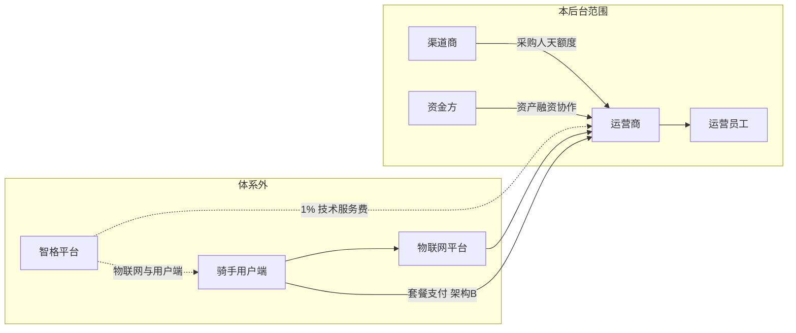
```mermaid
flowchart LR
  subgraph external [体系外]
    Rider[骑手用户端]
    IoT[物联网平台]
    Plat[智格平台]
  end
  subgraph backend [本后台范围]
    OP[运营商]
    CH[渠道商]
    Lease[资金方]
    Staff[运营员工]
  end
  Rider --> IoT
  Rider -->|套餐支付 架构B| OP
  IoT --> OP
  CH -->|采购人天额度| OP
  Lease -->|资产融资协作| OP
  OP --> Staff
  Plat -.->|1% 技术服务费| OP
  Plat -.->|物联网与用户端| Rider
```

### B. 组织与角色关系图

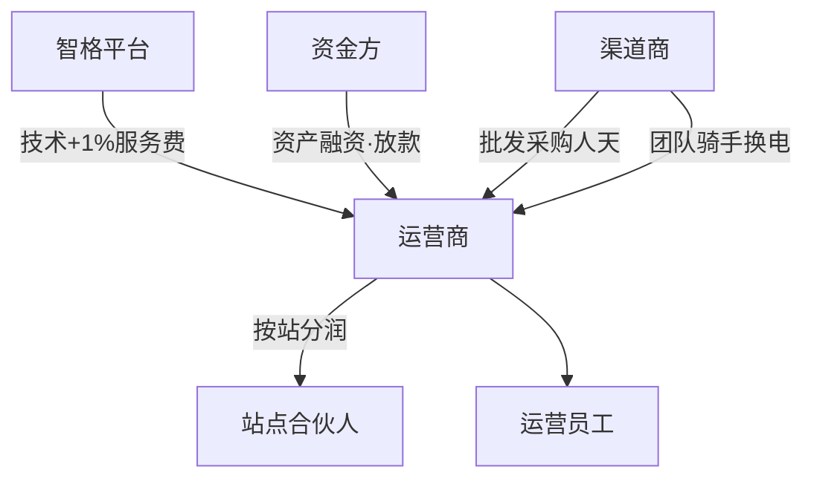
```mermaid
flowchart TB
  Plat[智格平台]
  Lease[资金方]
  OP[运营商]
  CH[渠道商]
  SP[站点合伙人]
  Staff[运营员工]
  Plat -->|技术+1%服务费| OP
  Lease -->|资产融资·放款| OP
  CH -->|批发采购人天| OP
  OP -->|按站分润| SP
  OP --> Staff
  CH -->|团队骑手换电| OP
```

### C. 后台总览（按登录身份）

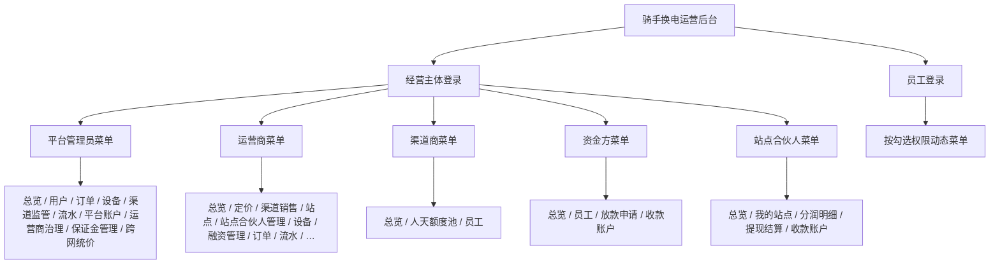
```mermaid
flowchart TB
  Root[骑手换电运营后台]
  Root --> EntityLogin[经营主体登录]
  Root --> EmpLogin[员工登录]
  EntityLogin --> PlatM[平台管理员菜单]
  EntityLogin --> OPM[运营商菜单]
  EntityLogin --> CHM[渠道商菜单]
  EntityLogin --> LeaseM[资金方菜单]
  EntityLogin --> SPM[站点合伙人菜单]
  PlatM --> PlatA[总览 / 用户 / 订单 / 设备 / 渠道监管 / 流水 / 平台账户 / 运营商治理 / 保证金管理 / 跨网统价]
  OPM --> OPA[总览 / 定价 / 渠道销售 / 站点 / 站点合伙人管理 / 设备 / 融资管理 / 订单 / 流水 / …]
  CHM --> CHA[总览 / 人天额度池 / 员工]
  LeaseM --> LeaseA[总览 / 员工 / 放款申请 / 收款账户]
  SPM --> SPA[总览 / 我的站点 / 分润明细 / 提现结算 / 收款账户]
  EmpLogin --> PermNav[按勾选权限动态菜单]
```

### D. 运营商功能心智图

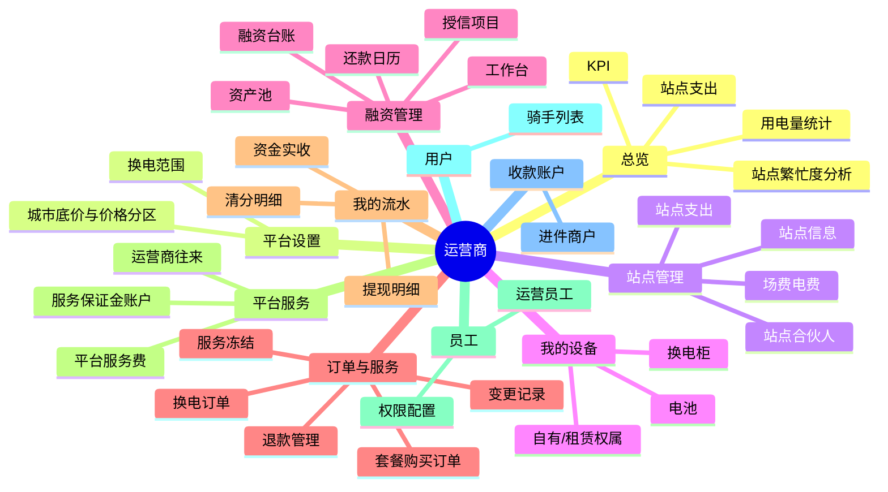
```mermaid
mindmap
  root((运营商))
    总览
      KPI
      站点繁忙度分析
      用电量统计
      站点支出
    平台设置
      城市底价与价格分区
      换电范围
    站点管理
      站点信息
      场费电费
      站点支出
      站点合伙人
    我的设备
      换电柜
      电池
      自有/租赁权属
    融资管理
      工作台
      融资台账
      授信项目
      资产池
      还款日历
    订单与服务
      套餐购买订单
      换电订单
      服务冻结
      变更记录
      退款管理
    我的流水
      资金实收
      清分明细
      提现明细
    平台服务
      服务保证金账户
      平台服务费
      运营商往来
    员工
      运营员工
      权限配置
    用户
      骑手列表
    收款账户
      进件商户
```

### E. 架构 B：支付 → 清分 → 摊销（时序）

前置：站点已绑定 `device_owner_id`；收款账户进件完成。

| 阶段 | 步骤 | 后台可见（运营商） | 资金侧 |
|------|------|-------------------------|--------|
| ① 收款+清分 | 骑手购买包月/次卡，支付成功 | 资金实收；清分明细「已清分」 | 平台 1% + 运营商 99% 实时分出 |
| ② 服务期 | 按日（包月）或当笔（次卡）确认收入 | 运营商内部收入台账 | 无二次打款 |
| ③ 换电 | 每次成功换电写入换电单 | 订单与服务 → 换电订单 | 无 |
| ④ 提现 | 运营商申请 → 平台审核 → 打款 | 提现申请 | 一期不扣融资待还 |
| ⑤ 退款 | 中途退款：运营商子商户原路退 R | 资金实收 −R；清分冲正 | 平台 1% 不退；已提现 → 须垫付 |

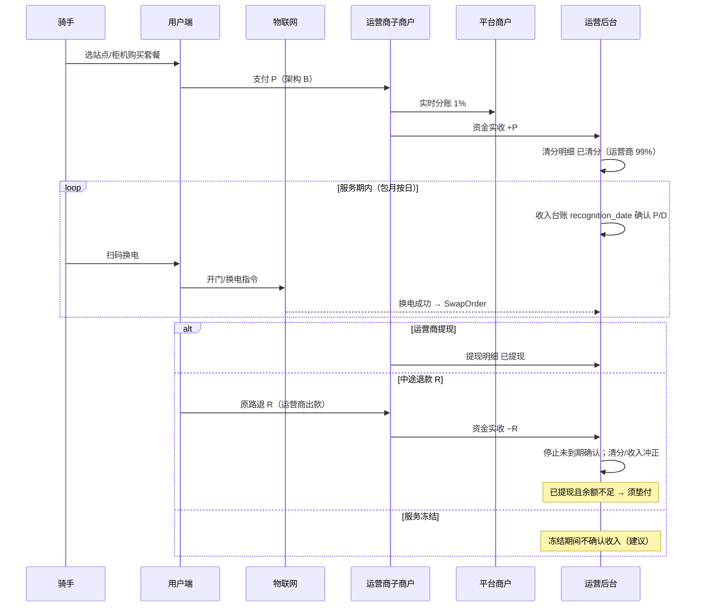
```mermaid
sequenceDiagram
  participant R as 骑手
  participant App as 用户端
  participant IoT as 物联网
  participant Mch as 运营商子商户
  participant Plat as 平台商户
  participant BO as 运营后台
  R->>App: 选站点/柜机购买套餐
  App->>Mch: 支付 P（架构 B）
  Mch->>Plat: 实时分账 1%
  Mch->>BO: 资金实收 +P
  BO->>BO: 清分明细 已清分（运营商 99%）
  loop 服务期内（包月按日）
    BO->>BO: 收入台账 recognition_date 确认 P/D
    R->>App: 扫码换电
    App->>IoT: 开门/换电指令
    IoT-->>BO: 换电成功 → SwapOrder
  end
  alt 运营商提现
    Mch->>BO: 提现明细 已提现
  else 中途退款 R
    App->>Mch: 原路退 R（运营商出款）
    Mch->>BO: 资金实收 −R
    BO->>BO: 停止未到期确认；清分/收入冲正
    Note over BO: 已提现且余额不足 → 须垫付
  else 服务冻结
    Note over BO: 冻结期间不确认收入（建议）
  end
```

异常：支付成功但设备未入网 → 不计费，待认证后补记或拒单；有效站/SLA 未达标 → 可冻提现或新单清分（政策可选）；平台 SaaS 费与运营清分分表。

### F. 换电订单与收入归因

成功换电生成 `SwapOrder`（关联套餐/额度池、柜机、格口、SOC；写入 `userOwner` / `cabinetOwner` / `batteryOwner`）。跨网费：U→C、U→B 经平台日清。

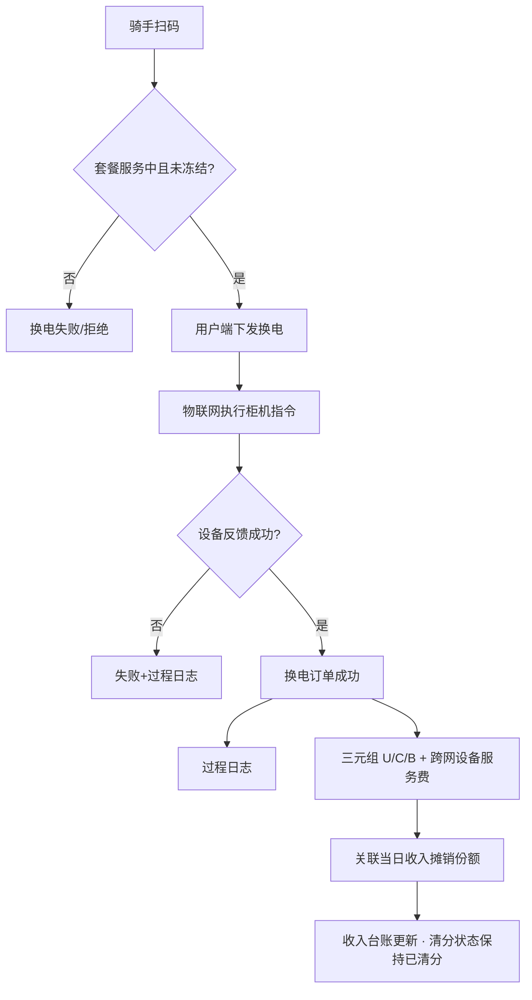
```mermaid
flowchart TD
  A[骑手扫码] --> B{套餐服务中且未冻结?}
  B -->|否| Z[换电失败/拒绝]
  B -->|是| C[用户端下发换电]
  C --> D[物联网执行柜机指令]
  D --> E{设备反馈成功?}
  E -->|否| Z2[失败+过程日志]
  E -->|是| F[换电订单成功]
  F --> G[过程日志]
  F --> T[三元组 U/C/B + 跨网设备服务费]
  T --> H[关联当日收入摊销份额]
  H --> I[收入台账更新 · 清分状态保持已清分]
```

| 对象 | 字段/规则 |
|------|-----------|
| 套餐单 | `valid_from` / `valid_to`、`swap_used`、`accrued`、`payout=已清分` |
| 换电单 | 必须 `package_order_id`；`pay` 常为 0（包月内含） |
| 清分 | 支付成功即已清分；换电不触发额外打款 |

### G. 跨网与保证金充值

详见 [换电场景与运营商结算.md](./换电场景与运营商结算.md)。菜单：运营商往来账、平台服务费、保证金账户；平台 → 保证金管理。

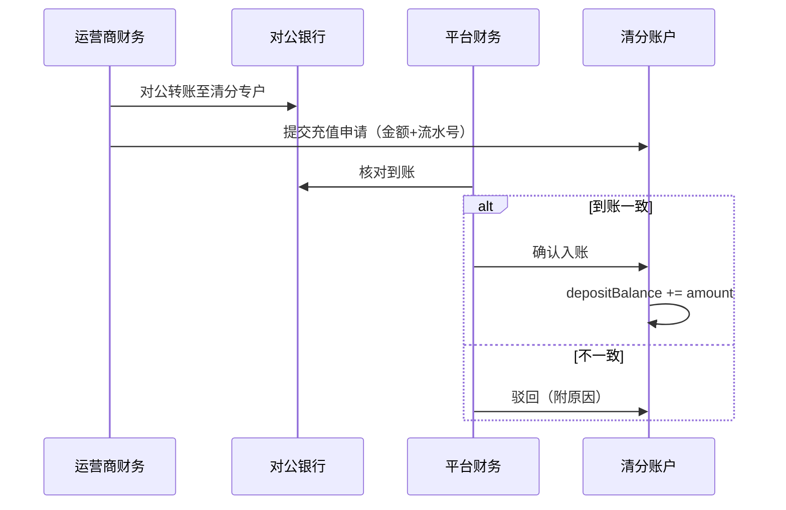
```mermaid
sequenceDiagram
  participant Op as 运营商财务
  participant Bank as 对公银行
  participant Plat as 平台财务
  participant Sys as 清分账户
  Op->>Bank: 对公转账至清分专户
  Op->>Sys: 提交充值申请（金额+流水号）
  Plat->>Bank: 核对到账
  alt 到账一致
    Plat->>Sys: 确认入账
    Sys->>Sys: depositBalance += amount
  else 不一致
    Plat->>Sys: 驳回（附原因）
  end
```

### H. 站点合伙人分佣流程

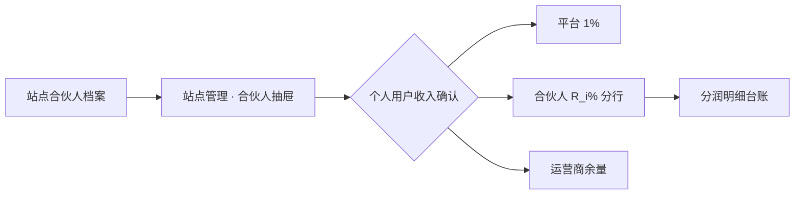
```mermaid
flowchart LR
  A[站点合伙人档案] --> B[站点管理 · 合伙人抽屉]
  B --> C{个人用户收入确认}
  C --> D[平台 1%]
  C --> E[合伙人 R_i% 分行]
  C --> F[运营商余量]
  E --> G[分润明细台账]
```

见 [站点合伙人.md](./站点合伙人.md)。

### I. 换电范围

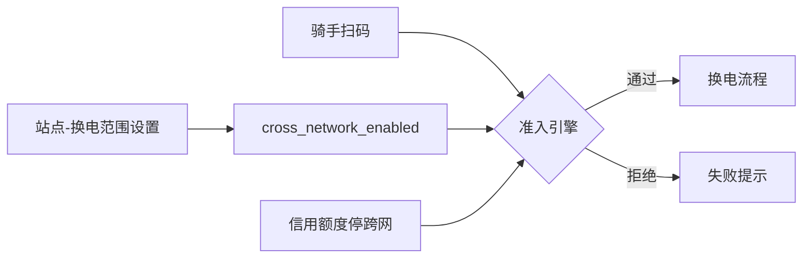
```mermaid
flowchart LR
  CFG[站点-换电范围设置] --> NET[cross_network_enabled]
  SCAN[骑手扫码] --> GATE{准入引擎}
  NET --> GATE
  CREDIT[信用额度停跨网] --> GATE
  GATE -->|通过| OK[换电流程]
  GATE -->|拒绝| TOAST[失败提示]
```

细则见 [换电范围策略.md](./换电范围策略.md)。

### J. 员工登录与权限

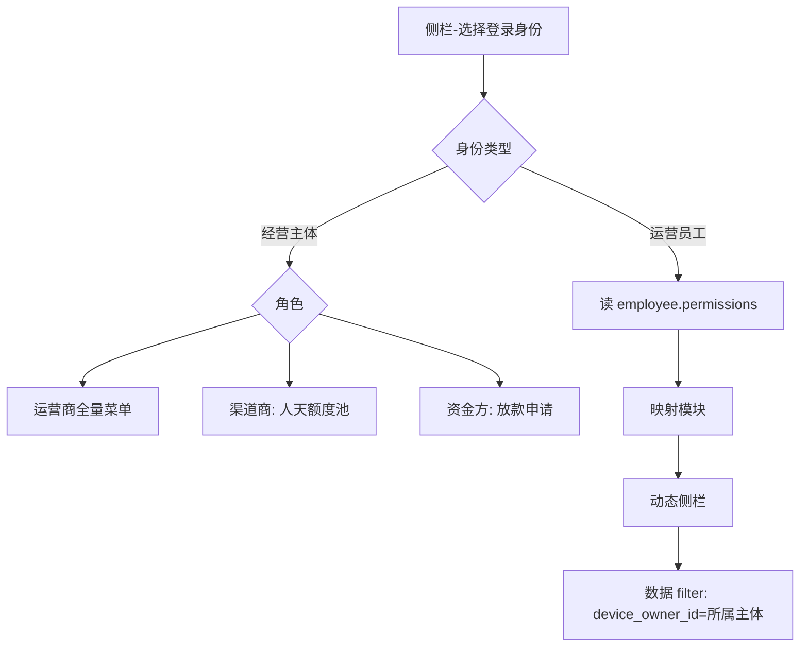
```mermaid
flowchart TD
  Start[侧栏-选择登录身份] --> Type{身份类型}
  Type -->|经营主体| Role{角色}
  Role --> OP[运营商全量菜单]
  Role --> CH[渠道商: 人天额度池]
  Role --> LE[资金方: 放款申请]
  Type -->|运营员工| Emp[读 employee.permissions]
  Emp --> Map[映射模块]
  Map --> Nav1[动态侧栏]
  Nav1 --> Scope1[数据 filter: device_owner_id=所属主体]
```

### K. 套餐服务状态机

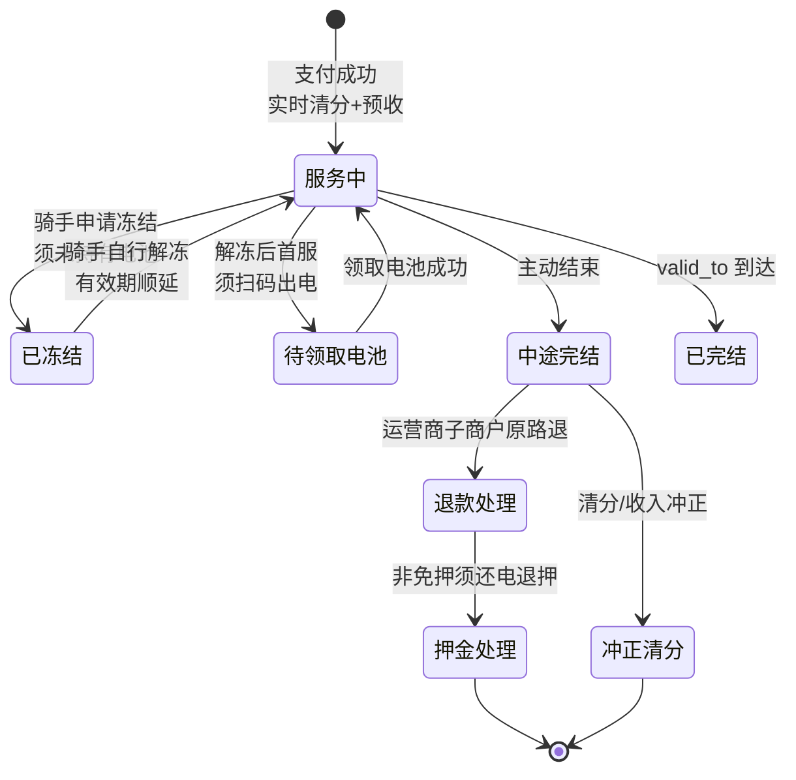
```mermaid
stateDiagram-v2
  [*] --> 服务中: 支付成功<br/>实时清分+预收
  服务中 --> 已冻结: 骑手申请冻结<br/>须未持有电池
  已冻结 --> 服务中: 骑手自行解冻<br/>有效期顺延
  服务中 --> 待领取电池: 解冻后首服<br/>须扫码出电
  待领取电池 --> 服务中: 领取电池成功
  服务中 --> 中途完结: 主动结束
  中途完结 --> 退款处理: 运营商子商户原路退
  退款处理 --> 押金处理: 非免押须还电退押
  押金处理 --> [*]
  服务中 --> 已完结: valid_to 到达
  中途完结 --> 冲正清分: 清分/收入冲正
  冲正清分 --> [*]
```

### L. 融资主流程

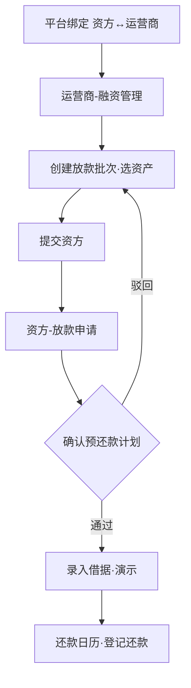
```mermaid
flowchart TD
  P[平台绑定 资方↔运营商] --> OP[运营商-融资管理]
  OP --> BATCH[创建放款批次·选资产]
  BATCH --> SUB[提交资方]
  SUB --> LS[资方-放款申请]
  LS --> CONF{确认预还款计划}
  CONF -->|通过| NOTE[录入借据·演示]
  NOTE --> REP[还款日历·登记还款]
  CONF -->|驳回| BATCH
```

见 [融资管理-PRD.md](./融资管理-PRD.md)。I6-5：仅融资台账，无直租轨道。

### M. 次卡 vs 包月 · 三台账

| 对比项 | 包月套餐 | 次卡 / 超次另付 |
|--------|----------|-----------------|
| 收入确认 | 按日摊销 `P/D` | 换电成功当笔 |
| 清分时机 | 支付成功实时清分（1B） | 支付成功实时清分 |
| 订单号 | `PackageOrder` | 独立订单号 |

| 台账 | 含义 | 菜单 |
|------|------|------|
| 资金实收 | 子商户实收实付 | 我的流水 → 资金实收 |
| 清分明细 | 支付分账与退款冲正 | 我的流水 → 清分明细 |
| 提现明细 | 运营商提现记录 | 我的流水 → 提现明细 |
| 收入台账 | 运营商主体摊销 | 内部报表 |

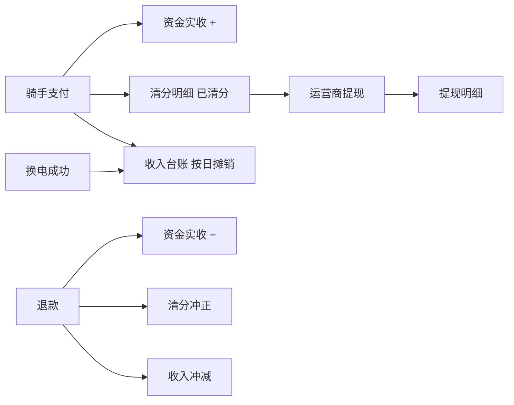
```mermaid
flowchart LR
  PAY[骑手支付] --> CASH[资金实收 +]
  PAY --> SPLIT[清分明细 已清分]
  SPLIT --> WD[运营商提现]
  WD --> PO[提现明细]
  PAY --> REV[收入台账 按日摊销]
  SWAP[换电成功] --> REV
  REF[退款] --> CASH2[资金实收 −]
  REF --> SPLIT2[清分冲正]
  REF --> REV2[收入冲减]
```

退款：运营商原路退；平台 1% 不退；已提现不足 → 须垫付。

### N. 企业天数池（配置码）

| 配置 | 首版 | 要点 |
|------|------|------|
| `deduct_mode` | 自然日 | 冻结日不计 |
| `billing_mode` | 预占确认 | 00:00 预占 → 换电或持电池确认 → 否则日终释放 |
| `activation_mode` | 分配即开通 | 首换开通第二期 |
| `pool_expiry_refund_policy` | 允许部分过期可退 | B2B 协商后运营商扣减 |

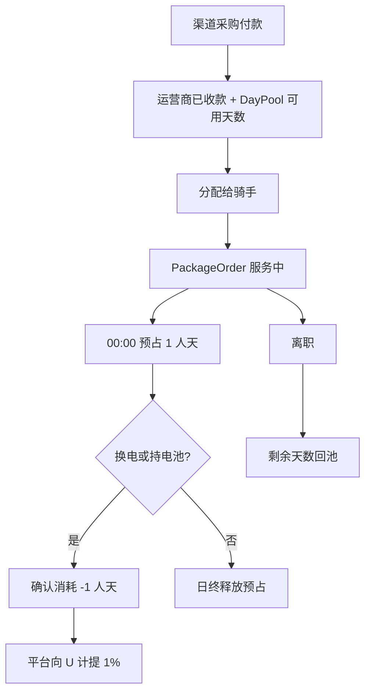
```mermaid
flowchart TD
  A[渠道采购付款] --> B[运营商已收款 + DayPool 可用天数]
  B --> C[分配给骑手]
  C --> D[PackageOrder 服务中]
  D --> E[00:00 预占 1 人天]
  E --> F{换电或持电池?}
  F -->|是| G[确认消耗 -1 人天]
  F -->|否| H[日终释放预占]
  G --> I[平台向 U 计提 1%]
  D --> J[离职]
  J --> K[剩余天数回池]
```

详规见 [天数池.md](./天数池.md)。清分/提现仅适用于 C 端个人套餐。

### O. 数据隔离

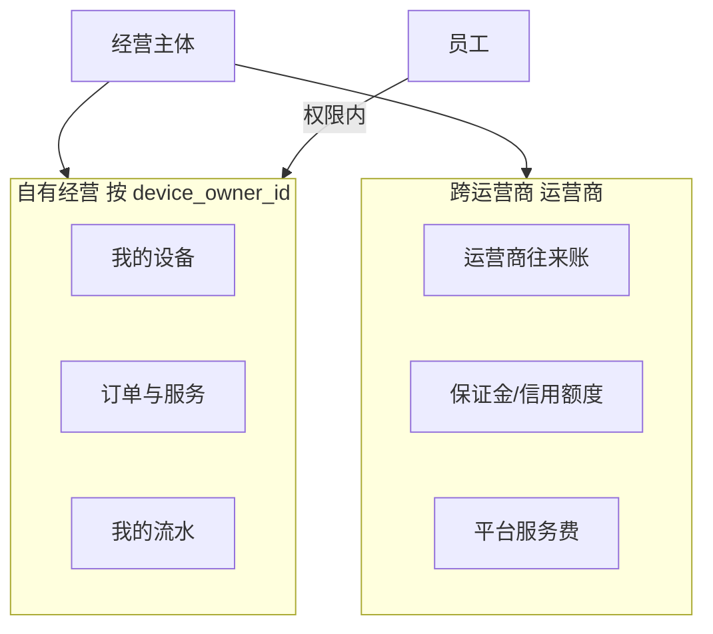
```mermaid
flowchart TB
  subgraph own [自有经营 按 device_owner_id]
    D1[我的设备]
    D2[订单与服务]
    D3[我的流水]
  end
  subgraph inter [跨运营商 运营商]
    I1[运营商往来账]
    I2[保证金/信用额度]
    I3[平台服务费]
  end
  Entity[经营主体] --> own
  Entity --> inter
  Staff[员工] -->|权限内| own
```

### P. 四渠道模式图

演示账号：`CH-SF` / `CH-CARD` / `CH-RENT` / `CH-ACT`。详规见 [渠道结算模式规则.md](./渠道结算模式规则.md)。

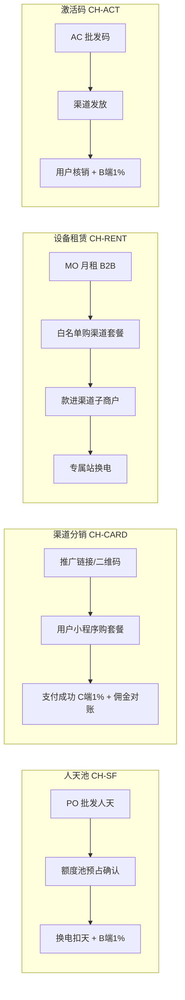
```mermaid
flowchart LR
  subgraph day [人天池 CH-SF]
    D1[PO 批发人天] --> D2[额度池预占确认]
    D2 --> D3[换电扣天 + B端1%]
  end
  subgraph dist [渠道分销 CH-CARD]
    C1[推广链接/二维码] --> C2[用户小程序购套餐]
    C2 --> C3[支付成功 C端1% + 佣金对账]
  end
  subgraph lease [设备租赁 CH-RENT]
    L1[MO 月租 B2B] --> L2[白名单购渠道套餐]
    L2 --> L3[款进渠道子商户]
    L3 --> L4[专属站换电]
  end
  subgraph act [激活码 CH-ACT]
    A1[AC 批发码] --> A2[渠道发放]
    A2 --> A3[用户核销 + B端1%]
  end
```

### Q. 菜单与角色对照表

| 模块 | 平台 | 运营商 | 渠道 | 资金方 | 站点合伙人 | 员工 |
|------|:----:|:------:|:----:|:------:|:----------:|:----:|
| 总览 | ✓ | ✓ | ✓ | ✓ | ✓ | 按权限 |
| 用户/订单/设备/流水（全平台） | ✓ | — | — | — | — | — |
| 渠道商管理 | ✓ 只读 | — | — | — | — | — |
| 平台账户 / 统价 / 保证金 | ✓ | — | — | — | — | — |
| 定价/渠道销售 | — | ✓ | — | — | — | 按权限 |
| 人天额度池 / 分销 / 租赁 / 激活码 | — | — | ✓ 按模式 | — | — | 按权限 |
| 站点/合伙人配置/设备/订单/流水 | — | ✓ | — | — | — | 按权限 |
| 合伙人门户 | — | — | — | — | ✓ 只读 | — |
| 往来账/平台服务费 | — | ✓ | — | — | — | 按权限 |
| 融资管理 | — | ✓ | — | — | — | 按权限 |
| 放款申请 | — | — | — | ✓ | — | 按权限 |
| 收款账户 | — | ✓ | — | ✓ | ✓ 只读 | 按权限 |

### R. 修订记录

| 版本 | 日期 | 说明 |
|------|------|------|
| 1.11 | 2026-07-07 | 站点合伙人纳入本期 |
| 1.10 | 2026-07-03 | §6 四渠道模式对齐 |
| 1.9 | 2026-07-02 | I6-5 移除直租轨道 |
| 1.0 | 2026-05-24 | 初版 |
