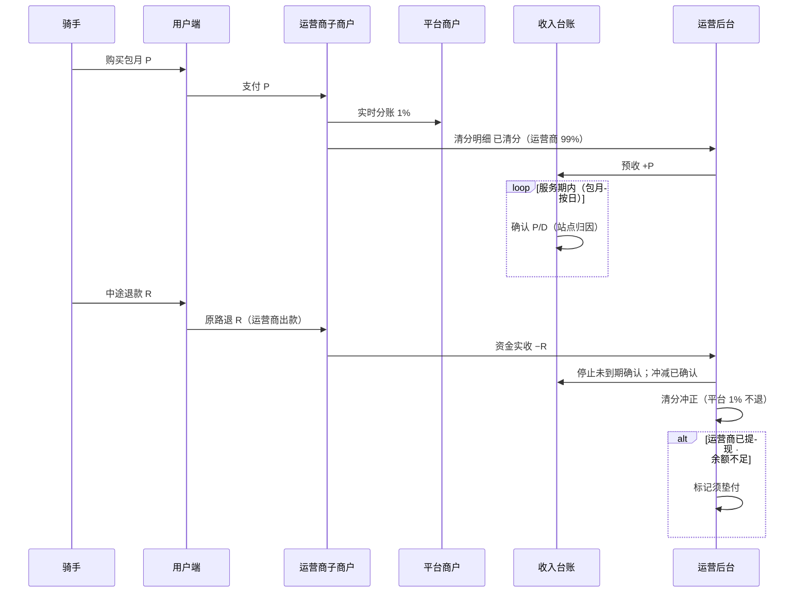

# 合作模式与分账（暂定）

> 业务扩张默认模式：**平台管理员、运营商、渠道商、资金方**四角色后台协作；**运营商可持有自有或租赁设备**（平台不持运营设备）。**智格平台**提供物联网与用户端，收取 **1% 技术服务费**（C 端支付分账 + B 端渠道人天**确认消耗**计提），不从运营流水抽运营分成。渠道 B2B 批发款在**采购到账时**已是运营商收入，骑手消耗人天**不触发向运营商二次打款**。各方按 `device_owner_id` 隔离订单与流水。**本期 C 端清分：平台 1% + 运营商 99%**（无站点合伙人切分）。

**产品形态**：`原型/外卖` 为**运营商 / 渠道商 / 资金方自用后台**；品牌方总部看板见 `req-prototype` 等其它项目。

**跨运营商清分**：柜机/电池使用费、保证金/信用额度见 **[换电场景与运营商结算.md](./换电场景与运营商结算.md)**。

**站点合伙人**：**非本期**，见 [站点合伙人-待定.md](./站点合伙人-待定.md)；历史规则归档于 [合伙人站点分佣.md](./合伙人站点分佣.md)。

## 1. 商业分工

| 角色 | 投入 / 产出 |
|------|-------------|
| **运营商** | 可**自有或租赁**柜/电；场地管理、运维、用户服务、渠道批发；架构 B 下为**收款主体** |
| **渠道商** | 向运营商采购人天额度；登记团队骑手；在签约范围内换电 |
| **我方（品牌方）** | 物联网、用户端、运营平台、支付清分能力、品牌与 SOP；**不抽运营分成** |
| **资金方** | 出租柜/电；管理租赁协议与租金收缴 |
| **已有系统** | 物联网、用户端（向运营商及授权站点开放） |

硬件 CAPEX 在**运营商**（租赁时产权在资金方）。

## 2. 我方服务包（可签约拆分）

| 服务项 | 说明 |
|--------|------|
| 物联网平台 | 设备接入、状态监控、告警、远程运维 |
| 用户端 | 骑手注册、换电、套餐与支付（资金进监管户） |
| 运营平台 / 工具 | 合作方看板、对账、工单、站点与设备管理 |
| 品牌与合规 | 定价框架、VIS、安全与 SLA 标准 |

可选：**按站 SaaS 年费 / 按柜月费 / 按量技术服务费**（与运营分成**分离**，按月或按年向运营商 billing，不进骑手套餐应分池）。

## 3. 分账规则（暂定）

### 3.1 原则

- 骑手套餐/次卡实收进入**持牌监管账户**（**架构 B**：收款主体为**运营商**二级商户号，见 §8）。
- 按订单归因至 **站点 → 运营商（device_owner_id）** 后确认收入。
- **平台 1% 技术服务费**：C 端在支付成功时分账；B 端渠道人天在确认消耗时按**平台标准人天价**向额度售卖方运营商计提（见 [换电场景与运营商结算.md](./换电场景与运营商结算.md)）。
- **可分配经营收入** = 确认收入 − **支付通道手续费** − **平台 1%（C 端已分账部分）**（及合同约定的营销补贴分摊）；余下为**运营商净得**。
- **平台 SaaS/技术服务合同**与单笔骑手订单应分台账**分表管理**。

### 3.2 双台账：清分（Cash）与收入（Revenue）

**决策 1B（已拍板）**：C 端套餐/次卡**支付成功即实时清分**——平台 **1%**、运营商净额 **99%** 进入运营商子商户可提现余额；**不再**使用「待结转 → 可打款 → 周期打款批次」作为主路径。

骑手购买的是**包月套餐**（含服务期、可能含换电次数上限），中途可能**全额/部分退款**。资金侧与收入侧**分轨**：

| 台账 | 触发 | 用途 | 后台菜单 |
|------|------|------|----------|
| **清分台账（Cash）** | 支付成功 / 退款 | 平台 1%、运营商净额、退款冲正；状态 `已清分` / `已提现` | 我的流水 → **清分明细** |
| **收入台账（Revenue）** | 按日摊销（包月）或当笔（次卡） | 运营商主体财务/报表；**不按站点归因** | 内部报表 |

| 时点 | 清分台账（Cash） | 收入台账（Revenue） |
|------|------------------|---------------------|
| 骑手支付包月成功 | **实时清分**：平台 1%、运营商 99% → `已清分` | 预收 +P；自次日起按 P/D 摊销 |
| 服务期内按日确认 | —（资金已在支付时分出） | 每日确认 P/D，归属 **运营商主体**（不按站点分摊） |
| 中途退款 | **运营商子商户原路退** R；清分冲正 | 停止未到期确认；冲减已确认收入 |
| 运营商提现 | `已清分` → `已提现` | — |

**退款出款主体（统一）**：由**运营商收款子商户**发起原路退；**平台 1% 不退**。若运营商已提现、可退余额不足 → 标记**须垫付**（见 PRD §5.2.2）。

**后台展示（运营商）**：`资金实收` 记骑手支付与退款出款；`清分明细` 记支付分账与退款冲正；`提现明细` 记运营商提现。三者不可混在同一列表。

### 3.3 收入确认（包月，推荐默认）

**按服务期按日摊销**（实现简单、与退款自然对齐）：

```
套餐实收（扣除支付手续费）= P
服务期天数 = D（如 30 天，按自然日或 24×30 小时写进合同）
每日确认收入 = P / D

第 t 日可分配收入 = 每日确认收入（若当日未发生退款终止）
```

可选增强（二期）：**按有效换电次数摊销**——设套餐等价「含 N 次换电」，每成功换电确认 `P/N`，更适合「包月限次」产品；未用完次数在到期时一次性确认或作废，需在用户协议写明。

**归因**：确认收入归属 **运营商（device_owner_id）**；**不设用户绑定站点**，不按站点分摊收入。站点侧仅用**繁忙度**（格口、电池、等待）评估，见 PRD §5.8。

### 3.4 分账计算公式（净额 · 本期）

```
某笔确认（某日、某站点）：
  allocatable = 当日确认收入 − 支付手续费分摊 − 营销补贴分摊（若有）

  运营商净得 = allocatable
  平台 1%（C 端）已在支付时分账，不在此重复扣减
```

**实时清分（决策 1B）**：C 端支付成功时，平台 1% 与运营商净额**一并清分、可提现**；收入台账仍用于按日摊销与站点归因，与清分时点**解耦**。

```
支付成功清分：
  平台商户 += P × 1%
  运营商子商户 += P × 99% − 支付通道手续费（按通道规则）

退款（运营商子商户出款）：
  退骑手 R（原路退）；平台 1% 不退
  清分冲正：运营商子商户 − 对应份额；收入台账同步冲减
```

### 3.5 退款设计（中途退款）

#### 3.5.1 退款类型

| 类型 | 典型场景 | 处理 |
|------|----------|------|
| **全额退款** | 开通后 N 天内未换电、重大故障 | 终止服务期；未确认部分不再确认；已确认部分按政策决定是否追回 |
| **部分退款** | 提前解约、协商退剩余天数 | 剩余天数不再确认；已确认收入按规则冲回 |
| **仅退差价** | 套餐降级 | 冲减差额对应的未确认 + 已确认（若需） |

#### 3.5.2 剩余天数法（部分退款，推荐）

```
已服务天数 = d
应退金额 R（支付通道退回骑手，R ≤ 未确认预收余额）

未确认收入冲减 = min(R, P − 已确认累计)
若 R 大于未确认部分，则超出部分从「已确认累计」中按相同比例冲减：
  冲减可分配收入 = R（上限为 P）
  冲减各方应分 = 按原 SplitLine 上运营商金额比例冲正
```

**全额退款且未产生任何确认**（如 7 天无理由、0 次换电）：`R = P`，不产生分账行，支付手续费损失按合同约定（总部承担或按比例）。

**已提现后发生退款**：运营商子商户可退余额不足时，标记**须垫付**；系统仍发起原路退，垫付记入运营商应付/保证金扣回（见 PRD §5.2.2）。

#### 3.5.3 支付、清分与退款时序（示意）



### 3.6 与「按次换电」的并存

若同时有次卡/超次付费：

| 产品 | 收入确认时点 | 分账 |
|------|--------------|------|
| 包月 | 按日摊销或按次摊销 | 同上 |
| 次卡/超次 | **换电成功当笔**实收 | 当笔确认、当笔分账 |

同一骑手包月期内超次另付费：次卡订单**单独订单号**，不参与包月摊销表。

### 3.7 比例变更

- 退款冲正按**原 SplitLine 各方金额**冲回。

### 3.8 暂不包含（二期）

- 平台 SaaS 账单与清分台账的自动对账
- 监管冻结清分（决策 9C 暂缓）；一期按架构 B + 支付通道实时分账 Mock 推进

## 4. 设备与结算前提

- 设备须为**总部认证型号**，经物联网平台入网后方可计费分账。
- 建议 **有效站** 门槛（可选）：月活跃骑手、柜体可用率、客诉闭环达标后，才释放上月分账打款。

## 5. 对账字段（运营看板 / 财务）

| 字段 | 说明 |
|------|------|
| `subscription_id` | 包月主单 |
| `payment_id` | 支付单（实付 P） |
| `service_start` / `service_end` | 服务期 |
| `recognition_date` | 收入确认日（摊销日） |
| `recognized_amount` | 当日确认收入 |
| `site_id` | 归因 |
| `platform_fee` | C 端 1% 分账（支付成功时） |
| `op_amount` | 运营商净得（正/负） |
| `saas_invoice_id` | 可选；平台 SaaS 费与运营台账分表 |
| `refund_id` / `refund_amount` | 退款单 |
| `split_line_type` | `RECOGNIZE` / `REFUND_REVERSAL` |
| `settlement_status` | 已清分 / 已提现 / 须垫付 / 冻结 |

## 6. 数值示例

包月 **P = 300 元**，**D = 30 天**，购买站点为「浦东站」。支付手续费与 C 端 1% 平台费另计。

| 事件 | 处理 |
|------|------|
| 支付成功 | 清分：平台 3 元（1%）、运营商 **297 元**（99%）→ `已清分`；收入台账预收 300 |
| 第 1–10 日正常服务 | 收入台账每日确认 10 元（站点归因）；**无二次打款** |
| 第 11 日骑手申请退款 **R = 120** | 运营商子商户原路退 120；停止第 11–30 日确认；清分/收入冲正 |
| 第 8 日全额退款 **R = 300**（0 次换电规则） | 运营商子商户原路退 300；平台 1% 不退；收入台账冲减已确认 80 |

若第 5 日运营商已提现 200 元，第 11 日退 120 → 可退余额不足时标记**须垫付**。

平台 SaaS：例如 200 元/柜/月，由运营商与平台**单独结算**，不出现在上述 10 元/日的 allocatable 中。

## 7. 合同与产品建议（写入协议）

1. **退款窗口**：未换电 N 天内可全额退；之后仅退剩余天数折算。  
2. **手续费**：退款是否退支付手续费、谁承担。  
3. **已提现后退款**：运营商须垫付或从保证金/下周期应付抵扣。  
4. **归因条款**：收入在运营商主体；站点评估用繁忙度，不用收入。  
5. **套餐暂停/冻结**：暂停期间是否继续摊销（建议：暂停不确认收入）。

## 8. 监管合规与分账主体（必读）

### 8.1 监管红线：避免「二清」

- 非持牌机构不得自建**资金池**、不得以平台名义代收后再**手工**向多方划款。
- 合规路径：资金进入**持牌支付机构**或**银行存管**体系，由持牌方按指令分账/结算；平台只做规则与对账，不碰「先汇总再私分」的银行账户。

### 8.2 必须明确的「一个分账主体」

业务上建议书面固定三类角色（合同 + 支付进件一致）：

| 角色 | 定义 | 本业务建议 |
|------|------|------------|
| **收款主体（分账出资方）** | 支付订单上的**商户**，资金先进入其待分账/待结算账户 | **运营商**二级商户 |
| **分账接收方** | 被分账的一方，须实名进件、签分账关系 | **智格平台**（C 端 1% 技术服务费） |
| **分账发起方** | 调支付机构分账 API 的主体 | 平台技术服务商代调用，或收款方自助发起 |

### 8.2.1 已选定：架构 B（运营商主收款）

全平台统一采用 **架构 B**，不再使用平台主收款（原架构 A 仅作对照，不实施）。

```
骑手 → 支付 → 【运营商 微信/支付宝 二级商户】
         → 支付成功：1% 实时分账至平台商户；99% 留存运营商（可提现）
         → 收入台账：服务期按日摊销（运营商主体，不触发二次打款）
         → 退款：运营商子商户统一原路退；平台 1% 不退
平台：IoT + 用户端 + 对账后台；1% 技术服务费；SaaS 费对公另结
```

| 项 | 约定 |
|----|------|
| **收款主体** | **运营商**（本站换电服务销售方，骑手发票抬头） |
| **平台分账** | 支付成功时 **1%** 分账至平台商户（C 端）；B 端渠道人天在确认消耗时代扣 |
| **平台** | 非运营收款主体；收取技术服务费 |
| **退款** | **运营商子商户**原路退回骑手；平台 1% 不退；已提现余额不足 → 须垫付 |

进件示例（演示租户「绿色出行」）：微信子商户 `19000001***`、支付宝直付通二级商户 `2088***`，签约主体与营业执照一致。

> 包月退款、清分冲正规则与 §3 相同；**资金出款起点在运营商商户**。

### 8.3 包月 + 退款在通道层的做法

- 下单时标记**分账订单**；**支付成功即发起分账**（平台 1% + 运营商 99%，决策 1B）。
- **收入台账**按日摊销与清分**解耦**：摊销归属运营商主体，不用于站点评估。
- **退款**：由**运营商子商户**发起原路退；平台 1% **不退**；已分出至平台的部分**不回退**。
- 若运营商已提现、可退余额不足 → 标记须垫付；通道层可走分账回退或运营商补款后再退。
- 运营商、平台须 **企业商户进件**（个人零钱接收方往往不能分账回退）。

### 8.4 通道分账比例（运营方之间）

| 通道 | 分账产品 | 说明 |
|------|----------|------|
| 微信支付 | 服务商分账（子商户收款） | 运营商收款后，向平台商户分出 1%；余款留存 |
| 支付宝 | 直付通 + 商家分账 | 运营商为二级商户，平台为分账接收方 |
| 汇付等聚合 | 斗拱延时分账 | 按进件配置各接收方比例 |

平台 **SaaS 费**不走支付分账比例，宜用**独立合同+对公转账/代扣**，避免与骑手运营收入混同。

### 8.5 费率较低的常见通道（需商务议价，非承诺价）

| 类型 | 代表 | 典型综合费率（参考） | 分账能力 |
|------|------|----------------------|----------|
| 直连 | 微信支付、支付宝 | 约 **0.2%–0.6%**（行业/体量不同） | 原生分账、回退、延时分账 |
| 服务商/聚合 | 汇付斗拱、连连、易宝、拉卡拉、通联 | 打包 **0.25%–0.55%** + 可能分账费 | 延时分账、银行电子账簿 |
| 银行存管 | 中信 E 管家、网商、部分城商行电商存管 | 支付通道费 + 存管/清分费（按年/笔） | 适合大额、多主体，实施周期长 |

**成本提示**：最低价往往来自「微信/支付宝直连 + 服务商补贴」，但需自有进件与行业类目；聚合便于多通道与分账参数统一，需对比**支付费率 + 分账费 + 提现费**总和。

### 8.6 选型建议（本项目）

1. **架构 B 已锁定**：运营商为收款主体，与开票、用户协议销售方一致。  
2. 优先 **微信 + 支付宝** 子商户/直付通 + **实时分账 + 分账回退**，对接 §3 清分台账与退款规则。  
3. 运营商、平台须 **企业商户进件**；C 端 1% 在支付成功时分账。  
4. 若需银行存管理念更强，再评估 **汇付斗拱 + 中信 E 管家** 等「收单 + 电子账簿」组合（费率与周期需单独 RFQ）。  
5. 渠道类型、对比与招标问题清单见 **§8.7 清分渠道选型附录**。

> 费率与进件条件以签约时支付机构/服务商报价为准；本文仅作方案设计参考，不构成法律或合规意见。

### 8.7 清分渠道选型附录（对比与推介）

清分渠道指：**持牌支付机构 / 银行存管** 提供的收单、待分账冻结、延时分账、分账回退、代付等能力组合。平台（品牌方）只做规则引擎与对账后台，**不触碰运营资金池**（见 §8.1）。

#### 8.7.1 本项目必备能力（与架构 B 对齐）

| 能力 | 业务要求 |
|------|----------|
| 收款主体 | 运营商 **二级/子商户** |
| 分账接收方 | 平台 **企业商户号**（C 端 1%）；勿用个人零钱接收方 |
| 结算节奏 | **支付成功实时分账**（1B）：平台 1%、运营商 99% 可提现 |
| 退款 | **运营商子商户**原路退；平台 1% 不退；余额不足 → 须垫付 + **分账回退**（如需） |
| 平台 | 运营分成 = 0；SaaS 对公另结，不走骑手订单分账比例 |
| 合作伙伴 | 场地分润建议 **内部台账 + 周期代付/对公**，与支付分账分轨（见 §9） |

#### 8.7.2 四类渠道总览对比

| 类型 | 代表 | 合规 | 与架构 B | 延时分账 / 回退 | 多级分账 | 费率（参考，议价） | 对接难度 | 适用阶段 |
|------|------|:----:|:--------:|:---------------:|:--------:|:------------------:|:--------:|:--------:|
| **微信直连** | 服务商 + 子商户分账 | 高 | 很匹配 | 支持；订单可分账窗口以签约为准（常见最长约 180 天） | 子商户收款后向其他**商户**接收方分出；向非子商户分出比例有产品上限（常见约 **30%**，解冻给子商户留存不计入） | 约 0.2%–0.6% | 中 | 首期首选（微信占比高） |
| **支付宝直连** | 直付通 + 商家分账 | 高 | 很匹配 | 支持延时/规则分账、退款回退（以产品为准） | 多主体分润配置相对灵活 | 约 0.2%–0.6% | 中 | 首期首选（双通道） |
| **持牌聚合支付** | 汇付斗拱、连连、易宝、拉卡拉、通联、宝付等 | 高 | 匹配 | 延时分账、电子账簿、代付较成熟 | 统一配置多接收方 | 约 0.25%–0.55% + 分账/提现费 | 中～高 | 主体多、要一套 API 时 |
| **银行存管 / 专户清分** | 网商、中信 e 管家、平安见证宝、微众等 | 很高 | 匹配（常配合收单） | 账期、专户清分强 | 多法人、大额 | 通道费 + 存管/清分费 | 高 | 二期增强、强审计 |
| **纯 SaaS 分账平台** | 各类第三方营销产品 | **视是否直连持牌** | 视资金路径 | 宣传需核验 | 营销常写「无限级」 | 低门槛宣传多 | 低～中 | **谨慎**：须确认资金不进平台自有账户 |

#### 8.7.3 分渠道说明

**（1）微信支付 — 服务商模式 + 子商户分账**

- **适合**：骑手微信支付为主；运营商已完成微信子商户进件。
- **优点**：C 端习惯好；**延时分账、分账查询、分账回退** 文档完善（[微信支付合作伙伴分账](https://pay.weixin.qq.com/doc/v3/partner/4015870957)）。
- **注意**：分给平台的比例受产品规则约束；需 **服务商/平台商** 资质与子商户进件能力；退款已分出部分须走 **分账回退**。

**（2）支付宝 — 直付通 + 商家分账**

- **适合**：与微信并列；运营商为二级商户，平台为分账接收方（见 §8.4）。
- **优点**：与架构 B、包月延期结算匹配度高。
- **注意**：与微信 **分别进件、分别对账**；若不用聚合，后台需支持双通道批次。

**（3）持牌聚合支付 — 综合推介（规模化阶段）**

- **适合**：品牌方技术中台、运营商主体多，希望 **统一分账 API + 微信/支付宝收单**。
- **优点**：一次对接多通道；实时/延时分账、电子账簿与「清分明细 → 提现明细」易映射；可与银行电子账簿组合（§8.5）。
- **注意**：对比 **支付费率 + 分账费 + 提现费** 总价；选型核验支付牌照与备付金管理。

**（4）银行存管 / 电商专户清分**

- **适合**：资金体量大、审计要求高、多法人区域运营商。
- **优点**：资金安全与合规叙事最强。
- **注意**：实施周期长、规则偏刚性；常与持牌收单 **组合**，一般不单独替代 C 端微信/支付宝。

**（5）合作伙伴提现（补充，非支付分账替代）**

- 场地合作方 **个人账户提现** 不宜依赖「微信分账到个人」；推荐：**支付分账处理运营商 ↔ 平台（企业商户）**，合作方分润在运营后台累计后，通过持牌 **代付** 或线下对公结算（与 §9、原型「个人账户」一致）。

#### 8.7.4 推介组合（按阶段）

| 阶段 | 建议 | 理由 |
|------|------|------|
| **首期 MVP～规模化** | **微信 + 支付宝直连**（架构 B） | 与 §8.2.1 一致；**支付成功实时分账** + 回退贴合 §3 退款 |
| **进件量大、双通道重复建设** | 引入 **一家持牌聚合**（汇付/易宝/连连等 RFQ 比价） | 统一进件与分账 API，降低重复对接 |
| **合规 / 金额升级** | **收单 + 银行电子账簿/存管** | 大额、多区域、强审计；周期通常 3～6 个月级 |

**不推荐**：平台自建资金池再手工划给各方；无牌照主体代收代付。

#### 8.7.5 招标 / RFQ 建议问题（商务 + 技术）

1. 是否支持 **子商户收款 + 支付成功实时分账**（平台 1% + 运营商 99%）？  
2. 退款是否由**收款子商户**发起原路退？已分至平台 1% 是否**不退**？  
3. 运营商、平台是否必须 **企业商户号**？是否支持对私（本项目应拒绝对私接收方）？  
4. 单笔订单分给多个接收方的 **比例上限**？与 1% 平台费是否冲突？  
5. **支付、分账、提现、代付** 费率是否分项报价？是否有年费/最低消费？  
6. 运营商**已提现后退款**是否支持垫付/分账回退组合？  
7. 对账文件是否含：支付单、分账明细、回退、手续费？  
8. 运营商 **进件流程**（平台批量 vs 各自进件）与周期？  
9. 合作伙伴 **代付到个人银行卡** 是否同一牌照产品？费率？  
10. 能否提供：支付牌照、备付金存管银行、行业协会备案等证明材料？

#### 8.7.6 与运营后台模块映射

| 后台概念 | 通道侧概念 |
|----------|------------|
| 我的流水 → 资金实收 | 支付成功入子商户 + 退款出款 |
| 清分明细 | 支付成功分账 API 明细（平台 1%、运营商 99%）+ 退款冲正 |
| 提现明细 | 运营商子商户提现至对公/对私结算卡 |
| 收入台账（内部） | 按日摊销；**不映射**为二次分账指令 |
| 退款、服务变更冲正 | **运营商子商户**原路退 + 清分冲正 |

业务流程详见 [功能结构与业务流程.md](./功能结构与业务流程.md) §4.1、§4.9。

## 9. 站点合伙人分佣（非本期 · 待定）

> **本期不实现**。C 端清分固定 **平台 1% + 运营商 99%**。  
> 说明与重启指引 → [站点合伙人-待定.md](./站点合伙人-待定.md)  
> 历史规则归档 → [合伙人站点分佣.md](./合伙人站点分佣.md) · [功能结构与业务流程.md](./功能结构与业务流程.md) §4.4

## 10. 修订记录

| 版本 | 日期 | 说明 |
|------|------|------|
| **1.0** | 2026-06-12 | **移出本期合伙人**；§3/§5/§6 改为平台 1% + 运营商 99%；§9 改为待定占位 |
| 0.1 | 2026-05-24 | 三方购设备 + 我方服务 + 分账 0–30% |
| 0.2 | 2026-05-24 | 包月按日确认收入 + 退款冲正分账 |
| 0.3 | 2026-05-24 | 监管分账主体 + 支付通道对照 |
| 0.4 | 2026-05-24 | 平台不参与运营分成；SaaS 与运营应分分表 |
| 0.5 | 2026-05-24 | 支付架构定为 B（运营商主收款） |
| 0.6 | 2026-05-24 | 运营商可持设备；新增合作伙伴场地分润 §9 |
| 0.7 | 2026-05-27 | 新增 §8.7 清分渠道选型附录（四类对比、推介组合、RFQ、后台映射） |
| 0.8 | 2026-06-10 | §9 重写：个人用户 1%+99% 默认；合伙人切分；尾差归运营商 |
| 0.9 | 2026-06-10 | §9.5：合伙人规则次日 0:00 生效 |
