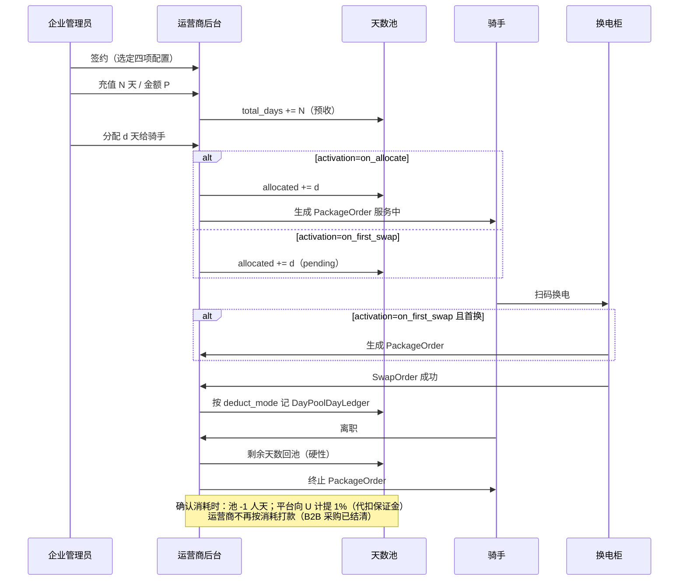

# 企业天数池 · 产品规则

> 面向站点/车队/用工企业批量采购换电服务天数，再向骑手分配额度。换电校验仍走 `PackageOrder`；池只管理**额度来源、分配、回收与结算策略**。  
> 与 [合作模式与分账.md](./合作模式与分账.md)（架构 B、按日确认）、[功能结构与业务流程.md](./功能结构与业务流程.md)（§4.2 换电、§4.6 套餐生命周期）衔接。  
> **差异追踪**（对照外部 prd-battery-swap-quota-pool v0.3）：[额度池PRD差异清单.md](./额度池PRD差异清单.md)

## 1. 与 personal 包月的关系

| 维度 | 个人包月（C 端） | 企业天数池（B 端） |
|------|------------------|-------------------|
| 付款方 | 骑手 | 企业/站点管理员 |
| 合约 | `PackageOrder` 直接绑骑手 | `DayPool` + `DayPoolAllocation` → 生成/激活 `PackageOrder` |
| 退款去向 | 骑手支付账户原路退 | **企业池余额/预存**（非骑手零钱） |
| 离职未用天数 | 骑手中途完结退款 | **必须回池**（硬性规则） |

---

## 2. 合同级可配置项（签约时选定）

以下四项在**企业天数池合同**或**池实例**上配置，同一运营商下不同企业可不同组合；系统按配置驱动计费、激活与结算，不做全局写死。

### 2.1 扣天口径 `deduct_mode`

| 取值 | 说明 | 收入确认建议 |
|------|------|----------------|
| `calendar_day` | **自然日**：服务期内每个自然日扣 1 天；**冻结日不计**（与 §4.6 冻结顺延一致） | 按日摊销 `P/D`，与现包月一致 |
| `swap_day` | **有换电才扣天**：当日存在**成功** `SwapOrder` 才扣 1 天；无换电不扣 | 按「有效服务日」确认，未换电日不确认（需在合同中写明） |

**运行规则（共用）**

- 扣天发生在**服务中**且未冻结的 `PackageOrder` 上。
- `swap_day` 下：换电失败、取消不计扣；一日多次换电仍只扣 1 天。
- 日切时间：默认 **自然日 0:00（业务时区）**；日终批处理写入 `DayPoolDayLedger`（扣天流水）。

### 2.1.1 计费批处理 `billing_mode`（首版写死）

与 `deduct_mode` **独立**：管「每日如何冻结与确认池余额」，首版固定为 **预占确认**。

| 取值 | 说明 |
|------|------|
| `reserve_confirm` | **首版默认**：每日 00:00 对有效骑手预占 1 人天；当日**有换电或持有电池**→确认消耗；**无换电且未持电池**→日终释放；同日多次换电不重复扣 |

### 2.2 激活时机 `activation_mode`

| 取值 | 说明 | `PackageOrder` 生成时点 |
|------|------|-------------------------|
| `on_allocate` | **分配即开通**：管理员划天数后立即生成套餐，`valid_from` = 分配日 | 分配成功时 |
| `on_first_swap` | **首换开通**：仅记 `DayPoolAllocation` 待激活；骑手**首次成功换电**时生成套餐 | 首笔成功换电时 |

**运行规则**

- `on_allocate`：`valid_to = valid_from + allocated_days − 1`（按自然日计期，与合同 D 一致）。
- `on_first_swap`：分配日至首换前**不扣天**（两种 `deduct_mode` 均不扣）；首换当日为 `valid_from`，再按分配天数展开服务期。
- 待激活分配在过期前可**撤回**（天数回池）；已激活不可撤回，仅可走离职回池或中途完结。

### 2.3 池过期退款 `pool_expiry_refund_policy`

| 取值 | 说明 |
|------|------|
| `none` | 池整体或部分过期：**不退款**，未分配/未激活天数作废 |
| `full_only` | 仅**整池未分配余额**在到期后可申请退回企业（需审核） |
| `partial_allowed` | **部分过期**也可退（如批量采购中某批次到期），按未消耗天数 × 池单价核算，上限为未确认预收 |

退款出款记入**资金实收**（退至企业付款账户或池预存账户），并冲减未确认收入 / 应分（与 [合作模式与分账.md](./合作模式与分账.md) §3.5 冲正一致）。

### 2.4 B2B 资金结算（已拍板 · 首版）

渠道人天池与 C 端个人包月的「提现明细」**不是同一套逻辑**：

| 时点 | 运营商 | 平台 | 池账本 |
|------|--------|------|--------|
| **渠道采购/到账** | 已收批发款（在线 T+0/T+1 或线下确认） | — | `total_days` / 资金实收 +采购入账 |
| **骑手确认消耗** | **不再按消耗打款**（钱已在采购时收到） | 按标准人天价 × **1%** 计提代扣 | `consumed_days` +1；平台服务费记账 |

### 2.5 结算节奏 `settlement_mode`（第二期 · 可选）

> **首版不实现**。渠道池场景下运营商收入在 B2B 采购时已结清；本字段保留供未来**财务内部对账**（非向运营商二次打款）。

| 取值 | 说明 |
|------|------|
| `per_rider` | （第二期）按骑手 `PackageOrder` 周期汇总内部确认收入 |
| `enterprise_monthly` | （第二期）按月生成 `DayPoolSettleBatch` 内部对账批次 |

---

## 3. 硬性规则（不可配置）

### 3.1 离职必须回池

骑手标记**离职/解绑企业**（或企业发起停用）时：

1. 立即终止其名下由天数池产生的 `PackageOrder`（等同中途完结的服务终止，但**不向骑手退款**）。
2. 计算**剩余可回池天数** `R_days`：
   - `calendar_day`：`R_days = valid_to 剩余自然日`（冻结期间已顺延的不计入剩余）。
   - `swap_day`：`R_days = 分配天数 − 已扣天累计`。
   - `on_first_swap` 且从未换电：`R_days = 全部分配天数`。
3. `DayPool.available_days += R_days`；写 `DayPoolRecycle` 流水（原因=`resign`）。
4. B2B 侧无 C 端清分；若发生协商退款，由运营商从已收 B2B 款中扣减（见渠道结算规则）。

### 3.2 换电门禁（不变）

须同时满足：有效 `PackageOrder`（服务中、未冻结）、企业关系有效、个人剩余天数 > 0（或 `valid_to` 未过期）、设备归属与站点策略通过。详见 [功能结构与业务流程.md](./功能结构与业务流程.md) §4.2。

---

## 4. 核心实体

| 实体 | 关键字段 |
|------|----------|
| `DayPool` | `enterprise_id`, `operator_id`, `deduct_mode`, `billing_mode`, `activation_mode`, `pool_expiry_refund_policy`, `settlement_mode`（第二期）, `total_days`, `allocated_days`, `consumed_days`, `available_days`, `expire_at` |
| `DayPoolPurchase` | 企业充值单、天数、金额 P、支付单号 → 资金实收 |
| `DayPoolAllocation` | `pool_id`, `rider_id`, `days`, `status`（pending/active/recycled/expired） |
| `DayPoolDayLedger` | 每日扣天：rider、package_order_id、deduct_mode 快照、是否扣减 |
| `DayPoolRecycle` | 回池：days、reason（resign/admin_revoke/expiry） |
| `DayPoolSettleBatch` | 仅 `settlement_mode=enterprise_monthly`；账期、应分汇总、打款状态 |
| `PackageOrder` | `source=day_pool`, `pool_id`, `allocation_id`；其余与 C 端包月一致 |

---

## 5. 主流程（时序）

---

## 6. 配置组合速查

| 场景 | 推荐配置 |
|------|----------|
| 顺丰站点包干、骑手天天换电（**首版**） | `calendar_day` + `reserve_confirm` + `on_allocate` + `partial_allowed` |
| 车队预充值、怕闲置扣费（第二期） | `swap_day` + `on_first_swap` + `full_only` |
| 短期活动池、过期不退 | 任意扣天/激活 + `none` |

---

## 7. 后台能力（原型已实现）

侧栏菜单 **「人天额度池」**（**渠道商**登录可见；运营商在「渠道销售」管理批发，资金方不可见）。渠道商向**签约运营商**采购人天额度（非向平台采购）。共 **6** 个顶层 Tab（含二期零售价/异常）；「额度池」页内再分 **额度池列表 / 额度明细**；「骑手登记」页内再分 **登记骑手 / 骑手团队**（**decision-062**：已移除「额度使用规则」与团队周期上限）：

| Tab | 能力 | 演示数据要点 |
|-----|------|----------------|
| **额度池** | 页内 Tab：**额度池列表 / 额度明细**；列表含余额/预占/消耗与续费，明细含全链路账本；池级扣天/激活四项见详情 | `QP-2601` 闪送 · `QP-2603` 陆家嘴（**一运营商一池**）；明细默认全部额度池 |
| **骑手登记** | 页内 Tab：**登记骑手** / **骑手团队**。登记列表支持在职/离职的加入、变更、移除团队；团队页创建团队并绑定消耗池 | 周骑手离职可变更/复职入队；`TEAM-DEFAULT`/`TEAM-WB`→`QP-2601` |
| **额度分配** | 页内 Tab：**骑手额度分配** / **分配·收回明细**；筛选在 Tab 下。骑手表：骑手/团队/消耗池/额度状态；明细表：额度池/操作/骑手/日起止。**无**团队周期额度上限 | 按团队消耗池操作；约束仅为池余额 + 骑手个人剩余 |
| **~~额度使用规则~~** | **已下线（decision-062）** | — |
| **消耗明细** | 骑手日消耗、换电同步、团队汇总 | `DC-0609-02` 持电池仍确认 |
| **零售价** | 城市+站点+套餐组合定价；权益不可用转自费 | 浦东驿站包月 ¥299 vs 批发 ¥8.5/天 |
| **异常记录** | 余额不足整批失败、支付退款待人工、用户冲突；手动/续费自动重试 | `EX-0609-01` 待重试 |

**与 PRD（额度池 v0.3）对齐的补充规则**（在原有四项配置之上）：

| 规则 | 说明 |
|------|------|
| 预占确认口径 | 天级：**00:00 预占 1 人天**；当日**有换电或持有电池**→确认消耗 1 人天；**无换电且未持电池**→日终释放；同日多次换电不重复扣 |
| 渠道同步 | 渠道骑手**每次换电**实时同步至渠道商；每骑手每日 1 条消耗记录，含**换电次数**、**持有电池数** |
| 余额不足 | **不允许透支**；不足覆盖全部符合条件用户时**整批预占失败**，不做部分分配 |
| 重试 | 管理员手动重试；**续费成功后自动重试**失败批次 |
| 多规则命中 | **已不适用**（decision-062 取消团队规则层）；预占仅校验池余额与骑手个人额度 |
| 支付退款 | 资格/额度**不自动回退**，生成待人工处理记录 |

**关联模块**：

| 模块 | 能力 |
|------|------|
| 总览 | 低余额橙色预警条；KPI「人天池可用」 |
| 用户 | 新增「人天池权益」列（预占/确认/失败/可自费） |
| 我的流水 | 资金实收含「额度池采购」「额度池零售」类型 |

### 批发价与平台标准日值

| 概念 | 维护方 | 说明 |
|------|--------|------|
| **平台标准人天价** | 平台管理员 | 默认 ¥8.5/人天；B 端 1% 平台费**计提基数**；向运营商只读展示 |
| **运营商批发价** | 运营商 | 面向渠道商签约/采购单价；**默认=平台标准日值**，运营商可在「定价管理」修改 |
| **合同锁定价** | 采购时锁定 | 渠道下单时按当时合同批发价结算；平台 1% 仍按标准日价计提 |

---

## 9. 算例与边界 FAQ

### 算例 A：自然日 + 分配即开通 + 预占确认（首版默认）

- 池 `QP-2601`：批发价 ¥8.5/人天；`deduct_mode=calendar_day`（预占确认口径）
- 6 月 9 日 00:00：12 名在职骑手各预占 1 人天（冻结 12）
- 6 月 9 日日间：
  - 5 人有换电 → 确认 5 人天
  - 1 人（陈骑手）**未换电但持有电池** → 仍确认 1 人天
  - 6 人无换电且未持电池 → 日终释放预占
- 渠道商可见：7 条骑手日消耗记录 + 全部换电同步明细；同日多次换电不重复扣人天

### 算例 B：~~团队额度上限~~（已废止 · decision-062）

> **不再**按团队配置周期额度上限。同一池内多团队共享池余额；控制粒度仅为：**池可用余额** + **骑手个人已分配剩余**。原 `RULE-01`/`RULE-02` 演示数据已下线。

### 算例 C：离职回池（冻结顺延后）

- 骑手 U2111：`calendar_day` + `on_allocate`；服务期至 6 月 25 日；6 月 7 日标记离职
- 剩余自然日 18 天（冻结期间已顺延的不计入）→ 回池 `+18` 人天
- 写 `DayPoolRecycle`；终止 `PackageOrder`；**不向骑手退款**

### FAQ

| 问题 | 结论 |
|------|------|
| 预占整批失败时，昨日已预占状态？ | 昨日已确认/已释放按历史账本；当日整批失败不影响昨日 |
| 渠道成员 C 端兜底支付？ | **已取消**（decision-054）；无人天额度不可自费换电 |
| 渠道骑手能否跨网换电？ | **能**；与个人用户相同准入规则；`userOwner`=额度售卖方 U；跨网设备费由 U 保证金/信用额度承担 |
| 一个渠道商需要几个池？ | **一签约运营商一池**；续费在原池增购；仅向**第二家运营商**签约才新增池 |
| 同运营商为何不能两个池？ | 四项合同在签约层已统一，拆池无业务意义；团队差异仅走**团队绑定池**与骑手分配（**无**团队周期上限，decision-062） |
| 团队与额度池关系？ | **团队必须关联 `pool_id`**；同运营商下多团队可共享该运营商池；多运营商时各团队绑定对应运营商的池 |
| 渠道消耗后运营商还要打款吗？ | **不要**。批发款采购时已收；消耗只扣池余额 + 平台计提 1% |
| `settlement_mode` 首版要不要？ | **不要**；第二期可选，仅内部对账，非运营商二次收款 |
| 余额不足骑手怎么办？ | 预占失败 → 权益不可用；**禁止换电**；持电池仅可还电；联系渠道续配（无自费兜底 SKU） |
| **额度耗尽仍持电池？** | **两者都进「待还电」**，原因须区分：①**个人无额度**；②**预占失败**。扫码**仅可还电**，禁止换电；不透支；**无自费兜底**。见 decision-049 / 054 |
| 未换电但持有电池算消耗吗？ | **算**；当日确认 1 人天；渠道商消耗明细展示换电 0 次、持电池 1 |
| 无换电且无电池算消耗吗？ | **不算**；日终释放预占 |
| 渠道自费 C 端清分？ | **不适用**（已取消兜底路径） |
| 额度池能否在线退款？ | **不能**；渠道商须与签约运营商**线下协商**；达成一致后运营商在「渠道销售 → 已售额度池」执行额度扣减（账本类型：**退款**），资金按对公约定另行结算 |
| 规则层还要配站点/权益类型吗？ | **不需要**；扣天/激活等口径统一继承额度池**平台四项**。**团队周期额度上限已取消**（decision-062），无独立「额度使用规则」配置页 |

---

## 10. 池实例与骑手团队

### 10.1 额度池与签约关系

| 规则 | 说明 |
|------|------|
| **一运营商一池** | 渠道 × 运营商 = **唯一** `DayPool` 实例；签约时确定平台统一四项 + 批发价 |
| **续费 / 增购** | 在同一池上增购人天，写入**批发订单（PO）**与**额度变动记录**，**不**新建第二池 |
| **运营商视角** | 「渠道销售 → 已售额度池」每个渠道**一行**；采购入账、调账、分配、预占/确认/回池等仅体现为**额度变动记录** |
| **多池** | **仅当**向第二家（及更多）运营商签约采购时，才新增池（如闪送 `QP-2601` + 陆家嘴 `QP-2603`） |
| **团队** | 编排骑手；**须关联 `pool_id`**；同运营商下多团队可共享该运营商池；跨运营商团队绑定各自运营商的池 |

### 10.2 团队模型（`ChannelTeam`）

| 字段 | 说明 |
|------|------|
| `team_id` | 团队 ID |
| `channel_id` | 所属渠道商 |
| `name` | 团队名称 |
| `pool_id` | **消耗额度池**（须属于团队所服务运营商；同运营商团队 pool_id 相同） |
| `is_default` | 是否默认团队（不可删除） |

骑手登记时选择团队；预占/确认消耗从团队绑定池扣减。`userOwner` = 该池售卖运营商 U。

### 10.3 与「一运营商一池」的表述关系

团队是骑手的**编排层**；额度池**不**关联组织/站点。团队通过 `pool_id` 决定扣减来源；**不再**为团队配置周期额度上限（decision-062）。

---

## 11. 历史说明（已废弃 Mock）

早期原型曾用 `QP-2602` 演示「同运营商、不同四项」拆池，已与「签约统一四项 → 一运营商一池」冲突，**已删除**。

---

## 12. 池实例切分（仅多运营商）

| 规则 | 说明 |
|------|------|
| 采购关系 | 每签约一家运营商 → 一个 `DayPool` |
| 跨网换电 | `userOwner` = 骑手所属团队绑定池的售卖方 U |
| 池内分工 | 团队 + `DayPoolRule` + `capDays` 软隔离，不物理拆池 |

---

## 13. 渠道骑手消耗与换电同步

### 13.1 确认消耗判定（每骑手 · 每日）

| 当日状态 | 是否确认消耗 1 人天 | 平台提成场景 | 关联单 |
|----------|---------------------|--------------|--------|
| 有 ≥1 次成功换电 | **是** | **确认消耗-换电** | 换电单号 |
| 无换电，但**持有电池**（IoT） | **是** | **确认消耗-持有电池** | 无（展示 —） |
| 无换电且**未持有电池** | **否** | — | — |

> **面向渠道商**：骑手当天未换电但持有电池，仍计为 1 人天确认消耗；不持电池且未换电则不产生消耗。平台「流水管理 → 平台提成」按上表场景展示（decision-060）。

### 13.1.1 额度不可用仍持电池（decision-049）

| 条件 | 处理 |
|------|------|
| 在职 + 持电池 +（**个人剩余人天=0** 或 **当日预占失败**） | 状态 **「待还电」**；`gateReason` 区分 `个人无额度` / `预占失败` |
| 扫码 | **仅可还电入柜**；禁止出电/换电 |
| 计费 | 无当日预占则**不扣池、不欠费** |
| 出路 | 渠道续配 / 池恢复后次日预占成功（**无**自费兜底） |
| 渠道预警 | 顶栏「骑手零额度」（在职剩余=0）紧挨「余额不足」；额度池页横幅同口径 |

### 13.2 数据模型

| 实体 | 粒度 | 关键字段 |
|------|------|----------|
| `DayPoolRiderDayConsume` | **1 骑手 / 1 自然日 / 1 条** | `rider_id`, `date`, `swap_count`, `battery_held`, `confirmed_days`(0/1), `confirm_reason`（swap/battery/both） |
| `ChannelRiderSwapSync` | **每次换电 1 条** | `swap_id`, `rider_id`, `pool_id`, `channel_id`, `site`, `time`, `synced_at` |

- 换电成功 → 写入 `ChannelRiderSwapSync` 并推送渠道商可见；
- 同日消耗记录 `swap_count` 随换电累加；`battery_held` 取日终快照或实时最新（展示用）。

---

## 14. 渠道骑手可换电校验（换电前）

换电扫码前须调用 `POST /api/v1/entitlement/check`。无人天额度时 `allowed_swap=false`；持电池 `allowed_return=true`；**不返回自费兜底 SKU**（decision-054）。

完整字段表与错误码见 **[渠道骑手可换电校验.md](./渠道骑手可换电校验.md)**。

---

## 8. 修订记录

| 版本 | 日期 | 说明 |
|------|------|------|
| 1.8 | 2026-07-23 | **decision-062**：移除「额度使用规则」与团队周期额度上限；顶层 Tab 6 项 |
| 1.0 | 2026-06-01 | 初版：四项合同可配置 + 离职强制回池；衔接架构 B 与套餐模型 |
| 1.1 | 2026-06-10 | 原型落地：人天额度池 9 Tab；对齐额度池 PRD 预占确认/余额不足/零售价/账本 |
| 1.2 | 2026-06-10 | 增补 §9 算例与 FAQ；额度使用规则 Tab 展示合同四项 |
| 1.3 | 2026-06-11 | 「配置规则」更名为**额度使用规则**；套餐字段改为**权益类型**；明确 B2B 额度池不支持在线退款；运营商可调账（充值/赠送/退款/修正） |
| 1.3 | 2026-06-11 | 新增 §10 池实例切分：一运营商一池；渠道骑手允许跨网换电 |
| 1.7 | 2026-06-12 | 拍板：§2.1.1 billing_mode；§2.4 B2B 采购结清/消耗仅平台1%；settlement_mode 标第二期 |
| 1.4 | 2026-06-11 | §14 渠道骑手可换电校验；对齐 G1 过期恢复、G4 组织管理员、G5 批量导入、骑手端自费兜底 |
| 1.6 | 2026-06-11 | 删除同运营商双池 Mock（QP-2602）；明确一运营商一池，多池仅多运营商 |
| 1.7 | 2026-06-11 | **方案 A**：规则层去掉权益类型/站点/组织；编排单元改为**团队**（须 `pool_id`）；池级激活固定**分配即开通** |
