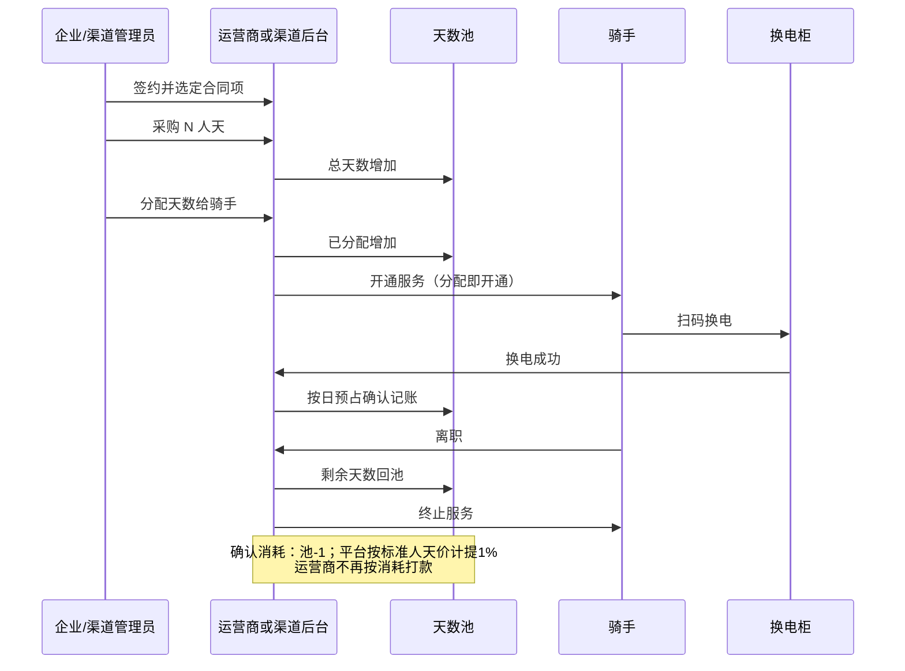

# 人天额度池（天数池）

> **这是什么**：渠道商向**签约运营商**批量买「人天」额度，再分给骑手换电用的库存——属于 **B 端额度**，不是骑手自己买的个人套餐。  
> **谁用**：渠道商后台「人天额度池」；运营商在「渠道销售」看已售池与批发；骑手侧表现为「有人天才能换电」。  
> **依据**：[渠道结算模式规则.md](./渠道结算模式规则.md) · [合作模式与分账.md](./合作模式与分账.md) · [渠道骑手可换电校验.md](./渠道骑手可换电校验.md) · decision-049 / 054 / 060 / 062 等（详见文末附录）  
> **写法**：[业务文档写作规范](./业务文档写作规范.md)

---

## 业务设定

### 一句话

渠道先付钱买人天进「池」，再把天数分给骑手；骑手换电或当天一直拿着电池，就从池里扣 1 人天。钱在**采购时**已经结给运营商，**不会**因为骑手又换了一次电再给运营商打一笔。平台按「标准人天价 × 1%」在确认消耗时向运营商计提。

### 和「个人包月」有什么不同

| | 个人包月（骑手自购） | 人天额度池（渠道采购） |
|--|----------------------|------------------------|
| 谁付钱 | 骑手 | 渠道 / 企业 |
| 权益从哪来 | 自己买的套餐单 | 池里分配下来的天数 |
| 没用完怎么退 | 按退款规则退给骑手 | 离职未用天数**必须退回池子**；不能退成骑手零钱 |
| 钱什么时候到运营商 | 骑手支付时 | 渠道批发采购时已结清 |

### 池里有什么、谁管

1. **一签约运营商 = 一个池**：同一渠道对同一运营商只有一个额度池；续费/增购都加在这个池上，不另开第二池。  
2. **只有签了第二家运营商**，才会多出一个池。  
3. **团队**用来编排骑手，每个团队绑渠道唯一消耗池。默认团队开户自动创建，不可改名/停用/删除；其它团队名称本渠道唯一，无在职成员才可停用或删除。  
4. **没有**「团队周期额度上限」配置页（已取消）；能控的只有：**池还剩多少** + **这个骑手个人还剩多少**。

### 每天怎么扣人天（首版默认）

首版统一为：**预占 → 确认或释放**（与「按自然日服务」配套，分配后即开通）。

1. **每天 0 点**：对在职、有额度的骑手，先各**预占** 1 人天。  
2. **当天结束时**：  
   - 有成功换电 → **确认消耗** 1 人天；  
   - 没换电但**还拿着电池** → 也 **确认消耗** 1 人天；  
   - 没换电且**没拿电池** → **释放**预占，不算消耗。  
3. 同一天换电多次，仍只扣 **1** 人天。  
4. **池余额不够覆盖当天所有人** → **整批预占失败**，不允许透支、不做「只给一部分人预占」。

### 分配与开通（首版）

- 管理员把天数分给骑手后，**立刻开通**服务（从分配日起算服务期）。  
- （二期可选）也可做成「第一次换电才开通」；首版原型以分配即开通为主。

### 骑手离职 / 解绑

硬性规则：

1. 立刻停掉他靠这个池开通的服务（**不向骑手退款**）。  
2. 算出**还能退回池里的天数**，加回池可用余额。  
3. 留下回池记录（原因如：离职）。

### 额度不够或预占失败时

- 不能换电；若手里还有电池 → 进入 **「待还电」**，扫码**只能还电**，不能再取出。  
- **没有**「自己掏钱买应急套餐」的兜底（已取消）。  
- 出路：渠道续配额度，或池恢复后次日预占成功。

### 池状态「余额不足」（唯一口径）

池状态、顶栏红字、短信预警 **同一条公式**（decision-113）：

**可用余额 < 在职骑手数 × 10**

- 在职 = 骑手登记为在职（含未分配、个人无额度、待还电）；离职不计。  
- 刚好等于 10 天 → 仍为「使用中」。  
- 在职为 0 → 不为余额不足。  
- **已作废**「可用 / 总量 < 20%」。  
- 0 点可用盖不住当日需预占人数 → **整批预占失败**（账本约束，不另定百分比）。

### 钱与平台费

| 时点 | 运营商 | 平台 | 池 |
|------|--------|------|-----|
| 渠道采购到账 | 已收到批发款 | — | 总天数增加 |
| 骑手确认消耗 | **不再**按消耗另收款 | 按标准人天价 × 1% 计提 | 消耗天数 +1 |

线下对公与保证金同一套认款包（decision-114）：**附言填采购单号**对上哪一笔；银行流水号是回单证据，不能单独认人。**不填转账日**（decision-115）。

- **平台标准人天价**：平台维护（如默认 ¥8.5/人天），是算 1% 的基数。  
- **运营商批发价**：卖给渠道的单价，默认等于标准价，可在定价里改；下单时按合同价锁定。  
- **池不能在线退款**：要退须渠道与运营商**线下谈妥**，再由运营商在「已售额度池」做额度扣减，资金按对公约定另结。

### 池过期怎么处理（合同可选）

签约时可约定过期策略，例如：

- 过期不退；或  
- 仅整池未分配部分可申请退企业；或  
- 部分过期也可按未消耗天数核算退（需审核）。

首版演示以业务操作为主；具体选项见附录。

### 后台落在哪

**客户 · 人天额度池**（顶层 Tab，已去掉「额度使用规则」）：

| 入口 | 做什么 |
|------|--------|
| 额度池 | 池列表（余额/预占/消耗、续费）+ 额度明细账本 |
| 骑手登记 | 登记骑手、编入团队；非默认团队可增改停删（无在职成员才可停/删） |
| 额度分配 | 给人配天数 / 收回；看分配与收回明细 |
| 消耗明细 | 每日谁消耗了、换了几次、是否持电池 |
| 零售价 | （二期相关）城市/站点组合价等演示 |
| 异常记录 | 余额不足整批失败、待人工等；可手动或续费后自动重试 |

**运营商**：渠道销售里看已售额度池、批发与调账；总览可有低余额提醒。  
**关联**：用户列表可看人天权益状态；流水里采购入账等类型。

### 常见问题（白话）

| 问 | 答 |
|----|-----|
| 一个渠道要几个池？ | 对每个签约运营商一个池；只多签运营商才多池。 |
| 消耗后运营商还要再收款吗？ | 不要，批发时已收齐。 |
| 没换电但拿着电池扣不扣？ | 扣 1 人天。 |
| 没换电也没电池？ | 不扣，预占释放。 |
| 额度没了还拿着电池？ | 待还电，只能还不能换；渠道续配。 |
| 池状态什么时候是「余额不足」？ | 可用 < 在职人数 × 10 天；与顶栏、短信同一条。 |
| 能否在线把池款退掉？ | 不能，须线下协商后再调额度。 |
| 渠道骑手能跨网换电吗？ | 能，规则与个人用户类似；归属仍是额度售卖方运营商。 |
| 默认团队能删或改名吗？ | 不能。开户自动创建，始终启用。 |
| 团队名能重复吗？ | 同一渠道内不能。 |
| 有在职骑手时能停用/删除吗？ | 不能，须先变更或移除。 |

### 推荐配置（首版场景）

站点包干、骑手几乎天天换电：**自然日服务 + 预占确认 + 分配即开通 + 允许部分过期退（若合同需要）**。

---

## 实现附录（开发用）

> 业务读者可跳过。实体名、枚举码、时序图、历史修订集中于此。

### A. 合同可配置项（枚举）

| 配置 | 取值 | 含义 |
|------|------|------|
| 扣天口径 | 自然日 / 有换电才扣 | 首版演示以自然日 + 预占确认为主 |
| 计费批处理 | 预占确认 | 首版写死：0 点预占，日终确认或释放 |
| 激活时机 | 分配即开通 / 首换开通 | 首版以分配即开通为主 |
| 池过期退款 | 不退 / 仅整池未分配可退 / 部分过期可退 | 签约选定 |
| 结算节奏 | 按骑手 / 企业月结 | **二期**；仅内部对账，非向运营商二次打款 |

### B. 硬性：离职回池（计算口径）

- 自然日：剩余自然日回池（冻结顺延段不计剩余）。  
- 有换电才扣：分配天数 − 已扣累计。  
- 首换开通且从未换电：全部分配天数回池。  
- 写回池流水；终止由池产生的套餐单；不向骑手退款。

### C. 核心实体（名称对照）

额度池、采购单、分配单、日扣天流水、回池流水、（二期）结算批次；骑手表单由池分配激活，来源标记为人天池。团队须绑定消耗池 ID。

### D. 主流程（时序）

```mermaid
sequenceDiagram
  participant E as 企业/渠道管理员
  participant BO as 运营商或渠道后台
  participant Pool as 天数池
  participant R as 骑手
  participant IoT as 换电柜

  E->>BO: 签约并选定合同项
  E->>BO: 采购 N 人天
  BO->>Pool: 总天数增加

  E->>BO: 分配天数给骑手
  BO->>Pool: 已分配增加
  BO->>R: 开通服务（分配即开通）

  R->>IoT: 扫码换电
  IoT->>BO: 换电成功
  BO->>Pool: 按日预占确认记账

  R->>BO: 离职
  BO->>Pool: 剩余天数回池
  BO->>R: 终止服务

  Note over BO,Pool: 确认消耗：池-1；平台按标准人天价计提1%<br/>运营商不再按消耗打款
```

### E. 确认消耗判定

| 当日 | 是否确认 1 人天 |
|------|----------------|
| ≥1 次成功换电 | 是 |
| 无换电但持有电池 | 是 |
| 无换电且未持电池 | 否（释放预占） |

额度不可用仍持电池：状态「待还电」；原因区分「个人无额度」/「预占失败」；仅可还电。

### F. 换电前校验

须做权益校验：无人天则不可换电；持电池可还电；**不返回**自费兜底 SKU。详见 [渠道骑手可换电校验.md](./渠道骑手可换电校验.md)。

### G. 决策与差异索引

- decision-049：额度耗尽仍持电池 → 待还电  
- decision-054：取消渠道 C 端自费兜底  
- decision-060：持电池确认消耗与平台提成场景  
- decision-062：取消额度使用规则 / 团队周期上限  
- decision-113：余额不足 = 可用 &lt; 在职×10（作废 20%）  
- decision-114：线下采购对公认款包（附言=单号，流水号作证据）  
- decision-115：人天采购不填转账日  
- decision-116：非默认团队可增改停删；无在职成员才可停用或删除  
- 外部 PRD 差异追踪（非摘要源）：[额度池PRD差异清单.md](./额度池PRD差异清单.md)

### H. 修订记录（摘要）

| 版本要点 | 说明 |
|----------|------|
| 初版 | 合同四项 + 离职强制回池 |
| 后续 | 预占确认、一运营商一池、B2B 采购结清、取消团队规则层与自费兜底等 |
| 2026-08-25 | 余额不足统一为在职×10；作废 20%（decision-113） |
| 2026-08-25 | 线下采购对公认款包：附言=单号，流水号作证据（decision-114） |
| 2026-08-25 | 人天采购去掉转账日（decision-115） |
| 2026-08-25 | 人天池团队：非默认可增改停删（decision-116） |
