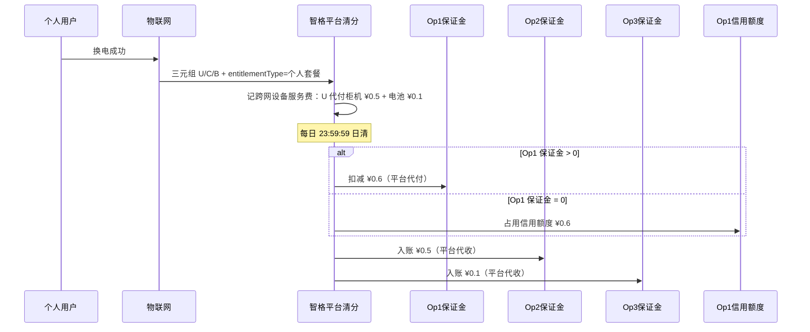

# 换电场景与运营商结算

> 两类用户 · 三元组归属 · **平台统一清分 + 运营商保证金/信用额度调拨**  
> 关联：[角色与功能清单.md](./角色与功能清单.md) · [PRD.md](./PRD.md) · [天数池.md](./天数池.md)

---

## 1. 核心原则

### 1.1 平台清分枢纽（新增约束）

设备流转产生的**运营商之间**直接费用（柜机服务费、电池使用费等），**不点对点线下结算**：

```
换电成功 → 平台计费入账（待调拨）
         → 日清扣款：优先从付款方「平台保证金」划扣
         → 仅当保证金余额 = 0 时，启用「信用额度」记账（允许欠费）
         → 收款方：优先计入平台保证金；保证金为 0 时记入信用额度
         → 运营商后台仅展示平台代收/代付流水（不展示对手方）
```

| 能力 | 说明 |
|------|------|
| **平台清分池** | 汇总全网跨运营商应付/应收，按账期轧差 |
| **运营商保证金** | 运营商在平台预存的清分账户；**平时跨网设备服务费/B 端代扣均划扣保证金** |
| **运营商信用额度** | 平台配置的上限；**仅当保证金余额为 0 时启用**，允许欠费记账 |
| **欠费管控** | **信用额度也用光** → 自动关闭该运营商所属全部用户的**跨网换电**（用户①个人 + 用户②渠道）；本站换电不受影响 |
| **换电范围策略** | 运营商可自主关闭**跨网换电**或**跨站点换电**（见 [换电范围策略.md](./换电范围策略.md)） |
| **信息隔离** | 运营商互不可见对方主体信息；往来仅展示 **平台代收 / 平台代付** |

> C 端个人套餐款、渠道批发采购款仍走支付通道/对公，**不直接计入**保证金/信用额度；保证金与信用额度专用于**运营商间设备使用费**及 **B 端平台费** 的平台清分调拨。

### 1.2 两类用户

| 类型 | 称谓 | 权益来源 | **用户归属运营商 userOwner** 定义 |
|------|------|----------|-----------------------------------|
| **用户①** | 个人套餐用户 | 向某运营商购买包月/次卡 | **套餐售卖运营商**（收款子商户对应主体） |
| **用户②** | 渠道成员 | 渠道商名下，使用人天额度换电 | **人天额度售卖运营商**（渠道商向其批发采购额度池的 `sellerOperator`） |

说明：

- **渠道商不是运营商**，不参与三元组中的 `userOwner`；渠道商与运营商是 B2B 采购关系。
- 用户②换电时：`channelId` 记录渠道身份；`userOwner` 记录额度合同锁定的运营商（可与柜机/电池运营商不同）。
- 平台允许**电池跨柜流转**、**用户跨运营商柜机换电**，故单次换电必须上报 **userOwner · cabinetOwner · batteryOwner** 三元组。

### 1.3 费用分层（互不替代）

| 层级 | 费用类型 | 付款方 → 收款方 | 清分通道 |
|------|----------|-----------------|----------|
| L0 | C 端套餐实收 | 用户 → userOwner 子商户 | 支付通道（架构 B） |
| L0' | 渠道人天批发 | 渠道商 → userOwner（额度售卖方） | 对公/线上 B2B |
| 跨网设备服务费 | **柜机服务费** | 应付方 → cabinetOwner | **平台保证金调拨**（保证金为 0 → 信用额度） |
| 跨网设备服务费 | **电池使用费** | 应付方 → batteryOwner | **平台保证金调拨**（保证金为 0 → 信用额度） |
| L2 | 平台 1% 技术服务费（C 端） | userOwner 子商户 → 平台 | 支付分账 |
| L2 | 平台 1% 技术服务费（B 端） | **额度售卖方 userOwner** → 平台 | 确认消耗时代扣（**已确认**） |
| L3 | C 端套餐应分（周期结转） | — | userOwner 内部待分账账户 |
| L3' | 渠道人天额度消耗 | — | 渠道额度池扣减（与跨网设备服务费独立） |

**跨网设备服务费与平台技术服务费、套餐应分/额度消耗 并行**：跨网换电可同时产生保证金/信用额度调拨 + 平台服务费 + 额度/套餐消耗。

---

## 2. 三元组与计费触发

每笔**换电订单**必须记录三方运营商归属：

| 字段 | 含义 | 取值 |
|------|------|------|
| `userOwner` | **用户归属运营商** | 个人套餐：套餐售卖运营商；渠道人天：额度售卖运营商 |
| `cabinetOwner` | **柜机归属运营商** | 扫码柜机资产 `device_owner_id` |
| `batteryOwner` | **电池归属运营商** | 换出电池资产 `device_owner_id` |

**跨网设备服务费规则**（每次换电服务，换电成功时计费）：

| 费用项 | 条件 | 应付方 → 收款方 | 单价 |
|--------|------|-----------------|------|
| 柜机服务费 | `cabinetOwner ≠ userOwner` | userOwner → cabinetOwner | ¥0.5/次 |
| 电池服务费 | `batteryOwner ≠ userOwner` | userOwner → batteryOwner | ¥0.1/次 |
| — | `cabinetOwner = userOwner` | **不产生**柜机费 | — |
| — | `batteryOwner = userOwner` | **不产生**电池费 | — |

> 同一维度归属运营商相同则该项费用为 0；两项可独立判断（例：U=C≠B 时仅付电池费）。

其他字段：

| 字段 | 来源 | 用途 |
|------|------|------|
| `entitlementType` | 权益引擎 | `个人套餐` / `渠道人天` |
| `channelId` | 仅用户② | 渠道商身份、额度池扣减 |
| `cross_net_cabinet_fee` / `cross_net_battery_fee` | 计费引擎 | 写入换电单与往来账 |

**计费触发**：换电成功（IoT 闭环）→ 同一事务写入三元组 + 计算跨网设备服务费 + 生成 L2/L3 明细。

---

## 3. 运营商间费用：谁付谁（已确认）

跨主体时，**应付方 = userOwner**，向设备持有方支付使用费；**双方不展示对方运营商信息**，后台仅见 **平台代收 / 平台代付**。

### 3.1 平台统一定价（暂定，高亮管控）

| 费用项 | 单价 | 收款方（内部） | 应付方 | 展示给运营商 |
|--------|------|----------------|--------|--------------|
| **柜机使用费** | **¥0.5 / 次** | cabinetOwner（C≠U 时） | userOwner（U） | 平台代付 / 平台代收 |
| **电池使用费** | **¥0.1 / 次** | batteryOwner（B≠U 时） | userOwner（U）**直付 B**（**已确认 U→B**） | 平台代付 / 平台代收 |

> 单价由**平台统一配置**，运营商后台只读；变更需平台运营发布（原型高亮标注）。

**场景 3**（U、C、B 三方不同）：U 平台代付 ¥0.5 给 C（柜机）+ ¥0.6 中 ¥0.1 给 B（电池），合计 **¥0.6/次**（若 C、B 均≠U）。

所有跨网设备服务费先入**平台清分池**，日清时**优先从 U 平台保证金划扣**，保证金为 0 才占用 U 信用额度；C/B 侧同理入账（运营商只见平台侧流水）。

---

## 4. 场景矩阵

符号：U = userOwner，C = cabinetOwner，B = batteryOwner；`=` 表示同一运营商。

### 4.1 用户① · 个人套餐

| # | U | C | B | 是否跨网 | 跨网设备服务费 | L2 平台费 | L3 套餐应分 |
|---|---|---|---|----------|-----------------|-----------|-------------|
| 1a | Op1 | Op1 | Op1 | 否 | 无 | C 端支付时已分账 1% | 支付时已清分至 Op1（99%） |
| 2a | Op1 | Op2 | Op2 | 是 | Op1→Op2 **换电服务费**（柜+电合并或拆分） | C 端 1% 已在 Op1 支付时分账 | 套餐应分仍归属 Op1，按换电分摊 |
| 3a | Op1 | Op2 | Op3 | 是 | Op1→Op2 柜机费；Op1→Op3 电池费 | 同上 | 同上 |
| 4a | Op1 | Op1 | Op3 | 是 | Op1→Op3 电池费 | 同上 | 同上 |
| 5a | Op1 | Op2 | Op1 | 是 | Op1→Op2 柜机费 | 同上 | 同上 |

**用户①要点**：

- 用户已向 **U** 付过套餐款，跨网时由 **U 的平台保证金**（不足时信用额度）经平台代付柜机/电池使用费，保证 **C/B 得到补偿**。
- 套餐应分与跨网费**分开记账**：应分是 U 的内部收入确认；跨网费是 U 的成本（保证金流出或信用额度占用）。

### 4.2 用户② · 渠道人天额度

| # | U | C | B | 是否跨网 | 跨网设备服务费 | L2 平台费 | L3' 额度消耗 |
|---|---|---|---|----------|-----------------|-----------|--------------|
| 1b | Op1 | Op1 | Op1 | 否 | 无 | 确认消耗 → 额度售卖方 Op1 付 1% | 渠道池 −1 人天（预占→确认） |
| 2b | Op1 | Op2 | Op2 | 是 | Op1→Op2 柜机费 + 电池费 | B 端 1%（确认消耗，Op1） | 渠道池 −1 人天 |
| 3b | Op1 | Op2 | Op3 | 是 | Op1→Op2 柜机费；Op1→Op3 电池费 | 同上 | 渠道池 −1 人天 |
| 4b | Op1 | Op1 | Op3 | 是 | Op1→Op3 电池费 | 同上 | 渠道池 −1 人天 |
| 5b | Op1 | Op2 | Op1 | 是 | Op1→Op2 柜机费 | 同上 | 渠道池 −1 人天 |

**用户②要点**：

- **U 必为额度售卖运营商**（渠道向该运营商批发采购的池；**一运营商一池**），成员在 Op2/Op3 柜换电时 `userOwner` 仍为该池的 U。
- **渠道成员允许跨网换电**（**已确认**）：与个人用户①相同，走运营商跨网/跨站开关 + 信用额度停跨网；**不因柜机归属运营商不同而拦截**。
- 额度消耗与跨网设备服务费**独立并行**：渠道池扣 1 人天；若 C/B≠U，由 **U 的平台保证金**（不足时信用额度）经平台代付跨网设备服务费；渠道商与骑手不另付跨网费。

### 4.3 用户① vs 用户② 同场景对比（#3 最复杂）

| 维度 | 用户① Op1 套餐 @ Op2 柜 + Op3 电 | 用户② 额度售卖 Op1 @ Op2 柜 + Op3 电 |
|------|-----------------------------------|--------------------------------------|
| userOwner | Op1（卖套餐） | Op1（卖人天额度） |
| 用户侧付费 | 已付套餐款给 Op1 | 渠道已向 Op1 批发采购池 |
| 跨网设备服务费 | U 保证金代付 ¥0.5 柜机 + ¥0.1 电池（保证金为 0 时走信用额度） | **同左**（U=额度售卖方 Op1） |
| L2 | C 端 1%（购套餐时） | B 端 1%（确认消耗时，Op1） |
| L3 | Op1 支付已清分（99%） | Op1 渠道池 −1 人天 |

---

## 5. 平台清分 + 保证金/信用额度：单笔换电流水

以 **场景 3a**（用户①个人套餐，U=Op1，C=Op2，B=Op3）为例：



| 步骤 | 系统动作 | 运营商可见 |
|------|----------|------------|
| T0 | 换电成功，写换电单 + 三元组 | 订单列表「权益来源=个人套餐」 |
| T1 | 生成 跨网设备服务费明细（¥0.5+¥0.1） | 「往来账」待日清（平台代收/代付） |
| T2 | C 端 1% 已在购套餐时分账 | — |
| T3 | **每日 23:59:59 清分**，优先划扣保证金；保证金为 0 才记信用额度 | 保证金/信用额度流水 |
| T4 | 日账单汇总 → 周/月报表 | 状态 → 已清分 |

### 5.1 清分节奏（已确认）

| 层级 | 周期 | 说明 |
|------|------|------|
| **日清** | 每天 **23:59:59** | 汇总当日 跨网设备服务费明细，轧差后**优先更新保证金**；保证金为 0 时更新信用额度 |
| **周/月报** | 基于日账单聚合 | 运营商往来账、对账导出；不改变日清事实账 |

---

## 6. 运营商保证金与信用额度（【补足】产品字段）

### 6.1 扣款顺序（已确认）

| 顺序 | 账户 | 启用条件 | 说明 |
|------|------|----------|------|
| **1** | **平台保证金** | 余额 > 0 | 平时跨网设备服务费 代付/代收、B 端 1% 代扣均划扣保证金 |
| **2** | **信用额度** | **仅当保证金 = 0** | 允许欠费记账；额度用光则停跨站 |

### 6.2 产品字段

| 字段 | 说明 |
|------|------|
| `operatorId` | 运营商 |
| `depositBalance` | 平台保证金余额 |
| `creditLimit` | 信用额度上限（平台配置） |
| `creditUsed` | 信用额度已占用（仅保证金为 0 后累计） |
| `creditAvailable` | 可用信用额度 = limit − used |
| `crossSwapEnabled` | 平台管控：信用额度用尽后是否仍允许所属用户**跨网换电** |
| `crossNetworkEnabled` | 运营商自配：是否允许跨网换电（双向） |
| `crossSiteEnabled` | ~~已废弃~~ | 本期不设用户绑定站点，同运营商任意站可换 |
| `ledger[]` | 扣款来源（保证金/信用额度）、平台代收/代付、日清批次 |

**管控（已确认）**：

- **平时**：日清从保证金划扣/入账。
- **保证金用尽**：启用信用额度，允许欠费。
- **信用额度也用光**：`crossSwapEnabled=false`，该运营商下**全部用户**（个人套餐 + 渠道成员）**禁止跨网换电**；本站换电不受影响。
- **运营商自关跨网**：向该运营商付费的用户不可在其他运营商换电；其他运营商用户亦不可在该运营商站点换电。
- **运营商自关跨网**：双向封闭；**无**跨站/主绑定站限制。

### 6.3 对公充值流程（v1）

| 步骤 | 操作方 | 动作 | 后台位置 |
|------|--------|------|----------|
| 1 | 运营商财务 | 对公转账至平台清分专户（附言含运营商 ID） | — |
| 2 | 运营商财务 | 提交充值申请（金额、转账日、银行流水号） | 运营商 → **保证金账户** |
| 3 | 平台财务 | 核对银行到账，确认入账或驳回 | 平台 → **保证金管理 → 充值确认** |
| 4 | 系统 | 增加 `depositBalance`，写入 `ledger[]` | 双方变动明细 |

**充值单字段**：`id`、`operatorId`、`amount`、`transferDate`、`transferRef`、`payerAccount`、`status`（待确认/已确认/已驳回）、`submitTime`、`confirmTime`、`confirmedBy`、`rejectReason`。

**平台侧补充能力**：手工入账（线下补录）、调整 `creditLimit`；信用额度用尽后 `crossSwapEnabled=false`（系统管控，非手工开关）。

---

## 7. 商务确认清单（已定稿）

| # | 议题 | 确认结果 |
|---|------|----------|
| 1 | 电池费付款路径 | **U→B**；双方**不展示对方信息**，仅 **平台代收/代付** |
| 2 | B 端 1% 计提主体 | **额度售卖方 U** |
| 2b | B 端 1% 计提基数 | **平台标准人天价**（默认 ¥8.5/人天，平台统一设置；与运营商批发价无关） |
| 2c | 运营商批发价 | 默认=平台标准日值；**运营商可修改**面向渠道的实际批发价 |
| 3 | 跨网统价 | 柜机 **¥0.5/次**、电池 **¥0.1/次**（**暂定**，平台统一管控，高亮） |
| 3b | 清分周期 | **每日 23:59:59** 清分；日账单汇总 **周/月** 报表 |
| 4 | 渠道跨网换电 | **允许**（与个人用户相同清分规则；`userOwner`=额度售卖方 U） |
| 5 | 欠费与停服 | **平时划扣保证金**；保证金为 0 才启用信用额度（允许欠费）；**信用额度也用光** → 关闭跨站换电 |

---

## 8. 后台模块映射（开发落地）

| 模块 | 用户① | 用户② | 平台 |
|------|-------|-------|------|
| 换电订单 | `entitlementType=个人套餐`，关联 subId | `entitlementType=渠道人天`，关联 poolId | — |
| 运营商往来账 | 跨网设备服务费平台代收/代付明细（不展示对手方） | 同左 | 清分池总览 |
| 保证金账户 | 对公充值申请、变动明细 | 同左 | **保证金管理**（充值确认/账户总览/账本） |
| 保证金/信用额度 | 保证金余额、信用额度（仅保证金=0 启用）、日清流水 | 同左 | 额度配置、停跨站开关 |
| 平台服务费 | C 端分账记录 | B 端确认消耗计提 | 全网报表 |
| 渠道额度池 | — | 消耗与跨网站点明细 | — |

原型现状：`运营商往来账`（含保证金/信用额度、日清账单 Mock）、`平台服务费`、`保证金账户`（运营商对公充值）、`保证金管理`（平台确认入账/账本）均已可演示。

---

## 9. 与旧版枚举对照

[角色与功能清单.md](./角色与功能清单.md) §5 枚举表仍然有效；本文补充：

- 明确 **用户①/②** 与 `userOwner` 取值规则
- 跨网设备服务费**必须经平台清分**（保证金优先，保证金为 0 才用信用额度），禁止运营商私下结算；双方不见对手方
- 用户② 跨网场景 #2b–#5b 与个人用户 #2a–#5a **清分规则一致**，差异仅在 L3（套餐应分 vs 渠道池扣人天）
