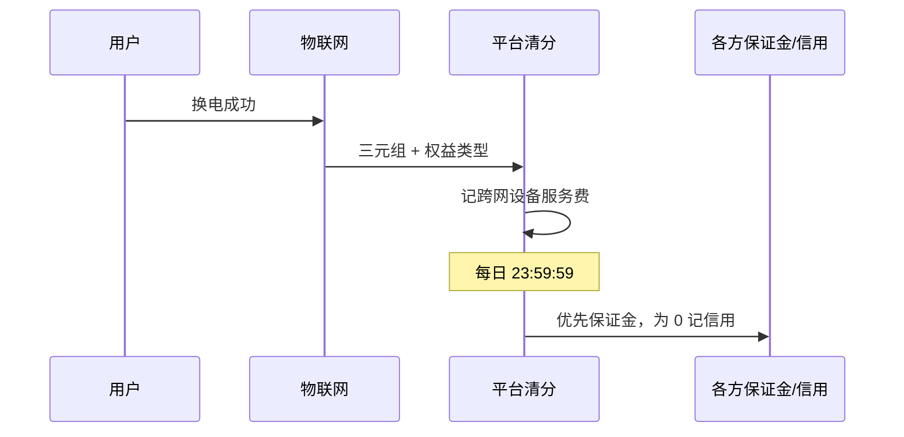

# 换电场景与运营商结算

> **这是什么**：骑手跨运营商换电时，柜机费、电池费谁付、平台怎么日清；以及个人用户与渠道人天在记账上的差别。  
> **依据**：[换电范围策略.md](./换电范围策略.md) · [天数池.md](./天数池.md) · [合作模式与分账.md](./合作模式与分账.md) · [运营商信用评估方案.md](./运营商信用评估方案.md) · 文末决策索引  
> **写法**：[业务文档写作规范](./业务文档写作规范.md)

---

## 业务设定

### 一句话

每次换电记清三件事：用户归谁、柜归谁、电池归谁。柜或电池不是「用户归属运营商」的，就产生跨网设备服务费——**一律经平台日清**，运营商之间不私下结；后台只看见「平台代收 / 平台代付」，看不见对手方。

### 两类用户

| | 个人套餐用户 | 渠道人天成员 |
|--|--------------|--------------|
| 权益从哪来 | 自己买的套餐 | 渠道池分配的人天 |
| 归属运营商 | 卖套餐、收钱的那家 | 卖人天额度的那家（一运营商一池） |
| 平台 1% | 购套餐支付成功时 | 确认消耗时，按标准人天价向额度售卖方计提 |
| 跨网 | 允许（受换电范围与信用停跨网约束） | **同样允许**；不因柜机是别家就拦截 |

渠道商不是运营商，不充当「用户归属」；只在渠道场景记渠道身份，用于扣池。

### 费用分层（互不替代）

| 层级 | 什么钱 | 谁付给谁 | 怎么走 |
|------|--------|----------|--------|
| 套餐 / 批发 | C 端实付或人天批发 | 用户→归属运营商；渠道→售卖方 | 支付通道 / 对公 |
| 跨网设备服务费 | 柜机费、电池费 | **归属运营商** → 柜主 / 电池主 | **平台保证金优先**，为 0 再记信用额度 |
| 平台技术服务费 | C 端 1% 或 B 端 1% | 归属运营商 → 平台 | 支付分账或确认消耗代扣 |
| 套餐应分 / 扣人天 | 收入确认或池 −1 | — | 与跨网费并行、分开记账 |

C 端套餐款、渠道批发款**不直接进**保证金/信用额度；保证金与信用专用于运营商间设备费及 B 端平台费调拨。

### 跨网费怎么算（每次换电成功）

平台统一定价（运营商只读，变更由平台发布）：

| 费用 | 条件 | 应付方 → 收款方 | 单价（暂定） |
|------|------|-----------------|--------------|
| 柜机使用费 | 柜主 ≠ 用户归属 | 归属运营商 → 柜主 | ¥0.5 / 次 |
| 电池使用费 | 电池主 ≠ 用户归属 | 归属运营商 → 电池主 | ¥0.1 / 次 |

两项独立判断：例如柜是自家、电池是别人，只付电池费。三方都不同时，归属方合计代付 ¥0.6/次。

### 平台怎么清分

1. 换电成功 → 记待调拨明细。  
2. **每天 23:59:59 日清**：优先从付款方**服务保证金**划扣；保证金为 0 才占用**信用额度**（允许欠费记账）。收款方优先入保证金，保证金为 0 再记信用。  
3. 周/月报表只是日账单汇总，不改日清事实。  
4. **信用额度也用光** → 自动关闭该运营商名下**全部用户**（个人 + 渠道）的**跨网换电**；本网换电不受影响。  
5. 运营商还可自关跨网（双向封闭），见 [换电范围策略.md](./换电范围策略.md)。本期**无**「主绑定站 / 跨站」用户限制。

### 场景要点（个人 vs 渠道同一跨网）

以「归属 Op1，在 Op2 柜换出 Op3 电池」为例：

| | 个人套餐 | 渠道人天 |
|--|----------|----------|
| 用户侧钱 | 已付给 Op1 套餐款 | 渠道已向 Op1 批发池 |
| 跨网费 | Op1 保证金（或信用）经平台代付 ¥0.5+¥0.1 | **相同** |
| 平台 1% | 购套餐时已分 | 确认消耗时 Op1 付 B 端 1% |
| 权益侧 | Op1 收入侧摊销 | Op1 侧渠道池确认 −1 人天 |

同网（归属=柜=电池）：无跨网费。

### 保证金怎么充

运营商财务对公转到平台清分专户 → 在「保证金账户」提交充值申请 → 平台「保证金管理」核对确认入账。平台可手工补录、调整信用上限；信用用尽后的停跨网由系统管控。

### 后台落在哪

| 模块 | 做什么 |
|------|--------|
| 换电订单 | 权益来源（个人套餐 / 渠道人天）、三方归属 |
| 运营商往来账 | 平台代收/代付明细（无对手方名称） |
| 保证金账户 / 保证金管理 | 充值申请与平台确认、账本 |
| 平台服务费 | C 端分账与 B 端消耗计提 |
| 渠道额度池 | 消耗与站点明细（渠道场景） |

### 已确认清单

- 电池费路径：归属运营商 → 电池主（经平台）。  
- B 端 1%：额度售卖方；基数=平台标准人天价（默认 ¥8.5，与批发价无关）。  
- 渠道成员允许跨网。  
- 扣款顺序：保证金 → 信用 → 停跨网。

---

## 实现附录（开发用）

> 业务读者可跳过。

### A. 三元组字段

| 字段 | 含义 |
|------|------|
| userOwner | 个人=套餐售卖方；渠道人天=额度售卖方 |
| cabinetOwner | 柜机 device_owner_id |
| batteryOwner | 换出电池 device_owner_id |
| entitlementType | 个人套餐 / 渠道人天 |
| channelId | 仅渠道成员 |
| cross_net_cabinet_fee / cross_net_battery_fee | 计费结果 |

### B. 日清时序（示意）

```mermaid
sequenceDiagram
  participant Rider as 用户
  participant IoT as 物联网
  participant Plat as 平台清分
  participant D as 各方保证金/信用

  Rider->>IoT: 换电成功
  IoT->>Plat: 三元组 + 权益类型
  Plat->>Plat: 记跨网设备服务费
  Note over Plat: 每日 23:59:59
  Plat->>D: 优先保证金，为 0 记信用
```

### C. 账户字段

depositBalance、creditLimit、creditUsed、creditAvailable；平台管控跨网开关；运营商自配跨网开关。ledger 记扣款来源与日清批次。充值单：金额、转账日、流水号、状态（待确认/已确认/已驳回）等。

### D. 决策索引

电池费 U→B · B 端 1% 主体与基数 · 统价 0.5/0.1 · 日清 · 渠道跨网允许 · 保证金优先信用 · 见相关决策与 PRD §5.6
