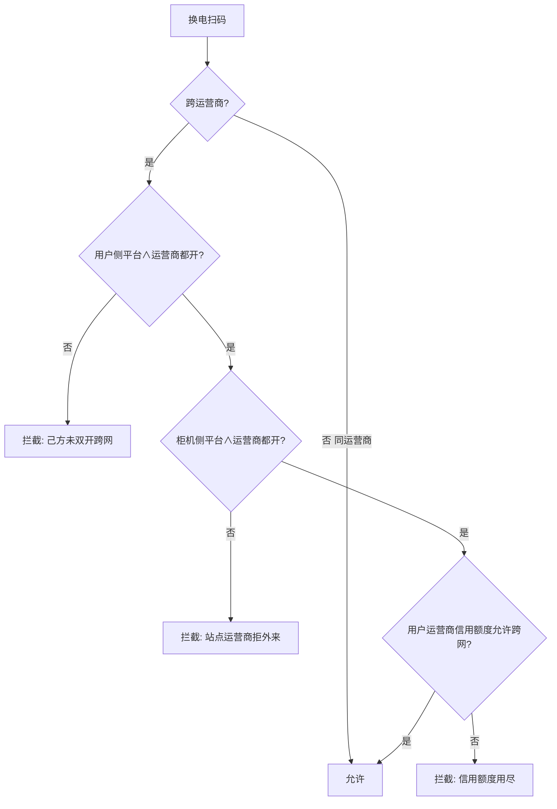

# 换电范围策略

> **这是什么**：运营商决定自己的用户**能不能去别的运营商柜子换电**，以及**别的运营商用户能不能来自己柜子换电**。  
> **本期不做**：给用户绑「主站点」或「只能在购套餐站换电」——**同一运营商下任意站点**都能购套餐、换电。  
> **叠加规则**：还要看平台「信用额度是否停跨网」，详见 [换电场景与运营商结算.md](./换电场景与运营商结算.md)。  
> **写法**：[业务文档写作规范](./业务文档写作规范.md)

---

## 业务设定

### 一句话

同运营商：想去哪站都行。跨运营商：该用户所属运营商、柜机所属运营商都必须 **平台开关 ∧ 运营商开关** 同时开着，且用户所属运营商没被信用停跨网。

### 两个概念

| 说法 | 含义 | 例子 |
|------|------|------|
| 同运营商换电 | 用户属于谁，柜子也是谁的 | 绿色出行用户在绿色出行任意站换电 |
| 跨网换电 | 用户所属运营商 ≠ 柜子所属运营商 | 绿色出行用户去陆家嘴运营商的柜子 |

用户「属于哪家运营商」：个人套餐看**卖套餐的那家**；渠道人天骑手看**卖额度的那家**。和扫码扫到哪一站**没有绑定关系**。

### 两个开关：平台 + 运营商（必须都开）

| 开关 | 谁配 | 默认 | 误触防护 |
|------|------|------|----------|
| **平台开关** | 平台管理员，按运营商 | **关闭**（新入网） | 详情里按钮 + 确认弹窗 |
| **运营商开关** | 运营商「平台设置 → 换电范围」 | **关闭** | 按钮 + 确认弹窗，**不用**即时勾选 |

**实际可跨网** = 平台开 **且** 运营商开。关任一端即 **双向封闭**：本网用户出不去，外人进不来。

同运营商内部：**没有**「跨站开关」，也**没有**主绑定站拦截。

### 扫码时怎么判（顺序）

1. 是不是跨运营商？  
   - **否** → 允许（同运营商任意站）。  
   - **是** → 继续。  
2. 用户所属运营商：平台开关与运营商开关是否都开？否 → 拦截（己方未双开）。  
3. 柜子所属运营商：平台开关与运营商开关是否都开？否 → 拦截（对方拒外来）。  
4. 用户所属运营商是否因**信用额度用尽**被停跨网？是 → 拦截。  
5. 以上都过 → 允许跨网换电。

### 和平台管控怎么叠

| 谁关的 | 什么情况 | 影响 |
|--------|----------|------|
| 运营商关本网开关 | 换电范围里确认关闭 | 双向：自己人出不去，外人进不来 |
| 平台关该运营商开关 | 运营商详情确认关闭 | 同上（即使运营商开关仍开） |
| 信用停跨网 | 保证金为 0 且信用额度用尽 | 只限制该运营商**自己用户出去**跨网（出站） |

### 后台与骑手端落位

| 端 | 位置 |
|----|------|
| 运营商后台 | 平台设置 → **换电范围**：看实际状态；用按钮+确认改本网开关（只读平台开关） |
| 平台后台 | 运营商管理 → 列表看实际/双开状态；**详情 → 跨网管控** 改平台开关（确认） |
| 骑手端 | 扫码被拦时提示原因 |

### 验收场景（白话）

| # | 场景 | 预期 |
|---|------|------|
| 1 | 本运营商用户，本运营商站点 A | 成功 |
| 2 | 本运营商用户，本运营商另一站点 B | 成功（同网任意站） |
| 3 | 本运营商用户去别家柜子，但本网或平台关了跨网 | 失败：己方未双开 |
| 4 | 别家用户来本运营商柜子，柜机侧未双开 | 失败：拒外来 |
| 5 | 本运营商用户去外地运营商，但被平台信用停跨网 | 失败：信用停跨网 |
| 6 | 渠道人天骑手跨网，两边都开跨网且信用允许 | 成功；跨网设备费由额度售卖方承担相关规则；渠道池按日扣人天 |

---

## 实现附录（开发用）

> 业务读者可跳过。

### A. 准入流程图

```mermaid
flowchart TD
  A[换电扫码] --> B{跨运营商?}
  B -->|否 同运营商| OK[允许]
  B -->|是| C{用户侧平台∧运营商都开?}
  C -->|否| X1[拦截: 己方未双开跨网]
  C -->|是| D{柜机侧平台∧运营商都开?}
  D -->|否| X2[拦截: 站点运营商拒外来]
  D -->|是| E{用户运营商信用额度允许跨网?}
  E -->|否| X3[拦截: 信用额度用尽]
  E -->|是| OK
```

### B. 字段与拦截原因

| 字段 | 说明 |
|------|------|
| 运营商 ID | 配置主体 |
| 平台是否允许跨网 | 平台按运营商配置，默认 false |
| 运营商是否允许跨网 | 运营商自配，默认 false；须确认后变更 |
| 实际可跨网 | 两开关都开；出站再叠加信用未停 |
| 柜机站点 / 柜机运营商 | 扫码事实，非用户绑定 |
| 用户归属运营商 | 售卖方 / 额度售卖方 |
| 拦截原因 | 见下表 |

| 拦截原因（建议枚举） | 含义 |
|----------------------|------|
| 用户侧未双开跨网 | 出站被拦 |
| 柜机侧未双开跨网 | 拒外来 |
| 信用额度停跨网 | 平台管控 |

**本期废弃（不用）**：跨站开关、用户主绑定站、仅主站可换 等旧字段。

### C. 关联文档

[换电场景与运营商结算.md](./换电场景与运营商结算.md)

### D. 修订记录

| 版本 | 说明 |
|------|------|
| 2.1 | 跨网须平台开关 ∧ 运营商开关；变更确认防误触（decision-111） |
| 2.0 | 取消用户绑定站点与跨站开关；同运营商任意站可购可换 |
| 1.x | 曾含主绑定站（已废）；渠道成员允许跨网 |
