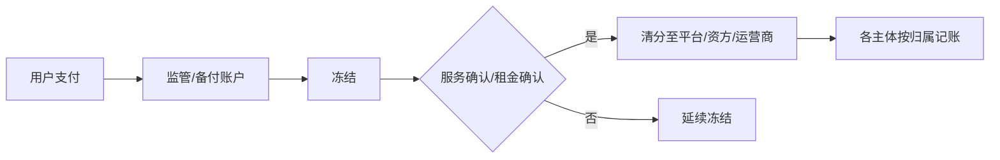

# 税筹与分账结构参考方案

> **状态**：参考方案（D22 待财务讨论）  
> **关联**：[2026-06-16会议对齐决议.md](./2026-06-16会议对齐决议.md) · [合作模式与分账.md](./合作模式与分账.md)

---

## 1. 背景与动机

会议提出：若 C 端 300 元套餐全额计入运营商营收，易快速突破**小规模纳税人 500 万**门槛，且进项抵扣受限（3% 浪费），综合税负上升。

**目标**：初期即将收入在合规前提下**拆分至合适主体**，降低运营商账面营收，优化税筹结构。

---

## 2. 现状架构 B（已落地原型）

| 环节 | 现状 |
|------|------|
| C 端收款 | 进**运营商**微信/支付宝子商户 |
| 平台 1% | 支付成功时实时分账至平台商户 |
| 运营商 99% | 支付成功时**实时清分**、可提现（决策 1B） |
| 收入确认 | 包月按日摊销（站点分析）；**不触发二次打款** |
| 退款 | **运营商子商户**统一原路退；平台 1% 不退 |
| 渠道 B2B | 采购时已结清；消耗仅计提 1% |

---

## 3. 会议目标模型（探索方向）

| 要点 | 说明 |
|------|------|
| 资金入口 | 可先入监管/备付，再按规则解冻清分 |
| 租金关联 | 平台确认租金偿还后，通知解冻相关份额 |
| 税筹 | 运营商仅确认**归属本主体**的部分为营收 |
| 与 D30/D36 关系 | 支付后**实时清分**至运营商可提现；已提现遇退款→待退款 |

---

## 4. 方案对比（供财务选型）

| 维度 | 架构 B（现状） | 监管冻结 + 拆分清分（目标） |
|------|----------------|----------------------------|
| 收款主体 | 运营商子商户 | 监管户或多主体合并收款 |
| 收入确认 | 按服务周期/日 | 确认后清分 + 各主体记账 |
| 运营商账面 | 全额预收 | 仅确认份额 |
| 实现复杂度 | 低（已 Mock） | 高（需通道+财务规则） |
| 税筹灵活性 | 低 | 高 |

---

## 5. 建议讨论议题（第二天上午 · 财务）

1. 一期是否必须上监管冻结，还是文档先标「目标态」、一期仍走架构 B + 实时清分？  
2. 平台 1%、资方租金、运营商经营各占哪条记账链路？（站点合伙人非本期）  
3. 小规模纳税人阈值与主体拆分边界（运营商 / 平台 / 资方 SPV？）  
4. 退款与已提现场景的税务与账务处理（对接 D36「待退款」）  

---

## 6. 产品侧下一步

- [ ] 财务会议输出主体拆分表  
- [ ] D13 二次确认后更新 PRD §清分  
- [ ] 多主体合并收款探索原型与架构 B 对照页  

---

## 7. 修订记录

| 版本 | 日期 | 说明 |
|------|------|------|
| 0.1 | 2026-06-16 | 初稿：会议税筹动机 + 现状/目标对照 |
