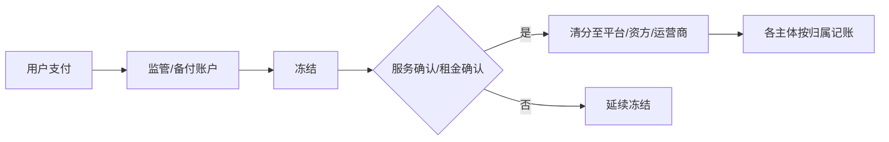

# 税筹与分账结构参考方案

> **这是什么**：讨论「套餐收入如何拆到合适主体、优化税筹」的**参考方案**，供财务选型；**不是**一期已上线规则。  
> **状态**：参考方案（待财务讨论）。  
> **关联**：[2026-06-16会议对齐决议.md](./2026-06-16会议对齐决议.md) · [合作模式与分账.md](./合作模式与分账.md) · [税收-待讨论.md](./税收-待讨论.md)  
> **写法**：[业务文档写作规范](./业务文档写作规范.md)

---

## 业务设定

### 一句话

一期资金流仍是「骑手付款进运营商子商户、平台抽 1%、实时清分」；本文描述会议提出的「先监管冻结、再按确认拆分清分」目标态，以及财务需要拍板的议题。

### 为什么要谈税筹

若一笔 300 元套餐全额算进运营商营收，容易很快碰到小规模纳税人约 500 万门槛，进项抵扣又受限，综合税负变高。目标是在**合规、有业务实质**的前提下，把收入拆到合适主体，降低运营商账面全额营收压力。

### 一期实际怎么走（架构 B · 已落地原型）

| 环节 | 怎么做 |
|------|--------|
| 骑手付款 | 进**运营商**微信 / 支付宝子商户 |
| 平台 1% | 支付成功时实时分到平台商户 |
| 运营商 99% | 支付成功时**实时清分**，可提现 |
| 收入确认 | 包月可按日摊销（站点分析用）；**不再二次打款** |
| 退款 | 从运营商子商户原路退；平台已分的 1% 不退套餐费对应规则见清分专文 |
| 渠道批发 | 采购时已结清；骑手消耗时只计提平台 1%，不再向运营商打采购款 |

### 会议想探索的目标态

用户支付 → 先进入监管 / 备付账户并冻结 → 服务确认（或租金确认）后 → 再清分到平台 / 资方 / 运营商 → 各主体按归属记账开票。

要点：运营商账面只确认「属于本主体」的那一份；与「支付后立刻可提现」的一期做法不同，复杂度更高（通道 + 财务规则）。

### 两种路径怎么比

| 维度 | 一期现状（架构 B） | 监管冻结 + 拆分清分（目标） |
|------|--------------------|----------------------------|
| 收款主体 | 运营商子商户 | 监管户或多主体合并收款 |
| 收入确认 | 按服务周期 / 日 | 确认后再清分 + 分主体记账 |
| 运营商账面 | 全额预收意味强 | 仅确认归属份额 |
| 实现复杂度 | 低（已 Mock） | 高 |
| 税筹灵活性 | 低 | 高 |

### 建议财务讨论什么

1. 一期是否必须上监管冻结，还是文档标「目标态」、一期继续架构 B？  
2. 平台 1%、资方租金、运营商经营各走哪条记账链路？（站点合伙人非本期重点）  
3. 小规模纳税人阈值与主体拆分边界（运营商 / 平台 / 资方 SPV 等）  
4. 退款与「已提现又退款」的税务与账务（对接「待退款」口径）

### 产品侧进度

- 一期原型：架构 B 单主体收款（运营商进件）——已完成。  
- 财务会议输出主体拆分表与税目映射 → 见 [税收-待讨论.md](./税收-待讨论.md)。  
- 二次确认后再更新 PRD 清分章节。

---

## 实现附录（开发用）

> 业务读者可跳过。

### A. 目标态示意

```mermaid
flowchart LR
  Pay[用户支付] --> Escrow[监管/备付账户]
  Escrow --> Freeze[冻结]
  Freeze --> Confirm{服务确认/租金确认}
  Confirm -->|是| Split[清分至平台/资方/运营商]
  Confirm -->|否| Hold[延续冻结]
  Split --> Tax[各主体按归属记账]
```

### B. 财务法务评审清单（待讨论）

| 项 | 说明 |
|----|------|
| 服务拆分基础 | 设备（柜/电池）、场地、电费、平台（软件/运维） |
| 税目映射 | 各基础对应 VAT 税目与开票主体 |
| 业务实质 | 拆分须有真实服务/合同，非纯税筹 |
| 实现路径 | 记账拆分 vs 多主体收款 vs 监管户（原「多法人合单」方案已撤出） |

### C. 修订记录

| 版本 | 日期 | 说明 |
|------|------|------|
| 0.3 | 2026-07-07 | 撤出 B+ 原型；收入拆分移入税收-待讨论 |
| 0.2 | 2026-07-06 | 曾落地 B+ 原型（已撤回） |
| 0.1 | 2026-06-16 | 初稿：会议税筹动机 + 现状/目标对照 |
| 0.4 | 2026-07-28 | 按 decision-088 分层改写 |
