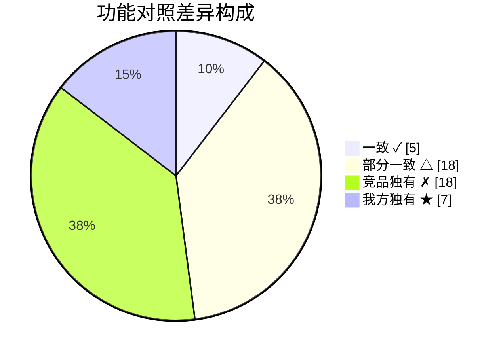
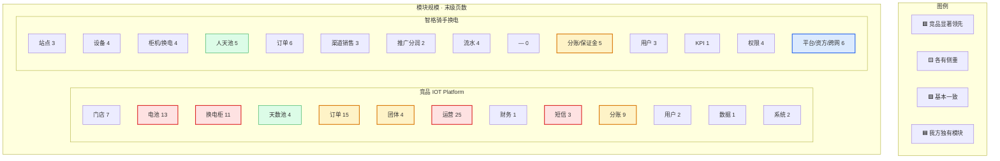
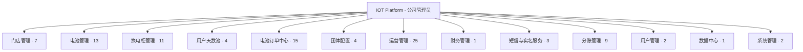

# 竞品功能清单

> **竞品系统**：[IOT Platform 运营后台](http://rltx.xtrunc.com/sw/login.html)（xtrunc / 锐联天下系）  
> **采样账号**：苏州军盛 · 角色「公司管理员」  
> **采样日期**：2026-06-23  
> **关联项目**：`原型/外卖/`（骑手换电 · 智格平台）  
> **对照文档**：[角色与功能清单.md](./角色与功能清单.md) · [PRD.md](./PRD.md) · [功能结构与业务流程.md](./功能结构与业务流程.md)  
> **说明**：我方「合作伙伴分润」已移出本期（见 [站点合伙人-待定.md](./站点合伙人-待定.md)）；下表竞品对比项仍保留历史对照。

---

## 1. 竞品概览

| 维度 | 竞品（IOT Platform） | 本项目（智格骑手换电） |
|------|---------------------|----------------------|
| 产品定位 | 电池租赁 + 换电柜 **单公司运营后台** | 多主体 **平台治理 + 运营商 + 渠道 + 资方** 四角色后台 |
| 角色模型 | 公司管理员 + 角色权限（单租户） | 平台管理员 / 运营商 / 渠道商 / 资金方 + 员工/合伙人 |
| 一级模块 | **13** | 按角色拆分，运营商约 **15+** 菜单域 |
| 末级功能页 | **97** | 原型已实现约 **80+** 功能点（四角色合计） |
| 技术形态 | Vue + iframe 多页；`/sw/` 路径 | 单页原型 Mock；架构 B 支付 |
| 渠道模式 | 团体商 + 天数池 + 渠道套餐 + 美团 SDK | 人天池 / 卡差价 / 设备租金池（三模式） |
| 跨网结算 | 分账配置 + 门店分账账户 | 跨运营商三元组 + 保证金/信用额度日清 |
| 资方租赁 | **无独立资方角色** | 资金方独立后台（协议/清单/租金收缴） |

**结论摘要**：竞品在 **单运营商日常运营**（营销、券、售后、批租、推广、报表）上功能更厚；本项目在 **多主体治理、跨网清分、资方租赁、渠道三模式** 上架构更完整。下文按模块逐项列出竞品能力，并在 §5 标注与我方差异。

> **交互对比图**：可在 Cursor 工作区打开 `canvases/competitor-feature-comparison.canvas.tsx`（默认筛选「仅不一致」项，行色高亮差异）。

---

## 2. 功能对比图（高亮不一致）

### 2.1 图例

| 标记 | 含义 | 高亮色 |
|------|------|--------|
| ✓ 一致 | 双方均有等价能力 | 绿色 |
| △ 部分一致 | 有重叠但能力深度或业务模型不同 | **黄色（不一致）** |
| ✗ 竞品独有 | 竞品有、我方暂无 | **红色（不一致）** |
| ★ 我方独有 | 我方有、竞品暂无 | **蓝色（不一致）** |

### 2.2 差异构成（48 项对照）

**不一致合计：43 项（89%）** — 一致仅 5 项（门店、租赁订单、支付记录、天数池、用户账户）。

### 2.3 一级模块并排对比

### 2.4 业务域差异热力（不一致项）

| 业务域 | 一致 | 部分一致 △ | 竞品独有 ✗ | 我方独有 ★ | **不一致小计** | 高亮结论 |
|--------|:----:|:----------:|:----------:|:----------:|:--------------:|----------|
| 资产与设备 | 0 | 3 | 5 | 1 | **9** | 竞品运维能力更全 |
| 站点与门店 | 1 | 2 | 2 | 0 | **4** | 竞品有合同与审计 |
| 订单与交易 | 2 | 4 | 4 | 0 | **8** | 竞品订单类型更多 |
| 天数池/渠道 | 1 | 3 | 1 | 0 | **4** | 概念对齐，规则我方更细 |
| 营销与运营 | 0 | 1 | 4 | 0 | **5** | **竞品全面领先** |
| 财务与分账 | 0 | 3 | 1 | 3 | **7** | **各取所长**（我方跨网/平台） |
| 用户与数据 | 1 | 2 | 1 | 0 | **3** | 竞品独立报表 |
| 系统与组织 | 0 | 1 | 0 | 3 | **4** | **我方架构独有** |

### 2.5 核心不一致清单（评审速览）

**竞品独有 ✗（我方缺失，按优先级）**

| P | 能力 | 竞品模块 |
|---|------|----------|
| P1 | 换电/电量统计、租赁报表 | 换电柜管理 · 数据中心 |
| P1 | 订单暂停/延期/换电审计 | 电池订单中心 |
| P2 | 营销活动 + 优惠券（12 页） | 运营管理 |
| P2 | 故障告警、ICCID、柜门清单 | 电池/换电柜管理 |
| P3 | 批租、以租代购、分时、售卖 | 订单中心 |
| P3 | 短信实名、保单、合同归档 | 增值模块 |

**我方独有 ★（竞品缺失）**

| 能力 | 我方模块 |
|------|----------|
| 多主体平台治理（设备绑定、渠道监管） | 平台管理员 |
| 跨运营商三元组 + 保证金/信用额度日清 | 运营商往来账 |
| 渠道三模式（人天池/卡差价/租金池） | 渠道销售 + 渠道商后台 |
| 资金方独立后台 | 资金方 |
| 平台 1% 技术服务费 + 人天标准日值 | 平台账户 / 统价 |
| 合作伙伴分润（B 端场地/员工） | 运营商 |

**部分一致 △（需对齐口径）**

| 竞品 | 我方 | 差异点 |
|------|------|--------|
| 换电群 / 柜群 | 换电范围开关 | 组织模型不同 |
| 用户天数池 | 人天额度池 | 我方 9 Tab + 预占确认规则 |
| 公司推广（C 端） | 合作伙伴分润（B 端） | 商业模型不同 |
| 分账配置（门店级） | 架构 B 支付分账 | 清分链路不同 |
| 美团 SDK | 卡差价模式 | 对接深度不同 |

---

## 3. 竞品功能结构图

---

## 4. 竞品功能清单（全量）

图例：**已实现** = 竞品菜单可见；页面内按钮级能力未逐页核实。

### 4.1 门店管理（7 页）

| 二级模块 | 功能页 | 页面路径 | 功能说明 |
|---------|--------|----------|----------|
| 门店管理 | 门店管理 | `new/siteinfo.html` | 门店 CRUD、基础信息 |
| | 合同管理 | `vue/contract_list.html` | 门店合同 |
| | 换电群管理 | `new/groupteam.html` | 换电群组配置 |
| 门店信息变动记录 | 门店变更记录 | `new/siteinfotransferhistory.html` | 门店信息修改历史 |
| | 电池定价修改记录 | `new/devicepricingpolicyhistory.html` | 定价策略变更 |
| | 换电群变更记录 | `new/groupchangehistory.html` | 换电群调整 |
| | 换电包记录 | `new/billelectricpackagehistory.html` | 换电套餐包记录 |

### 4.2 电池管理（13 页）

| 二级模块 | 功能页 | 页面路径 | 功能说明 |
|---------|--------|----------|----------|
| 电池信息管理 | 电池列表 | `new/deviceinfo.html` | 电池台账 |
| | 电池售后库存 | `new/devicemarketing.html` | 售后库存 |
| | 电池报废列表 | `new/invalidateinfo.html` | 报废电池 |
| | 电池地图 | `vue/loc_center.html` | 位置中心 / 地图 |
| 电池规格型号 | 电池规格型号 | `new/devicetype.html` | 型号管理 |
| | 电池规格型号定价 | `new/devicetypepolicy.html` | 型号级定价 |
| 物联网卡管理 | 物联网卡管理 | `new/iccidinfo.html` | ICCID 卡生命周期 |
| 售后管理 | 售后管理 | `new/deviceaftersalerequest.html` | 售后工单处理 |
| | 售后记录 | `new/siteaftersalelist.html` | 售后历史 |
| 电池信息变动记录 | ICCID 变动记录 | `new/iccidchangehistory.html` | 物联网卡变更 |
| | 电池调拨历史记录 | `new/deviceassettransferhistory.html` | 资产调拨 |
| | 型号定价历史 | `new/devicetypepolicyhistory.html` | 型号定价变更 |
| | 型号定价优惠记录 | `new/devicepricingpolicyhistory.html` | 优惠策略历史 |

### 4.3 换电柜管理（11 页）

| 二级模块 | 功能页 | 页面路径 | 功能说明 |
|---------|--------|----------|----------|
| 换电柜信息管理 | 换电柜列表 | `new/cabinetinfo.html` | 柜机台账 |
| | 柜门清单 | `new/cabinetinfodoor.html` | 柜门明细 |
| 换电柜定价 | 换电柜定价 | `new/deviceelectricpricing.html` | 换电价格 |
| 故障告警 | 故障告警 | `new/cabinetalarm.html` | 柜机告警 |
| 换电柜群管理 | 换电柜群管理 | `new/groupteamcabinet.html` | 柜机群组 |
| 换电群变更记录 | 换电群变更记录 | `new/groupchangehistory.html` | 换电群变更 |
| | 换电柜群变更记录 | `new/groupchangecabinethistory.html` | 柜群变更 |
| 电柜换电记录 | 电柜换电记录 | `new/cabinetservice.html` | 换电流水 |
| 换电统计信息 | 换电统计 | `vue/cabinet.html` | 换电次数等统计 |
| | 换电电量统计 | `vue/cabinet_power.html` | 电量统计 |
| 其他 | 未弹最高电量电池 | `new/cabinetmessage.html` | 异常电池提醒 |

### 4.4 用户天数池（4 页）

| 功能页 | 页面路径 | 功能说明 |
|--------|----------|----------|
| 用户天数池 | `new/groupdaypool.html` | 天数池账户 |
| 用户天数池订单 | `new/grouppoollist.html` | 天数池订单 |
| 天数池流水 | `new/groupdayflow.html` | 消耗/充值流水 |
| 天数池历史记录 | `new/groupdaypoolhistory.html` | 变更历史 |

### 4.5 电池订单中心（15 页）

| 二级模块 | 功能页 | 页面路径 | 功能说明 |
|---------|--------|----------|----------|
| 订单信息管理 | 电池租赁订单 | `new/billlist.html` | 租赁主订单 |
| | 电池售卖订单 | `new/devicesaledlist.html` | 售卖订单 |
| | 分时订单列表 | `new/billtimesharing.html` | 分时租赁 |
| | 以租代购订单列表 | `new/orderpayment.html` | 租购模式 |
| | 欠费订单 | `new/userarrearage_devlist.html` | 欠费管理 |
| | 订单首租电机柜 | `new/billlist_cab.html` | 首租关联柜机 |
| | 渠道套餐订单 | `vue/channel_package_bill.html` | 渠道套餐 |
| 单据信息管理 | 保单列表 | `new/insurancelist.html` | 保险单 |
| | 押金单列表 | `new/userdeposit.html` | 押金 |
| | 合同文件列表 | `vue/contract_filing.html` | 合同归档 |
| 用户支付记录 | 用户支付记录 | `new/usrcashpaymentbill.html` | 支付流水 |
| 订单信息变动记录 | 已租代购换电记录 | `new/orderpaymentdevicechghistory.html` | 租购换电 |
| | 订单暂停记录 | `new/billpause.html` | 暂停/恢复 |
| | 电池更换记录 | `new/billdevicechghistory.html` | 电池替换 |
| | 订单手动延期记录 | `new/billaccountchangerecord.html` | 手动延期 |

### 4.6 团体配置（4 页）

| 功能页 | 页面路径 | 功能说明 |
|--------|----------|----------|
| 团体商 | `new/channelpolicy.html` | 团体商主体与策略 |
| 团体减免配置 | `new/channeldiscountconfig.html` | 减免规则 |
| 团体配置更改历史 | `new/channelpolicyhistory.html` | 策略变更 |
| 团体减免配置历史 | `new/channeldiscountconfighistory.html` | 减免变更 |

### 4.7 运营管理（25 页）

| 二级模块 | 功能页 | 页面路径 | 功能说明 |
|---------|--------|----------|----------|
| 客服管理 | 客服电话 | `new/hotline.html` | 热线配置 |
| | 用户-故障报修 | `new/deviceerrorrpt.html` | 报修工单 |
| 营销活动 | 活动列表 | `vue/promoteInfo.html` | 活动配置 |
| | 活动参与列表 | `vue/promoteUser.html` | 参与记录 |
| | 活动券发放列表 | `vue/promoteList.html` | 券发放 |
| | 申领券审核列表 | `vue/promoteUserReward.html` | 申领审核 |
| | 推广关系列表 | `vue/promoteUserBind.html` | 推广绑定 |
| 优惠券 | 分时券 | `new/coupontime.html` | 分时券配置 |
| | 券池配置 | `vue/coupon_active.html` | 券池 |
| | 代金券 | `new/couponcash.html` | 代金券 |
| | 延期券 | `new/coupondeferred.html` | 延期券 |
| | 分时券用户 | `new/coupontimeuser.html` | 用户分时券 |
| | 代金券用户 | `new/couponcashuser.html` | 用户代金券 |
| | 延期券用户 | `new/coupondeferreduser.html` | 用户延期券 |
| 批租管理 | 批租管理 | `new/batchrentcontract.html` | B 端批量租赁 |
| | 电子对账 | `new/batchrentpayflow.html` | 批租对账 |
| 美团套餐(SDK) | SDK 信息列表 | `new/sdkinfochannelpackage.html` | 第三方渠道套餐 |
| | SDK 订单 | `new/meituansdkbillchannelpackage.html` | SDK 订单 |
| 公司推广 | 公司推广配置 | `new/userextconfig.html` | 推广规则 |
| | 推广员管理 | `new/userext.html` | 推广员 |
| | 推广关系列表 | `new/userextbind.html` | 推广绑定 |
| | 推广用户订单 | `new/userextbillflow.html` | 推广订单 |
| | 推广提现 | `new/userextwithdraw.html` | 推广提现 |
| 渠道套餐 | 套餐列表 | `vue/channel_package.html` | 渠道套餐配置 |
| 公告管理 | 公告管理 | `vue/sys_notice.html` | 系统公告 |

### 4.8 财务管理（1 页）

| 功能页 | 页面路径 | 功能说明 |
|--------|----------|----------|
| 订单记账 | `vue/bill_data.html` | 订单财务记账 |

### 4.9 短信与实名服务（3 页）

| 功能页 | 页面路径 | 功能说明 |
|--------|----------|----------|
| 账户总览 | `new/servicepackageaccount.html` | 短信/实名账户余额 |
| 服务使用明细 | `new/servicepackageconsumption.html` | 消耗明细 |
| 充值记录 | `new/servicepackagerecharge.html` | 充值历史 |

### 4.10 分账管理（9 页）

| 二级模块 | 功能页 | 页面路径 | 功能说明 |
|---------|--------|----------|----------|
| 分账配置 | 电池租赁分账配置 | `vue/profit_rent_config.html` | 租赁分账规则 |
| | 换电分账配置 | `vue/profit_cabinet_config.html` | 换电分账规则 |
| 分账记录 | 电池租赁待分账记录 | `vue/profit_rent_record_stay.html` | 待分账 |
| | 电池租赁分账记录 | `vue/profit_rent_record.html` | 已分账 |
| | 换电分账记录 | `vue/profit_site_electric_account.html` | 换电分账 |
| | 电柜管理费用记录 | `vue/profit_cabinet_manage_account.html` | 管理费 |
| | 电柜电表记录 | `vue/profit_cabinet_power_account.html` | 电表费用 |
| 门店分账账户 | 门店分账账户 | `vue/site_account.html` | 门店账户 |
| 公司审核 | 公司审核 | `vue/profit_withdraw_list.html` | 提现/分账审核 |

### 4.11 用户管理（2 页）

| 功能页 | 页面路径 | 功能说明 |
|--------|----------|----------|
| 用户账户管理 | `new/usrdata.html` | C 端用户档案 |
| 用户团体更改记录 | `new/userchannelchange.html` | 用户归属团体变更 |

### 4.12 数据中心（1 页）

| 功能页 | 页面路径 | 功能说明 |
|--------|----------|----------|
| 电池租赁信息报表 | `vue/statistics_rent.html` | 租赁统计报表 |

### 4.13 系统管理（2 页）

| 功能页 | 页面路径 | 功能说明 |
|--------|----------|----------|
| 管理员列表 | `new/user.html` | 后台账号 |
| 角色管理 | `vue/sysrole.html` | 角色与菜单权限 |

---

## 5. 与我方功能对照矩阵

> 对照基准：[角色与功能清单.md](./角色与功能清单.md) 四角色能力。  
> 符号：**✓** 我方已有（原型/文档） · **△** 部分覆盖 · **✗** 我方暂无 · **★** 我方独有

### 5.1 资产与设备

| 竞品功能 | 我方对应 | 差异说明 |
|---------|---------|----------|
| 电池列表 / 换电柜列表 | 运营商「我的设备」· 平台「设备管理」 | ✓ 竞品含型号定价、报废、地图；我方强调平台绑定与跨主体权属 |
| 电池规格型号 + 定价 | — | ✗ 我方 C 端按套餐定价，无独立型号定价体系 |
| 物联网卡 ICCID 管理 | — | ✗ 我方 IoT 由智格平台承担，后台未暴露 |
| 电池售后 / 报废 | — | ✗ 非本期 |
| 电池地图 / 位置中心 | — | ✗ 非本期 |
| 柜门清单 / 故障告警 | 换电柜在线状态（Mock） | △ 竞品更细 |
| 换电统计 / 电量统计 | 运营商总览 KPI | △ 竞品有独立统计页 |
| 未弹最高电量电池 | — | ✗ |
| 平台设备批量导入 / 待绑定 | 平台管理员「设备管理」 | ★ 我方独有 |

### 5.2 站点与门店

| 竞品功能 | 我方对应 | 差异说明 |
|---------|---------|----------|
| 门店管理 | 运营商「站点」 | ✓ 基础 CRUD 对齐 |
| 合同管理 | — | ✗ 非本期 |
| 换电群 / 换电柜群 | 换电范围策略（跨网/跨站） | △ 竞品用「群」组织；我方用运营商级开关 + 站点 |
| 门店/换电群变更记录 | — | ✗ 审计类，可借鉴 |
| 换电柜定价 | 个人套餐定价 + 跨网统价 | △ 竞品单租户内定价；我方分 C 端零售价与跨网设备费 |

### 5.3 订单与交易

| 竞品功能 | 我方对应 | 差异说明 |
|---------|---------|----------|
| 电池租赁订单 | 套餐购买订单 | ✓ |
| 电池售卖订单 | — | ✗ 我方聚焦换电租赁 |
| 分时订单 | — | ✗ |
| 以租代购 | — | ✗ |
| 欠费订单 | 服务冻结 / 欠费停预占 | △ |
| 渠道套餐订单 | 渠道商 B2B + 三模式 | △ 竞品单一「渠道套餐」；我方三模式更细 |
| 保单 / 押金单 | — | △ 押金在渠道信用方案中，无独立保单 |
| 合同文件列表 | — | ✗ |
| 订单暂停 / 电池更换 / 手动延期 | 服务冻结 / 中途完结 | △ 我方有冻结完结；竞品延期/换电记录更细 |
| 用户支付记录 | 流水管理 · 用户支付 | ✓ |

### 5.4 天数池 / 团体 / 渠道

| 竞品功能 | 我方对应 | 差异说明 |
|---------|---------|----------|
| 用户天数池（4 页） | 渠道商人天额度池 · 天数池.md | ✓ 概念对齐；我方 9 Tab 更细（团队/预占/规则） |
| 团体商 + 团体减免 | 渠道销售 · 签约渠道商 | △ 竞品「团体减免」独立模块；我方在签约与三模式中体现 |
| 美团 SDK 套餐 | 卡差价模式（美团骑士卡演示） | △ 竞品有 SDK 对接页；我方 Mock 三模式 |
| 批租管理 + 电子对账 | — | ✗ B 端批量租赁，可评估是否纳入渠道扩展 |
| 渠道套餐列表 | 渠道销售 · 三模式签约 | △ |

### 5.5 营销与运营

| 竞品功能 | 我方对应 | 差异说明 |
|---------|---------|----------|
| 营销活动（5 页） | — | ✗ 活动/券发放/申领审核，竞品完整 |
| 优惠券（7 页：分时/代金/延期） | — | ✗ 非本期 |
| 公司推广（5 页） | 合作伙伴分润 ★ | △ 竞品 C 端推广体系；我方 B 端合伙人分润 |
| 客服电话 / 故障报修 | — | ✗ |
| 公告管理 | — | ✗ |

### 5.6 财务与分账

| 竞品功能 | 我方对应 | 差异说明 |
|---------|---------|----------|
| 分账配置（租赁/换电） | 合作模式与分账 · 架构 B | △ 竞品门店级分账；我方支付通道分账 + 应分/打款 |
| 分账记录（5 类） | 我的流水 · 清分明细/提现明细 | △ |
| 门店分账账户 / 公司审核 | 合作伙伴提现 · 收款账户 | △ |
| 订单记账 | — | ✗ 独立财务记账页 |
| 跨运营商往来账 | 运营商往来账 ★ | ★ 我方跨主体日清 + 保证金/信用额度 |
| 平台 1% 技术服务费 | 平台提成 · 平台账户 ★ | ★ 我方多主体平台治理 |
| 保证金管理（对公充值/信用额度） | 服务保证金账户 ★ | ★ 我方档位评估 + 跨网关闭规则 |

### 5.7 用户与数据

| 竞品功能 | 我方对应 | 差异说明 |
|---------|---------|----------|
| 用户账户管理 | 平台用户管理 · 运营商骑手档案 | ✓ 我方多角色视角更全 |
| 用户团体更改记录 | 用户渠道归属 | △ |
| 电池租赁信息报表 | 平台/运营商总览 KPI | △ 竞品独立报表；我方 KPI 在总览 |
| 短信与实名服务（3 页） | — | ✗ 增值能力 |

### 5.8 系统与组织

| 竞品功能 | 我方对应 | 差异说明 |
|---------|---------|----------|
| 管理员 / 角色管理 | 各角色员工登录 + 权限 | △ 竞品单公司 RBAC；我方多 entityId 隔离 |
| 资金方 / 租赁协议 | 资金方后台 ★ | ★ 我方独有完整资方模块 |
| 运营商治理 / 渠道监管 | 平台管理员 ★ | ★ 我方独有 |
| 跨网统一定价 | 跨网设备服务费 ★ | ★ 平台级管控 |

---

## 6. 差异汇总

### 6.1 竞品显著强于我方（可借鉴）

| 优先级 | 能力域 | 竞品模块 | 建议 |
|--------|--------|----------|------|
| P1 | 数据统计 | 换电统计、电量统计、租赁报表 | 纳入「数据面板」或运营商总览二期 |
| P1 | 订单运营 | 欠费订单、订单暂停/延期/换电记录 | 补齐订单生命周期审计 Tab |
| P2 | 营销拉新 | 活动、优惠券、推广提现 | 评估是否由运营商自营或平台统一 |
| P2 | 设备运维 | 故障告警、柜门清单、ICCID | IoT 侧能力，后台可做只读展示 |
| P3 | B 端扩展 | 批租管理、以租代购、分时租赁 | 视商务是否需要 |
| P3 | 增值 | 短信实名、保单、合同归档 | 非核心换电链路 |

### 6.2 我方显著强于竞品（差异化）

| 能力域 | 说明 |
|--------|------|
| 多主体平台治理 | 平台管理员统管全网运营商/渠道/设备绑定 |
| 跨运营商清分 | 三元组 + 日清 + 保证金/信用额度 + 跨网关闭 |
| 渠道三模式 | 人天池 / 卡差价 / 设备租金池，规则文档完整 |
| 资金方独立后台 | 协议、设备清单、租金收缴、对公工单 |
| 合作伙伴分润 | 场地/员工分润 + 提现（竞品为 C 端推广体系） |
| 人天标准日值 | 平台统一 B 端计提基数，与批发价解耦 |
| 渠道信用评估 | 押金抵扣、档位、准入（竞品未见同等机制） |

### 6.3 概念映射表（便于评审沟通）

| 竞品术语 | 我方术语 |
|---------|---------|
| 门店 | 站点 |
| 换电群 / 换电柜群 | 换电范围（跨网/跨站） |
| 用户天数池 | 人天额度池 |
| 团体商 | 渠道商 |
| 团体减免 | 渠道签约策略 / 三模式规则 |
| 渠道套餐 | 渠道 B2B 订单（PO/CO/RO） |
| 分账配置 | 架构 B 分账 + 应分/打款 |
| 公司推广 | 合作伙伴分润（不同商业模型） |
| 美团 SDK | 卡差价模式（美团骑士卡） |

---

## 7. 模块规模对比

| 一级模块 | 竞品页数 | 我方主要对应（角色） |
|---------|---------|-------------------|
| 门店管理 | 7 | 运营商·站点 |
| 电池管理 | 13 | 平台·设备 / 运营商·我的设备 |
| 换电柜管理 | 11 | 运营商·我的设备 / 换电订单 |
| 用户天数池 | 4 | 渠道商·人天额度池 |
| 电池订单中心 | 15 | 平台·订单 / 运营商·我的订单 |
| 团体配置 | 4 | 运营商·渠道销售 |
| 运营管理 | 25 | 部分→合作伙伴分润；其余 ✗ |
| 财务管理 | 1 | 运营商·我的流水 |
| 短信与实名 | 3 | ✗ |
| 分账管理 | 9 | 合作模式与分账 / 流水 |
| 用户管理 | 2 | 平台·用户 / 运营商·骑手 |
| 数据中心 | 1 | 总览 KPI（待加强） |
| 系统管理 | 2 | 员工权限 |
| — | — | **★ 平台治理 / 资方 / 跨网结算**（竞品无） |

---

## 8. 采样说明与局限

1. **单租户视角**：采样账号为「苏州军盛 · 公司管理员」，未见平台超管、渠道商独立登录、资方登录菜单；竞品可能另有更高权限账号。
2. **菜单级梳理**：仅基于 `sys/menu/user` 接口与页面路径，未逐页核实字段、按钮与业务规则。
3. **版本时点**：2026-06-23 在线版本；竞品迭代后菜单可能变化。
4. **安全**：采样所用账号密码已在沟通中出现，**建议尽快修改**。

---

## 9. 关联文档

| 文档 | 用途 |
|------|------|
| [角色与功能清单.md](./角色与功能清单.md) | 我方四角色功能基准 |
| [额度池PRD差异清单.md](./额度池PRD差异清单.md) | 外部 PRD 与我方差异（天数池专篇） |
| [PRD.md](./PRD.md) | 产品主文档 |
| [功能结构与业务流程.md](./功能结构与业务流程.md) | 我方功能结构 Mermaid |
