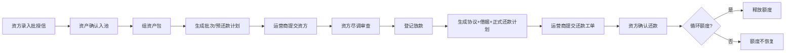

# 融资管理 · 产品需求说明

> 版本 1.2 · 2026-07-03  
> 关联原型：`prototype/index.html` · 运营商 **融资管理** · 资方 **放款申请**  
> 设计参考：两轮换电资产融资租赁管理系统（fuzzy-guide 2026-05-29）

---

## 1. 背景与定位

运营商以换电资产运营并收取服务收入，设备采购需大量资金。运营商向融资租赁方（设备租赁公司）申请**资产融资放款**，并跟踪**协议、借据与还款**。

**首期定位**：内部融资台账，替代 Excel 与人工追踪；批授信由资方**线下完成后在系统录入**；资方侧完成**尽调审查、登记放款、还款确认**（Mock 演示）。

**明确排除（I6-4）**：ERP / 运营系统自动对接、银行流水自动核销、资产池 Excel 批量导入（首期）、发票与总账。

**架构决策（2026-07-03）**：融资协作以 **授信 → 资产包 → 放款批次 → 协议 → 借据 → 还款计划** 为主链路；移除原「设备直租」菜单（月租金 / 租金收缴），协议作为融资场景下的独立实体，**非**直租菜单复用。

---

## 2. 系统架构

| 参与方 | 系统入口 | 核心对象 |
|--------|----------|----------|
| **运营商** | **融资管理** | 主体授信（只读）、授信项目、资产池、资产包、放款批次、协议（只读）、还款日历、还款工单 |
| **设备租赁公司（资方）** | **放款申请** | 批授信录入（Mock）、尽调审查、**登记放款**、还款工单确认 |
| **平台管理员** | 租赁公司绑定 | 建立「租赁公司 ↔ 运营商」关系 |

### 2.1 对象层级

```text
运营商主体级总授信（资方录入，对应该资方）
  └── 授信项目（可多个，共享主体额度池）
        └── 放款批次（同月可多批）
              └── 协议（一批次一协议：协议号 + 设备清单 + 一份还款计划）
                    └── 借据
                          └── 正式还款计划 → 还款工单 → 资方确认
```

---

## 3. 角色与菜单

| 角色 | 菜单 | 能力 |
|------|------|------|
| **运营商** | 融资管理 | 工作台、资产包、融资台账、授信项目、资产池、还款日历；组包、提交申请、**提交还款工单** |
| **设备租赁公司（资方）** | 放款申请 | **录入/维护主体授信**（Mock）、尽调审查、**登记放款**（唯一入口）、确认还款工单 |
| **平台管理员** | — | 资方/运营商主体绑定 |

---

## 4. 核心对象与状态

### 4.1 运营商主体级总授信（Operator Credit）

- **由资方录入**（线下批授信完成后），非运营商自助申请。
- 字段：运营商、资方、**授信总额**、**已占用**（已放款）、**拟占用/已申请**（已提交待审 + 尽调通过待登记放款）、**可用**、是否**循环额度**、批授信日期、备注。
- 口径：**总额 = 可用 + 已占用 + 拟占用**。
- **默认非循环**；资方可配置为循环额度。
- **循环额度**：借据对应还款全部确认后，**释放**已占用至可用；再次提款**无需重新批授信**，但须重新组资产包并走尽调。
- **非循环额度**：还款不释放额度。

### 4.2 授信项目（Finance Project）

- 挂在资方 + 运营商下，字段：项目名称、单台参考融资额、基础放款条件、项目状态。
- 项目额度为**主体授信的子视图/分摊**；工作台与授信 Tab 展示主体级汇总。

### 4.3 资产包（Asset Package）

- 融资前须先**配置资产包**：从可融资池勾选设备，互斥占用（同一 SN 不可重复入包）。
- 字段：包编号、名称、授信项目、设备 SN 列表、参考融资金额、状态、关联批次。
- 状态：草稿 → 已生成批次 → 已提交 → 已放款 / 已作废。
- **首期不做** Excel 导入与标签；资产手工确认入池。

### 4.4 可融资资产（Asset）

| 状态 | 说明 |
|------|------|
| 可融资 | 人工确认，可加入资产包 |
| 包内占选 | 已被草稿资产包占用 |
| 申请锁定 | 已提交资方、尽调中 |
| 已融资 | 已绑定协议/借据 |
| 已替换 | 曾为标的物，坏件已换新 SN |
| 异常 | 故障/丢失/资方不认可 |

**资产替换**（融资资产池内操作）：对已融资或包内设备，登记故障 SN → 新 SN；旧资产标「已替换」，新资产继承关联关系（演示）。

### 4.5 放款申请批次（Drawdown Application）

组织维度：资方 + 授信项目 + **申请月份** + **批次号**。

| 状态 | 运营商 | 资方 | 额度 | 资产 |
|------|--------|------|------|------|
| 草稿 | 维护资产包/预还款计划 | — | 不占用 | 可增删 |
| 已提交资方 | 只读 | **尽调审查** | **拟占用** | 申请锁定 |
| 尽调通过 | 只读 | **登记放款** | **拟占用** | 锁定 |
| 已驳回 | 可退回修改 | — | 释放拟占用 | 释放 |
| 已放款 | 还款 | — | 转已占用 | 已融资 |

### 4.6 协议（Finance Agreement）

- **独立实体**：协议号、运营商、资方、授信项目、关联批次、**设备清单（SN 列表）**、**一份正式还款计划**、借据编号、状态。
- **一批次一协议**；一个授信项下可有**多个**放款批次/协议/借据。
- 由资方 **登记放款** 时自动生成并绑定，此前批次内容均可修改。

### 4.7 预还款计划 / 正式还款计划

- **预还款计划**：批次下、登记放款前；尽调时可审查。
- **正式还款计划**：登记放款后固化，绑定协议与借据；进入还款日历。

### 4.8 借据（Loan Note）

登记放款时录入：借据编号、实际放款金额、放款日、起租日、期限、合同编号等。

### 4.9 还款工单（Repayment Ticket）

- 运营商对某期应还**提交还款工单**（金额、付款方式、凭证备注）；支持**部分还款**。
- 资方在「放款申请」页**确认**后计入实还；循环额度项目在借据**全部还清**后触发额度释放。

---

## 5. 关键流程



**流程步骤对照**：批授信（录入）→ 传资产（入池/组包）→ 提交申请 → **尽调**（非竞标）→ 等待登记放款 → 登记放款 → 还款。

---

## 6. 页面结构（运营商 · 融资管理）

| Tab | 内容 |
|-----|------|
| 工作台 | KPI：待还、逾期、拟占用、主体授信占用；待办跳转 |
| 资产包 | 新建/编辑、选 SN、生成批次 |
| 融资台账 | 批次列表与register详情；草稿→提交资方 |
| 授信项目 | **主体级**总额/已占用/拟占用/可用、循环类型；下属项目列表 |
| 资产池 | 融资状态筛选；**资产替换**入口 |
| 还款日历 | 应还列表；**提交还款工单**（非直接入账） |

---

## 7. 页面结构（资方 · 放款申请）

| 区域 | 内容 |
|------|------|
| 主体授信 | 录入/查看运营商总授信（Mock） |
| 待尽调 | 已提交批次 → **尽调通过/驳回** |
| 待登记放款 | 尽调通过批次 → **登记放款**（唯一按钮，绑定协议+借据+计划） |
| 还款工单 | 待确认工单列表 → 确认部分/全额 |

---

## 8. 违约金参考规则（首期文档约定，系统暂不自动计提）

> 供合同条款与二期算法参考；首期还款日历仅标记「逾期」，不自动算罚息。

| 规则项 | 建议值 | 说明 |
|--------|--------|------|
| 宽限期 | **3 个自然日** | 应还日后 3 日内不计违约金 |
| 计息基数 | 当期**未还本金 + 未还租金**合计 | 不含已确认还款部分 |
| 日违约金率 | **0.05%/日**（万分之五） | 或合同约定：年化 18% ÷ 360 |
| 计算公式 | `违约金 = 计息基数 × 0.05% × 逾期天数` | 宽限期后第 1 天起算 |
| 上限 | 累计违约金不超过**当期应还总额的 24%** | 避免复利失控 |
| 触发 | 资方确认逾期后手工登记或二期自动 | 首期原型仅「逾期」状态 |

**示例**：当期应还 ¥10,500，宽限期后逾期 10 天 → 违约金 = 10,500 × 0.05% × 10 = **¥52.50**（未达上限）。

---

## 9. Mock 演示数据（绿色出行 OP-SX）

| 对象 | 示例 |
|------|------|
| 资方 | 华东设备租赁 `LEASE-HD` |
| 主体授信 | OP-SX · 总额 500 万 · **非循环**（Mock 可切换循环演示） |
| 授信项目 | 绿色出行换电资产融资项目 |
| 待尽调 | `FDA-2606-01` · 已提交资方 |
| 待登记放款 | `FDA-2605-02` · 尽调通过 |
| 已放款 | `FDA-2603-01` · 协议 `FLA-202603` · 借据 `LN-2603-01` · 第 3 期逾期 |
| 还款工单 | `RT-2606-01` · 待资方确认 |

---

## 10. 权限（首期）

- 运营商：`finance.view` · 不可登记放款。
- 资方：`finance.drawdown` · 尽调、登记放款、还款确认。

---

## 11. 验收要点

见 [acceptance-criteria.md](./acceptance-criteria.md) § 融资管理、§ 放款申请。

---

## 修订记录

| 版本 | 日期 | 说明 |
|------|------|------|
| 1.2 | 2026-07-03 | 协议实体；尽调替代竞标；主体级授信；拟占用口径；默认非循环+释放；资产包入 PRD；登记放款仅资方；还款工单；违约金参考规则 |
| 1.1 | 2026-07-02 | 移除设备直租双轨 |
| 1.0 | 2026-07-02 | 首期融资台账 |
