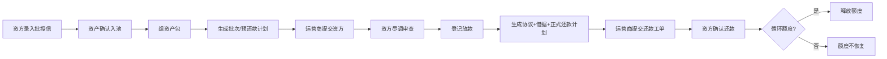

# 融资管理 · 产品需求说明

> **这是什么**：运营商用换电柜/电池向设备租赁公司申请**资产融资放款**，并在系统里跟踪授信、资产包、借据与还款——整模块属**二期**。  
> **依据/关联**：decision-003 / 056 / 061（文末索引）· 原型：运营商「融资管理」、资方「放款申请」· [acceptance-criteria.md](./acceptance-criteria.md)  
> **写法**：[业务文档写作规范](./业务文档写作规范.md)

---

## 业务设定

### 一句话

二期内部融资台账：资方线下批完授信后录入系统；运营商组资产包申请放款；资方尽调、登记放款；运营商提交还款工单，资方确认。不做银行自动核销、ERP 对接。

### 交付范围

| 项 | 说明 |
|----|------|
| 公司一期 | **不交付**本模块；提现里「本月融资待还」扣减也属二期 |
| 原型 | 可浏览并标「二期」 |
| 本文「首期」 | 指融资产品自身的 MVP 边界（相对 Excel），不是公司一期上线范围 |

### 谁登录、干什么

| 参与方 | 后台入口 | 干什么 |
|--------|----------|--------|
| 运营商 | 融资管理 | 看授信占用、组资产包、提放款申请、提还款工单、看还款日历 |
| 设备租赁公司（资方） | 放款申请 | 录入主体授信、尽调通过/驳回、登记放款、确认还款工单 |
| 平台管理员 | 租赁公司绑定 | 建立「资方 ↔ 运营商」关系 |

### 主链路（白话）

1. 平台绑好资方与运营商。  
2. 资方录入该运营商的**主体总授信**（总额、是否循环等）。  
3. 运营商把可融资设备**确认入池**，勾选组成**资产包**，生成放款批次与预还款计划，提交资方。  
4. 资方**尽调**：通过则进入「待登记放款」；驳回则释放拟占用额度，运营商可改再提。  
5. 资方**登记放款**（唯一入口）：生成协议、借据、正式还款计划；额度从「拟占用」转「已占用」。  
6. 运营商按期**提交还款工单**（可部分还）；资方确认后计入实还。若是循环额度且整笔借据还清 → 释放已占用回可用。

### 授信怎么理解

- 由资方录入，不是运营商自助申请。  
- **总额 = 可用 + 已占用 + 拟占用**。  
- **默认非循环**：还完也不释放额度。  
- **循环额度**：借据全部确认还清后，已占用回到可用；再借仍要重新组包、走尽调，但不必重新批授信。

### 资产与批次状态（白话）

| 资产状态 | 含义 |
|----------|------|
| 可融资 | 可进资产包 |
| 包内占选 | 已被草稿包占用（同一设备号不可重复入包） |
| 申请锁定 | 已提交资方、尽调中 |
| 已融资 | 已绑协议/借据 |
| 已替换 | 坏件换新设备号，新件继承关联 |
| 异常 | 故障/丢失/资方不认可 |

| 批次状态 | 运营商 | 资方 | 额度 |
|----------|--------|------|------|
| 草稿 | 可改包与计划 | — | 不占用 |
| 已提交 | 只读 | 尽调 | 拟占用 |
| 尽调通过 | 只读 | 登记放款 | 拟占用 |
| 已驳回 | 可改再提 | — | 释放拟占用 |
| 已放款 | 还款 | — | 转已占用 |

一批次对应一份协议、一份正式还款计划。同月可多批。

### 运营商菜单（融资管理）

| 页签 | 内容 |
|------|------|
| 工作台 | 待还、逾期、拟占用、主体授信占用；待办跳转 |
| 资产包 | 新建/编辑、选设备、生成批次 |
| 融资台账 | 批次列表与详情；草稿→提交 |
| 授信项目 | 主体级总额/已占用/拟占用/可用；下属项目 |
| 资产池 | 按融资状态筛；资产替换 |
| 还款日历 | 应还列表；提交还款工单（不是直接入账） |

### 资方菜单（放款申请）

| 区域 | 内容 |
|------|------|
| 主体授信 | 录入/查看运营商总授信 |
| 待尽调 | 通过 / 驳回 |
| 待登记放款 | 登记放款（唯一按钮） |
| 还款工单 | 确认部分/全额 |

### 明确不做

- ERP / 运营系统自动对接  
- 银行流水自动核销  
- 资产池 Excel 批量导入（融资产品首期）  
- 发票与总账  
- 原「设备直租」菜单（月租金 / 租金收缴）已移除；协议只存在于融资链路  
- 运营商「我的设备」不再打开租赁协议抽屉；权属展示为「融资」，入口并入本模块（二期）  
- 渠道「设备租赁 / 白名单」是另一套渠道能力，与本模块融资不同

### 违约金（文档约定，系统暂不自动算）

宽限期 3 个自然日；之后按未还本金+未还租金 × 日万分之五计；累计违约金上限为当期应还的 24%。首期原型只标「逾期」，不自动罚息。

### 验收

细则见 [acceptance-criteria.md](./acceptance-criteria.md) 中融资管理、放款申请相关条目。

---

## 实现附录（开发用）

> 业务读者可跳过。

### A. 对象层级

```text
运营商主体级总授信（资方录入）
  └── 授信项目（可多个，共享主体额度池）
        └── 放款批次
              └── 协议（一批次一协议：协议号 + 设备清单 + 还款计划）
                    └── 借据
                          └── 正式还款计划 → 还款工单 → 资方确认
```

### B. 流程图


```mermaid
flowchart LR
  A[资方录入批授信] --> B[资产确认入池]
  B --> C[组资产包]
  C --> D[生成批次/预还款计划]
  D --> E[运营商提交资方]
  E --> F[资方尽调审查]
  F --> G[登记放款]
  G --> H[生成协议+借据+正式还款计划]
  H --> I[运营商提交还款工单]
  I --> J[资方确认还款]
  J --> K{循环额度?}
  K -->|是| L[释放额度]
  K -->|否| M[额度不恢复]
```

### C. 违约金参考公式

`违约金 = 计息基数 × 0.05% × 逾期天数`（宽限期后第 1 天起算）。  
示例：应还 ¥10,500，宽限期后逾期 10 天 → ¥52.50。

### D. Mock 演示（绿色出行）

| 对象 | 示例 |
|------|------|
| 资方 | 华东设备租赁 `LEASE-HD` |
| 主体授信 | 总额 500 万 · 非循环（可切循环演示） |
| 待尽调 | `FDA-2606-01` |
| 待登记放款 | `FDA-2605-02` |
| 已放款 | `FDA-2603-01` · 协议 `FLA-202603` · 借据 `LN-2603-01` · 第 3 期逾期 |
| 还款工单 | `RT-2606-01` · 待资方确认 |

### E. 权限

| 角色 | 权限 |
|------|------|
| 运营商 | `finance.view`；不可登记放款 |
| 资方 | `finance.drawdown`；尽调、登记放款、还款确认 |

### F. 决策索引

| 决策 | 要点 |
|------|------|
| decision-003 | 整链二期 |
| decision-056 | 取消设备侧租赁协议产品面；权属「融资」入口并入本模块 |
| decision-061 | 提现侧融资待还预留亦二期 |

### G. 修订记录

| 版本 | 日期 | 说明 |
|------|------|------|
| 1.4 | 2026-07-22 | 对齐 decision-056/061；二期范围 |
| 1.2 | 2026-07-03 | 协议实体；尽调；主体授信；还款工单；违约金参考 |
| 1.1 | 2026-07-02 | 移除设备直租双轨 |
| 1.0 | 2026-07-02 | 首期融资台账 |
