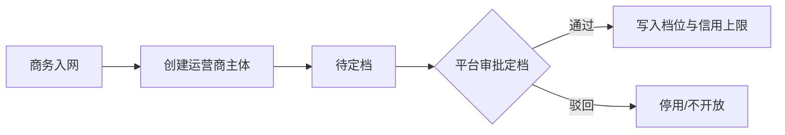

# 运营商信用评估方案

> **这是什么**：运营商**入网定档**用的政策包（最低保证金、信用封顶、跨网默认）——给招商与融资参考，**不是**渠道押金信用，也**不限制**可签渠道家数。  
> **依据**：需求评审方案 B · [换电场景与运营商结算.md](./换电场景与运营商结算.md) · [渠道信用评估方案.md](./渠道信用评估方案.md) · 文末决策索引  
> **写法**：[业务文档写作规范](./业务文档写作规范.md)

---

## 业务设定

### 一句话

平台给运营商定 A/B/C/D 档；档位决定建议最低保证金、信用额度封顶、跨网默认开还是关。运营商只能看自己的档位与政策，**不能**自己改平台授信上限。中间不自动调档，靠入网审批与年度复审（或人工升降档）。

### 和另外两套「信用」的区别

| | 本文 · 运营商准入档位 | 服务保证金 + 信用额度（清分） | 渠道信用 |
|--|----------------------|-------------------------------|----------|
| 对象 | 运营商主体 | 运营商清分欠费记账 | 渠道商押金抵扣 |
| 作用 | 政策包 + 融资参考 | 跨网费 / B 端代扣：先保证金后额度 | 应押抵扣与补缴 |
| 谁改额度 | 仅平台（受档位封顶） | 调额不得高于档位封顶 | 平台评 + **运营商可改**渠道额度 |

### 四档政策包

| 档位 | 名称 | 最低保证金 | 信用封顶 | 跨网默认 |
|------|------|------------|----------|----------|
| A | 战略 | ¥50,000 | ¥100,000 | 开 |
| B | 标准（默认新入网） | ¥20,000 | ¥50,000 | 开 |
| C | 审慎 | ¥10,000 | ¥10,000 | 关 |
| D | 观察 | 全额预存（不展示固定金额） | 0 | 关 |

D 档含义：跨网/B 端计提须全额预存，不设信用透支。参数由平台在「档位配置」维护。

### 入网与复审

1. 平台创建运营商主体 → 信用档案「待定档」。  
2. 平台管理员在「运营商信用评估 → 运营商定档」选档、填依据。  
3. 定档后：初始化信用上限（默认取封顶，可在保证金管理下调但不可超过封顶）；写入跨网默认（A/B 默认可开，C/D 默认关；运营商仍可再关）。  
4. **不**按档位限制可签渠道数。  
5. 自定档日起每 **12 个月**复审：维持 / 升 / 降；须写原因并留变更记录。  
6. 降档时若当前额度高于新封顶 → **自动压顶**；已占用欠费不清零，仍按清分规则走。升到/定为 D：额度置 0 并关跨网。

### 与现有模块

| 模块 | 联动 |
|------|------|
| 运营商管理 | 展示档位、封顶、下次复审；未定档标红 |
| 保证金管理 | 调信用额度校验 ≤ 档位封顶 |
| 服务保证金账户（运营商） | 只读档位与政策、融资参考说明 |
| 渠道销售 | **不**按档拦截签约数 |
| 融资 / 资方 | 档位作可融资水平参考 |
| 跨网清分 | 仍：保证金 → 信用 → 停跨网；档位只约束上限与默认开关 |

### 一期范围

档位配置、定档与升降、变更记录、调额封顶校验、运营商只读摘要：交付（Mock 可演示）。外部征信/自动复审、按档限渠道数：**不做**。

### 后台落在哪

平台 · 运营商信用评估（档位配置 / 定档 / 变更记录）；运营商管理；保证金管理。运营商 · 服务保证金账户只读摘要。

---

## 实现附录（开发用）

> 业务读者可跳过。

### A. 入网流程示意

### B. 实体

OperatorAdmissionTierConfig（code/name/minDeposit/creditCap/crossNetworkDefault；已无 maxChannels）  
OperatorCreditProfile（tier、待定档/已定档、assignedAt、nextReviewAt…）  
OperatorCreditTierLog  
既有 OperatorCreditAccount.creditLimit ≤ creditCap

### C. 决策索引

方案 B 准入档位制；去可签渠道数限制。与渠道信用方案独立，勿混用。
