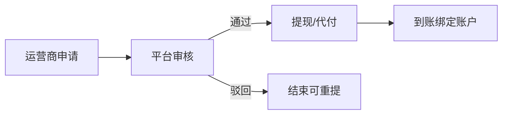

# 运营商提现规则

> **这是什么**：运营商子商户里已清分的钱，如何申请提到绑定结算账户；与「支付成功即时清分」分开。  
> **依据**：[合作模式与分账.md](./合作模式与分账.md) · [融资管理-PRD.md](./融资管理-PRD.md) · [PRD.md](./PRD.md) · 文末决策索引  
> **写法**：[业务文档写作规范](./业务文档写作规范.md)

---

## 业务设定

### 一句话

骑手付款成功后，平台 1% 与运营商份额已经清分；**要提到银行卡，必须走提现申请，平台审核通过后才打款到运营商本人绑定的那一张对公银行卡**。本规则只约束**运营商**；设备租赁渠道自己收的白名单套餐款不走这套审核。

### 清分 ≠ 提现

| 环节 | 何时 | 结果 |
|------|------|------|
| 清分 | 支付成功即时 | 子商户入账，状态「已清分」 |
| 提现 | 申请 + 平台审核 | 打到运营商绑定的唯一对公银行卡 |

### 可提现余额（一期）

可提现 = 已清分累计 − 已提现 − 待审/处理中申请金额（不为负则取 0）。

| 项 | 含义 |
|----|------|
| 已清分 | 实时清分进子商户、尚未提走的运营商净额 |
| 已提现 | 状态为「已提现」的金额合计 |
| 待审/处理中 | 「待审核」「审核通过」「处理中」占用额度 |

**二期**（与融资管理同期）：再减去「本月融资待还」预留，避免待还到期前过度提现；还款确认后释放。一期原型可展示该 KPI（标二期），**不扣减**、申请单不写待还预留。

### 提现怎么走

1. 运营商在「我的流水 → 提现申请」填金额（不得超过可提现）。  
2. 到账账户为「收款账户」绑定的**唯一对公银行卡**（未绑定不可申请）。平台可在运营商档案维护该卡，运营商也可自助绑定。  
3. 平台在「运营商管理 → 运营商提现审核」审核。  
4. 通过后发起通道提现/代付 → 状态「已提现」，记到账时间。  
5. **驳回**须填原因；运营商可改后重提。

### 谁适用

| 主体 | 是否走本流程 |
|------|----------------|
| 运营商（C 端套餐收款） | 是 |
| 客户·人天池 | 否（B2B 采购时已结清） |
| 渠道 · 设备租赁 | 否（白名单款进渠道子商户） |
| 渠道 · 链接分销佣金及时到付 | 否（进渠道子商户，若开启） |
| 平台自有 1% 收入 | 否（平台自结） |

### 验收要点

- 支付成功 → 清分明细「已清分」。  
- 一期可提现不含融资待还扣减。  
- 申请占用待审额度；驳回释放；通过记已提现。  
- **未绑定对公银行卡不可提现**；绑定后打款至该唯一账户。运营商可自助绑定；**平台管理员可在运营商详情代为添加或变更**。  
- 设备租赁收款页注明不适用本审核。

---

## 实现附录（开发用）

> 业务读者可跳过。

### A. 公式

```
一期：max(0, 已清分 − 已提现 − 待审处理中)
二期：max(0, 一期可提现 − 本月融资待还)
本月融资待还 = 还款日历当月非已还清的 (dueAmount − paidAmount) 合计
```

### B. 状态与实体

WithdrawalRequest：金额、账户、状态（待审核 / 审核通过 / 处理中 / 已提现 / 已驳回）、申请/审核/到账时间、驳回原因。  
`month_due_reserved`：二期字段；一期恒 0 / 不展示。

### C. 流程示意



### D. 决策索引

融资待还预留划二期；一期公式不含本月融资待还。见 [decision-061](../decisions/decision-061.md)。
