# 功能结构图与业务流程图

> 骑手换电 · 代理商 / 运营商 / 租赁公司后台  
> 与 [PRD.md](./PRD.md)、[合作模式与分账.md](./合作模式与分账.md)、[代理层级与分润结算.md](./代理层级与分润结算.md) 配套阅读。

---

## 1. 系统边界

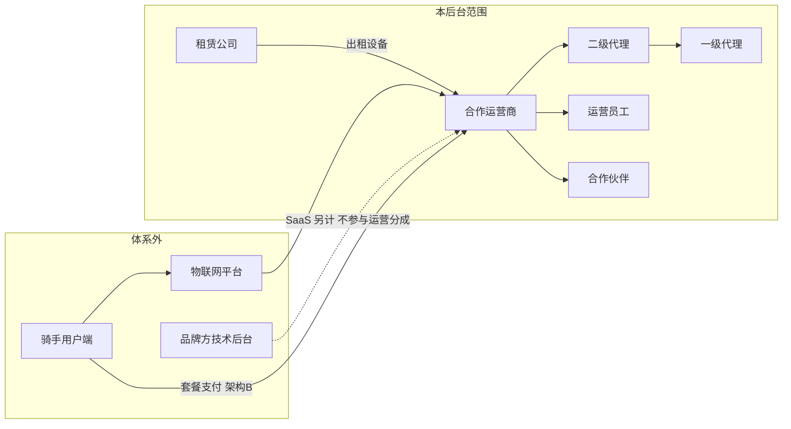

---

## 2. 组织与角色关系

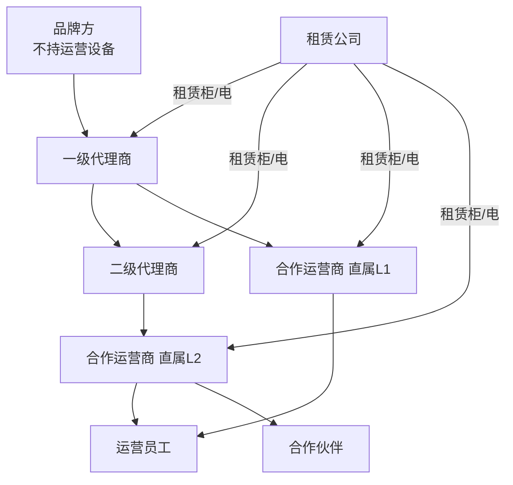

---

## 3. 功能结构图

### 3.1 后台总览（按登录身份）

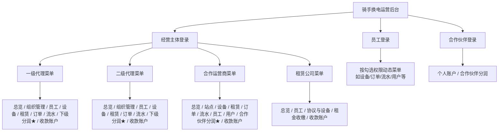

### 3.2 合作运营商功能结构（主体账号）

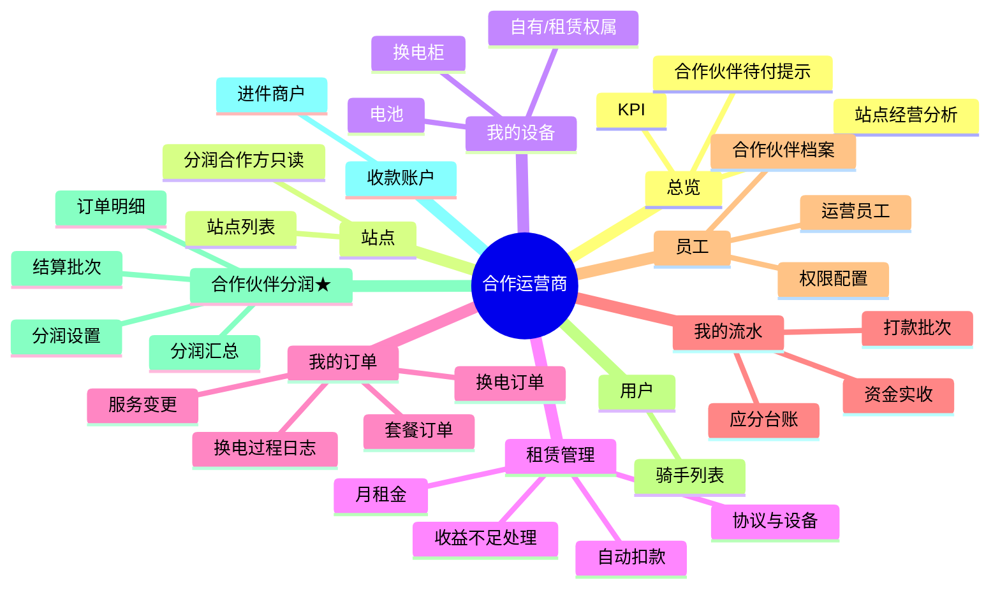

### 3.3 员工模块结构

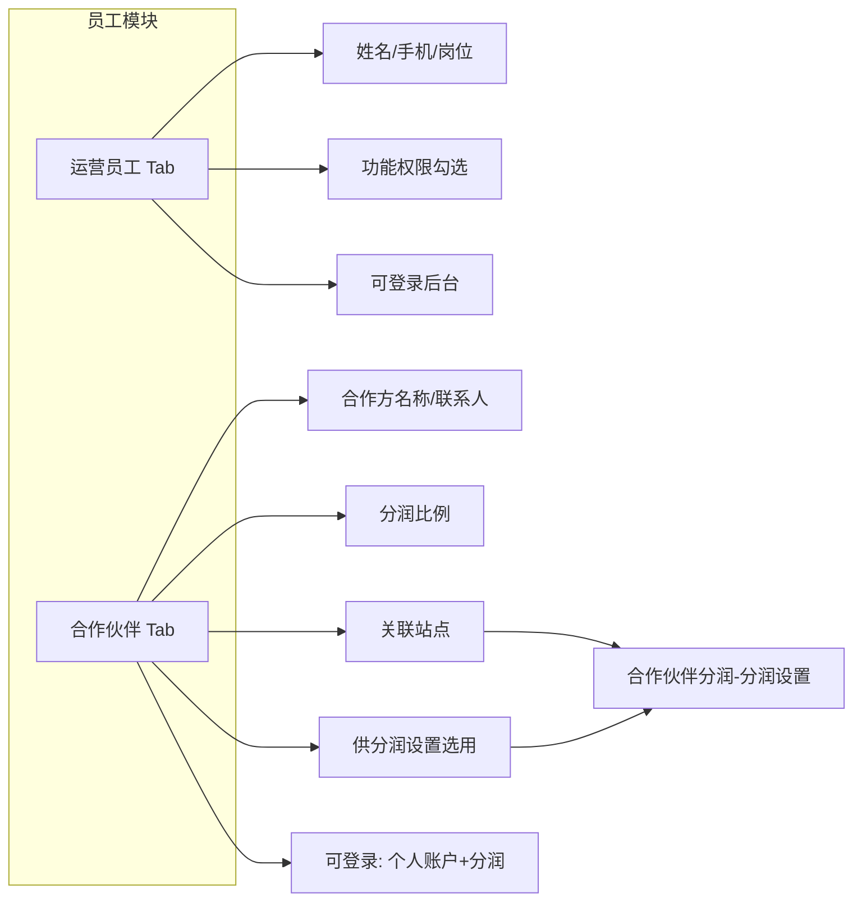

### 3.4 合作伙伴登录功能结构

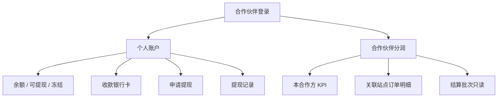

---

## 4. 核心业务流程

本章在流程图之外补充：**参与方、步骤、后台菜单、状态字段、异常分支**。金额与比例细则见 [合作模式与分账.md](./合作模式与分账.md)、[代理层级与分润结算.md](./代理层级与分润结算.md)。

### 4.0 流程索引

| 编号 | 流程 | 关键结论 |
|------|------|----------|
| 4.1 | 架构 B：支付 → 确认收入 → 向上分账 | 支付≠分账；包月按日确认；周期完结才打款 |
| 4.2 | 换电与应分结转 | 换电成功只记应分「待结转」，不即时划款 |
| 4.3 | 下级分润 | 上级看**下级自有设备**经营；用户脱敏 |
| 4.4 | 合作伙伴分润与提现 | 与代理抽成**分菜单**；站点一对一合作方 |
| 4.5 | 员工/合作伙伴登录 | 菜单与数据范围按权限/身份裁剪 |
| 4.6 | 套餐服务生命周期 | 冻结停确认；中途完结冲正应分 |
| 4.7 | 租赁与月租金 | 收益不足须人工处理 |
| 4.8 | 次卡/超次 | 当笔确认、当笔分账（与包月摊销并存） |
| 4.9 | 三台账与打款批次 | 资金实收 / 应分台账 / 打款批次不可混列 |

---

### 4.1 架构 B：骑手支付 → 收入确认 → 向上分账

**业务目标**：骑手资金进入**持牌监管体系**下合作运营商（或代理商）二级商户；平台不抽运营分成；上级代理应得在**周期完结**后由收款方发起分账划出。

**参与方**：骑手、用户端、物联网、收款商户（运营商/代理）、监管清分、一/二级代理商户、本后台。

**前置条件**：站点已绑定 `device_owner_id`；收款账户进件完成；代理合同（`l1_from_op_rate` / `l2_from_op_rate` / `l1_from_l2_rate`）已生效。

| 阶段 | 步骤 | 后台可见（运营商/代理） | 是否打款 |
|------|------|-------------------------|----------|
| ① 收款 | 骑手购买包月/次卡，支付成功 | **我的流水 → 资金实收**（+预收） | 否 |
| ② 服务期 | 按日（包月）或按次/当笔（次卡）确认可分配收入 | **应分台账** 每日/每笔 +SplitLine | 否（仅记账） |
| ③ 换电 | 每次成功换电写入换电单，分摊应分 | **我的订单 → 换电**；应分「待结转」 | 否 |
| ④ 完结 | `valid_to` 届满 / 次卡用尽；无进行中退款 | 套餐状态 → **可打款** | 准备结算 |
| ⑤ 分账 | 收款商户调清分 API；上级商户到账 | **打款批次** 已分账 | 是 |
| ⑥ 退款 | 中途退款：冲预收 + 负向 SplitLine | 实收退款出款；应分冲正 | 已打款则下周期抵扣 |

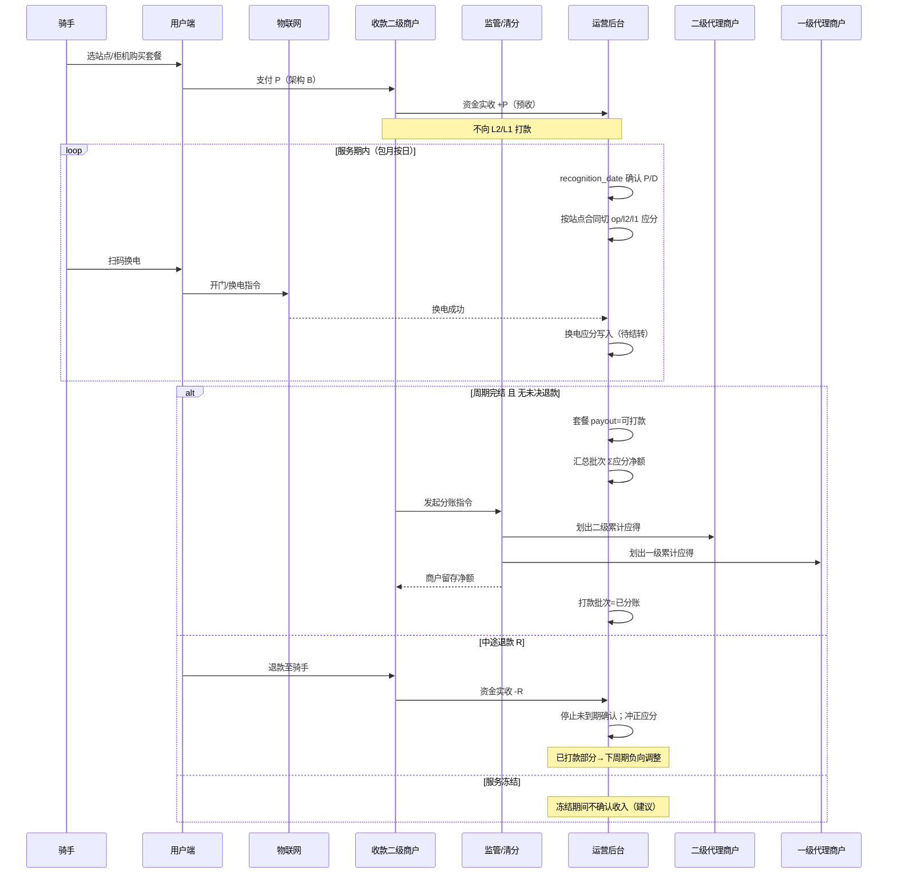

**异常分支**

| 场景 | 处理 |
|------|------|
| 支付成功但设备未入网 | 不计费；待物联网认证后人工补记或拒单 |
| 代理比例中途变更 | 仅**新确认日**起用新比例；历史 SplitLine 不追溯 |
| 有效站/SLA 未达标 | 批次可挂「冻结」，延迟打款 |
| 平台 SaaS 费 | 与运营应分**分表**；不向骑手套餐池计提 |

---

### 4.2 换电订单与应分（不即时打款）

**业务目标**：记录每次换电事实与过程日志，并把该次换电对应的经济份额记入应分，待套餐周期结束后一并结算。

**主流程**

1. 骑手在**服务中**且未冻结套餐下，于己方站点柜机扫码。
2. 用户端校验套餐有效性 → 物联网执行开门/换电 → 返回成功/失败。
3. 成功：生成 `SwapOrder`（关联 `package_order_id`、`cabinet_id`、格口、电池 SOC 等）。
4. 按当日（或当次）已确认的套餐收入份额，计算：运营商净得、二级应得、一级应得、合作伙伴应得（若站点已设合作方）→ 写入应分行，状态 **待结转**。
5. 套餐 `valid_to` 到达且无退款 → 该套餐下所有「待结转」→ **可打款** → 进入打款批次。

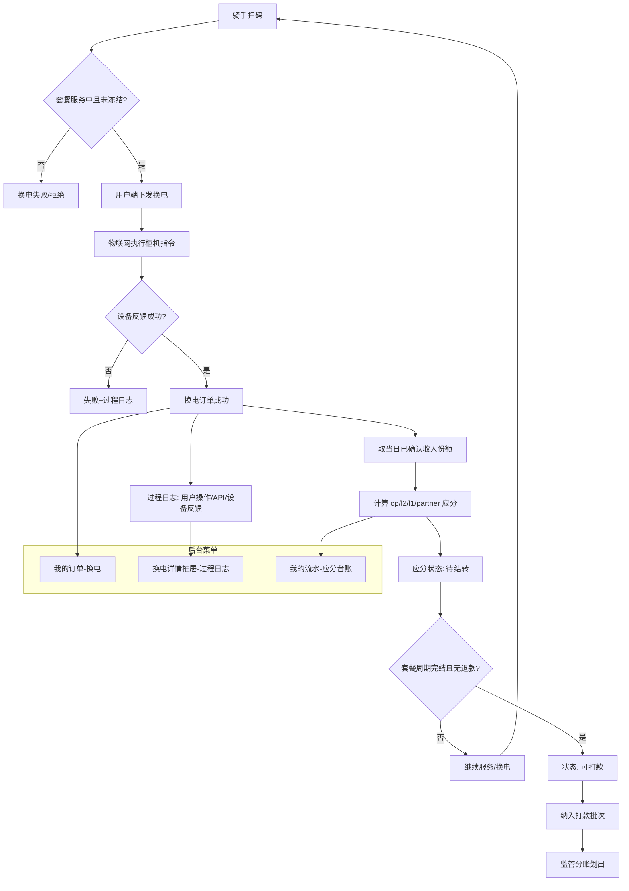

**与套餐订单关系**

| 对象 | 字段/规则 |
|------|-----------|
| 套餐单 | `valid_from` / `valid_to`、`swap_used`、`accrued`、`payout` |
| 换电单 | 必须 `package_order_id`；`pay` 常为 0（包月内含） |
| 应分 | 不单独向代理「按换电笔」打款，只累计至套餐周期批次 |

---

### 4.3 下级分润（上级代理视角）

**业务目标**：一级/二级代理查看**下级主体在其自有设备**上产生的经营收入及本账号计提，用于对账与催收下级分账。

**范围**

| 下级类型 | 上级可见经营 | 计提基数（合同） |
|----------|--------------|------------------|
| 二级代理 | 二级**自有**设备订单 | `l1_from_l2_rate` × 二级从其直属运营商分润 |
| 合作运营商 | 运营商**自有**设备订单 | `l2_from_op_rate` 或 `l1_from_op_rate` |

**主流程**

1. 下级设备产生套餐/换电 → 按收入确认口径形成「经营收入」。
2. 系统按生效合同计算上级计提 → 写入下级分润汇总与**订单明细**（逐笔）。
3. 周期完结后，下级收款商户向监管发起分账 → 上级商户到账。
4. 上级在 **下级分润 → 结算批次** 核对「应收 vs 实收」。

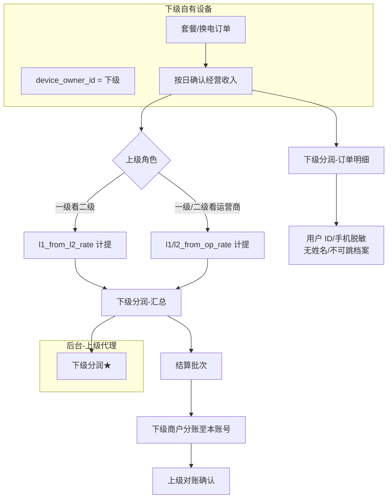

**隐私**：明细中仅订单号、站点、柜机、金额、计提；`U****` / `138****` 脱敏。

---

### 4.4 合作伙伴分润与提现

**业务目标**：合作运营商将**关联站点**的部分可分配收入分给场地合作方；合作方可登录查看明细并提现。

**与 4.3 边界**：下级分润 = 代理层级合同；合作伙伴分润 = 场地合同（在「员工-合作伙伴」维护比例），**分菜单、分表**。

**主流程（配置 → 计提 → 结算 → 提现）**

| 步骤 | 操作方 | 动作 | 后台位置 |
|------|--------|------|----------|
| 1 | 运营商主体 | 员工 → 合作伙伴：名称、比例、关联站点 | 员工 / 合作伙伴 Tab |
| 2 | 运营商主体 | 为站点指定唯一合作方 | 合作伙伴分润 → **分润设置** |
| 3 | 系统 | 站点订单确认收入 × 合作方比例 → 合作方应分 | 分润汇总 / 订单明细（**不脱敏**） |
| 4 | 系统 | 周期完结后结转可提现余额 | 合作伙伴 **个人账户** |
| 5 | 合作方登录 | 绑卡、申请提现 | 个人账户 / 提现记录 |
| 6 | 运营商/财务 | 线下或代付打款后更新状态 | 提现：处理中 → 成功 |

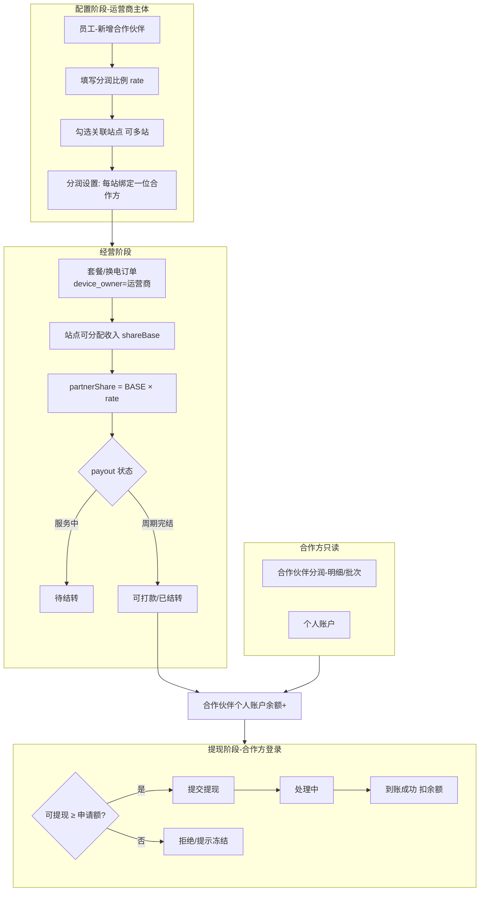

**规则摘要**

- 一站点同一时间仅一位合作伙伴。
- 汇总笔数须与明细可勾稽。
- 合作方**不可**操作分润设置、员工管理、他人站点数据。

---

### 4.5 员工 / 合作伙伴登录与权限

**业务目标**：同一后台支持经营主体、运营员工、合作伙伴三类身份；菜单与数据最小化暴露。

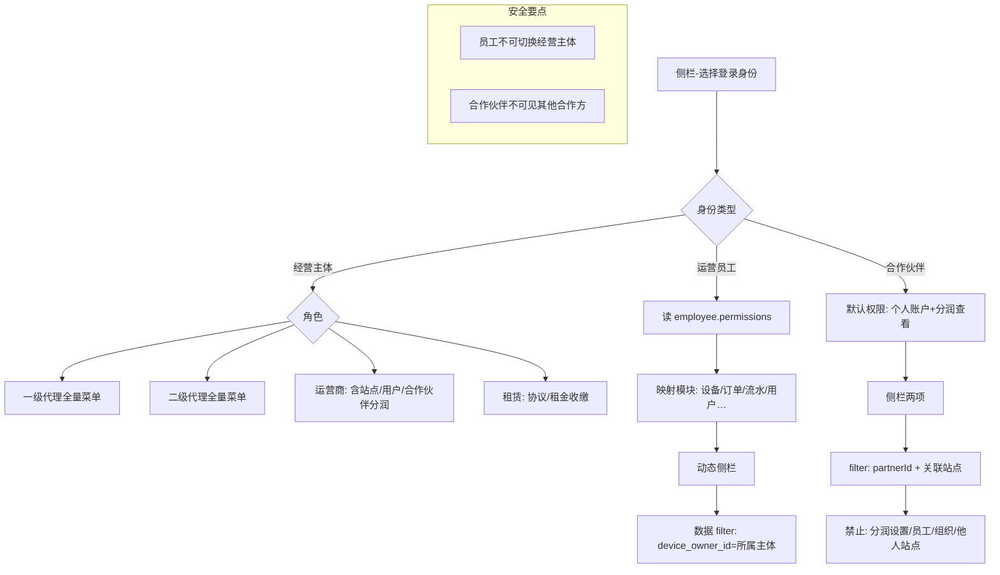

| 权限项（示例） | 运营员工 | 合作伙伴 |
|----------------|:--------:|:--------:|
| 我的设备/订单 | 勾选可见 | — |
| 下级分润 | 一级/二级且勾选 | — |
| 合作伙伴分润-查看 | 勾选 | 默认 |
| 合作伙伴分润-设置 | 勾选 | — |
| 个人账户/提现 | — | 默认 |

---

### 4.6 套餐服务生命周期（后台可见）

**业务目标**：支持冻结、中途完结退款、到期完结；各状态驱动**是否继续确认收入**与**应分能否打款**。

| 状态 | 骑手侧 | 收入确认 | 换电 | 应分/打款 |
|------|--------|----------|------|-----------|
| 服务中 | 可换电 | 按日确认 | 正常累计待结转 | 周期未完结为待结转 |
| 已冻结 | 不可换电 | **建议暂停**确认 | 拒绝新换电 | 待结转维持 |
| 中途完结 | 服务终止 | 停止未到期确认；冲已确认 | 停止 | 冲正后重新结算或关闭 |
| 已完结 | 到期 | 确认至 valid_to | — | 待结转→可打款 |

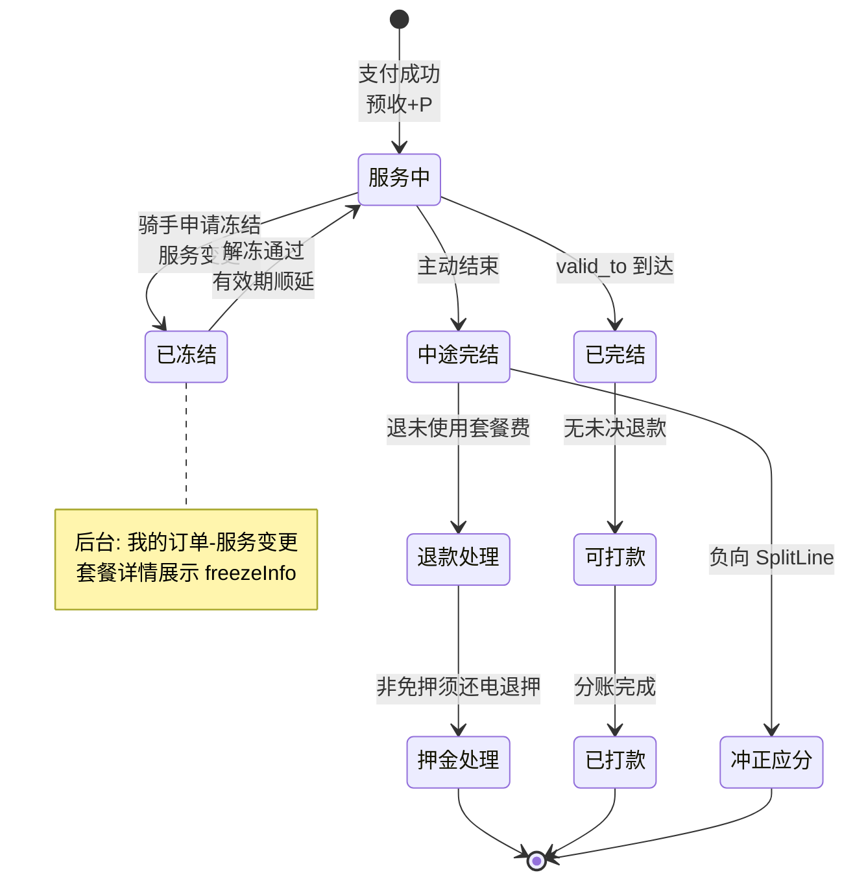

**中途完结退款拆分（后台「服务变更」）**

1. 骑手发起 → 运营商审核（演示可简化）。
2. 计算应退套餐费 R（剩余天数法等）。
3. 资金实收退款出款；应分台账冲正。
4. 若有电池押金且非信用免押：还电验收后押金原路退。

---

### 4.7 租赁设备与月租金

**业务目标**：租赁公司出租柜/电；承租方（运营商/代理）按月付租；可用站点经营收入自动扣划，不足则人工跟进。

**主流程**

1. **租赁公司**：维护 `LeaseContract`（承租方、设备清单、月租金、押金、租期）。
2. **承租方**：「协议与设备」查看绑定资产；「月租金」见各期账单与站点收入覆盖。
3. **每月**：生成 `LeaseRentBill`（应还、站点收入、缺口、缴纳方式）。
4. **自动扣款**：若开通且 `站点可分配收入 ≥ 月租金` → 从租金支付账户扣至出租方。
5. **收益不足**：自动扣款失败 → 状态需**人工处理**（补缴/登记跟进）。
6. **租赁公司**：「租金收缴」看实还进度。

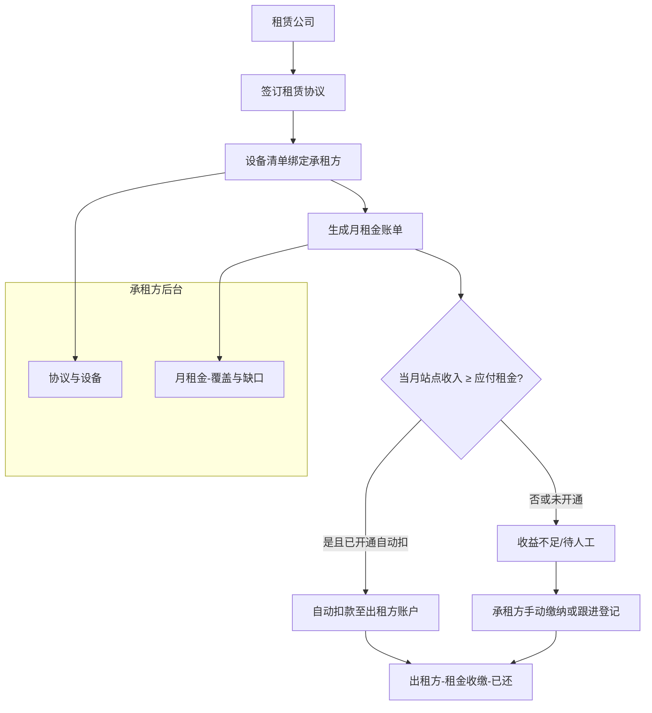

**与订单关系**：租赁设备仍记 `device_owner_id` = 承租运营主体；骑手订单归属不变，租金从经营收入侧扣划，不参与代理「下级分润」基数混淆。

---

### 4.8 次卡 / 包月外超次（当笔确认）

| 对比项 | 包月套餐 | 次卡 / 超次另付 |
|--------|----------|-----------------|
| 收入确认 | 按日摊销 `P/D` | **换电成功当笔** |
| 打款时机 | 周期完结批次 | 可当笔或短周期结算 |
| 订单号 | `PackageOrder` | **独立订单号**，不并入包月摊销表 |
| 后台 | 套餐 Tab + 应分待结转 | 套餐/换电列表均可关联查看 |

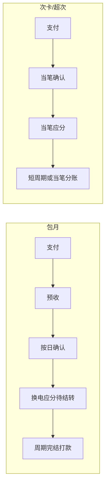

---

### 4.9 三台账与打款批次（对账主线）

**切勿混列**：骑手「付了多少钱」≠「已分给各方多少钱」≠「银行已划出多少钱」。

| 台账 | 含义 | 典型条目 | 菜单 |
|------|------|----------|------|
| 资金实收 | 监管户实收实付 | 套餐支付 +、退款 −、押金收退 | 我的流水 → 资金实收 |
| 应分台账 | 确认收入与各方应得/冲正 | SplitLine +/−、待结转/可打款 | 我的流水 → 应分台账 |
| 打款批次 | 实际分账划出记录 | 批次号、划出至 L2/L1、商户留存 | 我的流水 → 打款批次 |

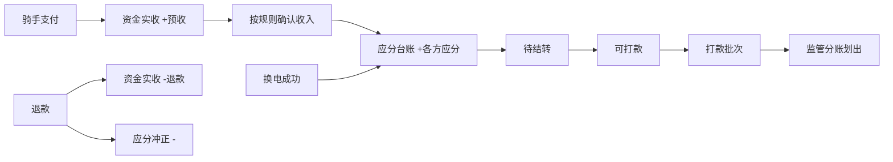

**打款批次生成条件（套餐维度）**

1. `valid_to` 已过或次卡额度用尽，订单关闭。  
2. 无进行中 `refund`。  
3. 可选：运营商/代理在后台确认，或 T+N 自动确认。  
4. Σ应分净额 > 0 且未冻结。  

**下级分润 / 合作伙伴分润** 的「结算批次」与运营商「打款批次」概念对应，视角分别为上级应收、合作方应付。

---

## 5. 数据隔离与分润菜单关系

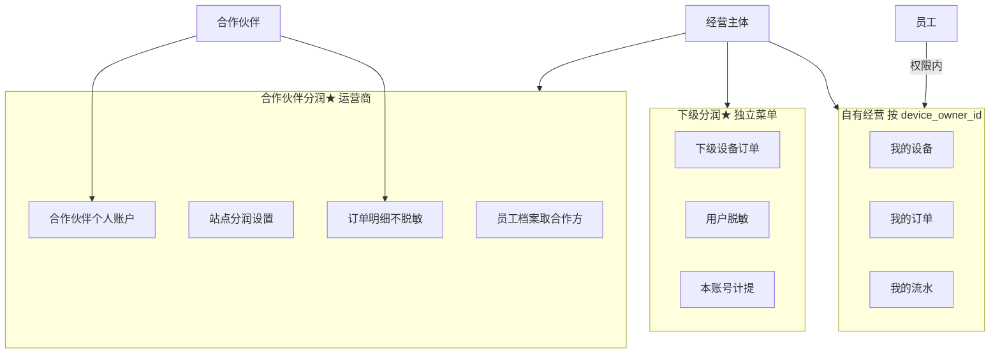

---

## 6. 菜单与角色对照（速查）

| 模块 | 一级代理 | 二级代理 | 合作运营商 | 租赁公司 | 运营员工 | 合作伙伴 |
|------|:--------:|:--------:|:----------:|:--------:|:--------:|:--------:|
| 总览 | ✓ | ✓ | ✓ | ✓ | 按权限 | — |
| 组织管理 | ✓ | ✓ | — | — | 按权限 | — |
| 员工 | ✓ | ✓ | ✓ | ✓ | 按权限 | — |
| 站点 | — | — | ✓ | — | 按权限 | — |
| 我的设备 | ✓ | ✓ | ✓ | — | 按权限 | — |
| 租赁-协议/月租金 | ✓ | ✓ | ✓ | 协议侧 | 按权限 | — |
| 租金收缴 | — | — | — | ✓ | 按权限 | — |
| 我的订单 | ✓ | ✓ | ✓ | — | 按权限 | — |
| 我的流水 | ✓ | ✓ | ✓ | — | 按权限 | — |
| 用户 | — | — | ✓ | — | 按权限 | — |
| 下级分润★ | ✓ | ✓ | — | — | 按权限 | — |
| 合作伙伴分润★ | — | — | 主体✓ | — | 按权限 | 本人✓ |
| 个人账户 | — | — | — | — | — | ✓ |
| 收款账户 | ✓ | ✓ | ✓ | ✓ | 按权限 | — |

---

## 7. 修订记录

| 版本 | 日期 | 说明 |
|------|------|------|
| 1.0 | 2026-05-24 | 初版：功能结构图、架构B分账、下级/合作伙伴分润、员工登录、租赁与套餐生命周期 |
| 1.1 | 2026-05-27 | §4 细化：分阶段步骤表、异常分支、换电/下级/合作方/冻结/租赁/次卡/三台账与打款条件 |
