# 功能结构图与业务流程图

> 骑手换电 · 代理商 / 运营商 / 租赁公司后台  
> 与 [PRD.md](./PRD.md)、[合作模式与分账.md](./合作模式与分账.md)、[代理层级与分润结算.md](./代理层级与分润结算.md) 配套阅读。

---

## 1. 系统边界

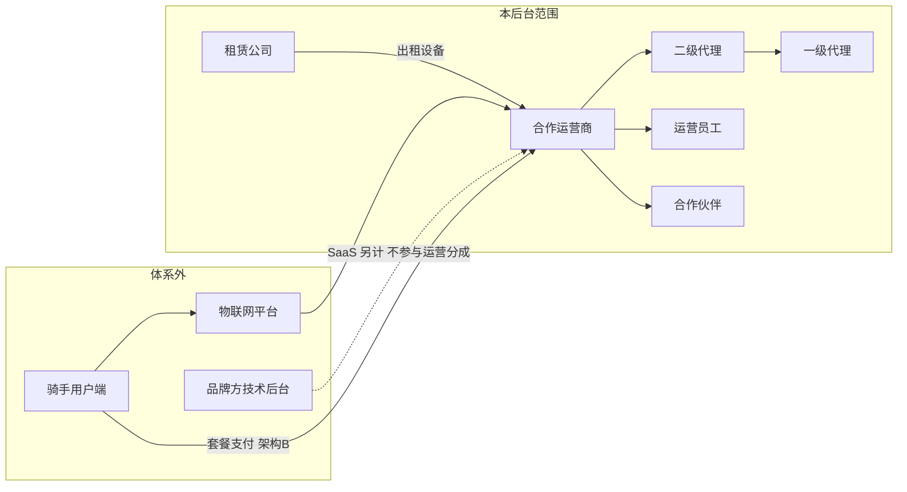

---

## 2. 组织与角色关系

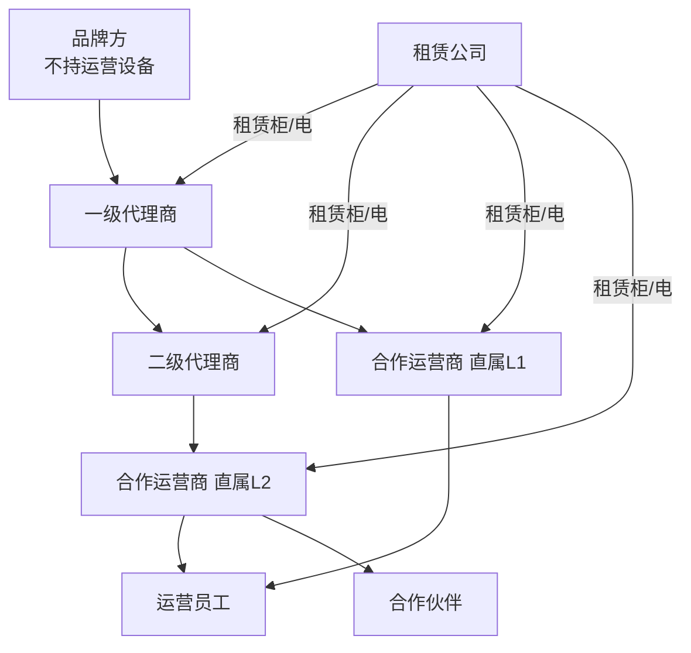

---

## 3. 功能结构图

### 3.1 后台总览（按登录身份）

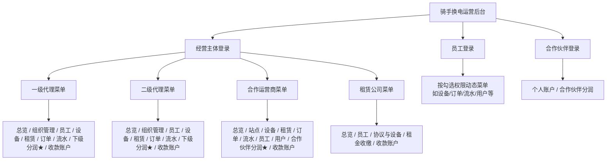

### 3.2 合作运营商功能结构（主体账号）

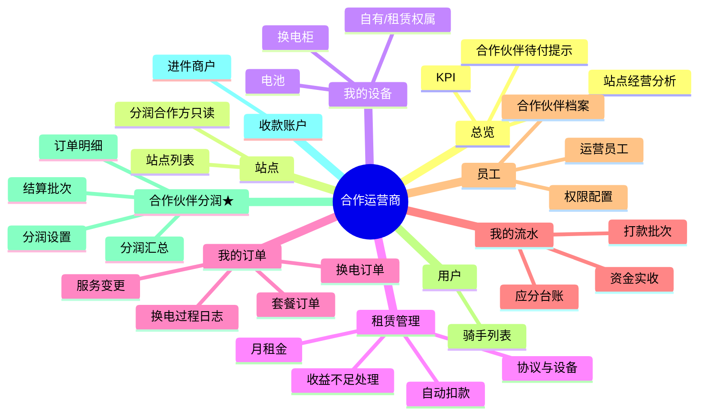

### 3.3 员工模块结构

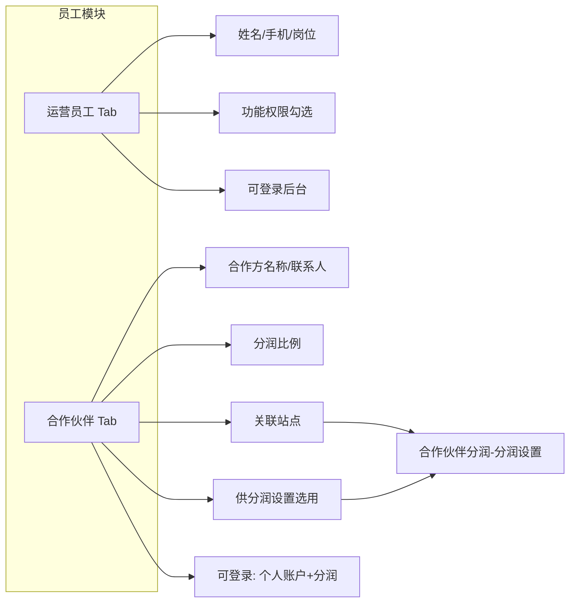

### 3.4 合作伙伴登录功能结构

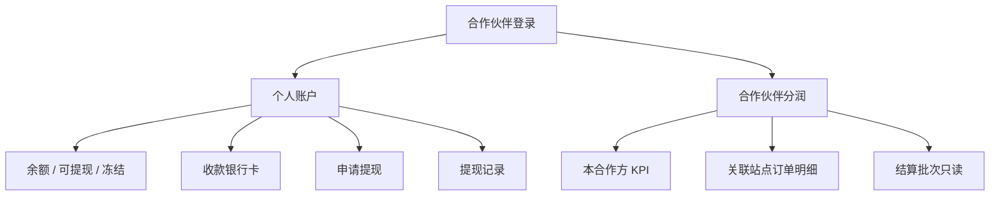

---

## 4. 核心业务流程

### 4.1 架构 B：骑手支付 → 收入确认 → 向上分账

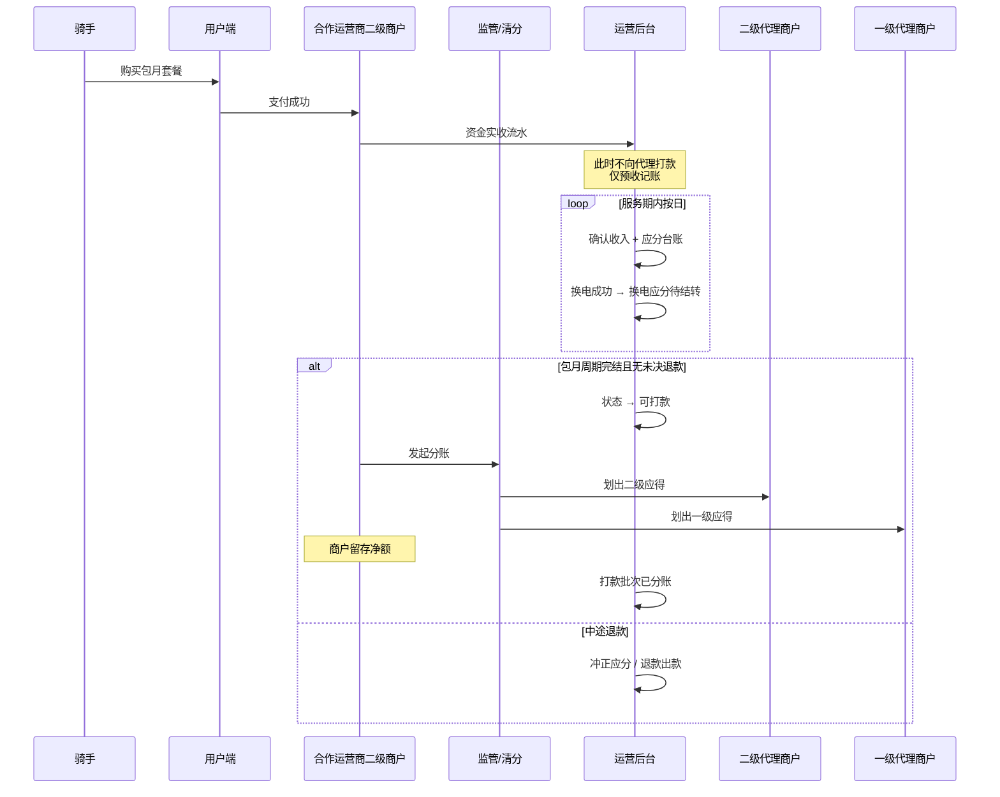

### 4.2 换电订单与应分（不即时打款）

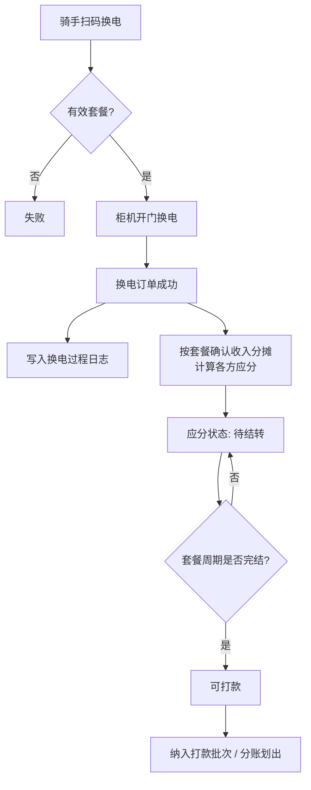

### 4.3 下级分润（上级代理视角）

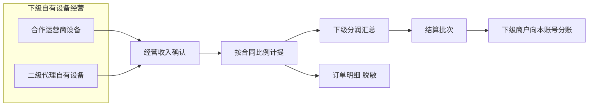

### 4.4 合作伙伴分润与提现

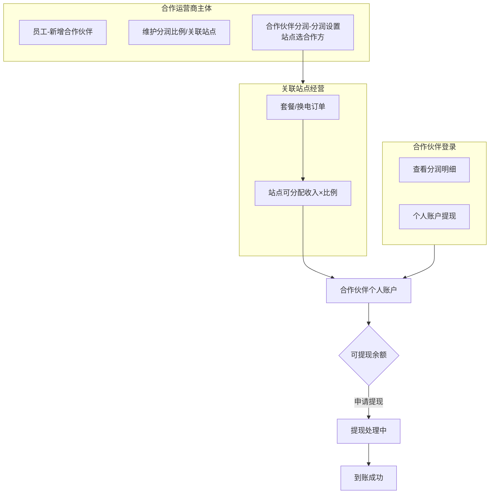

### 4.5 员工 / 合作伙伴登录与权限

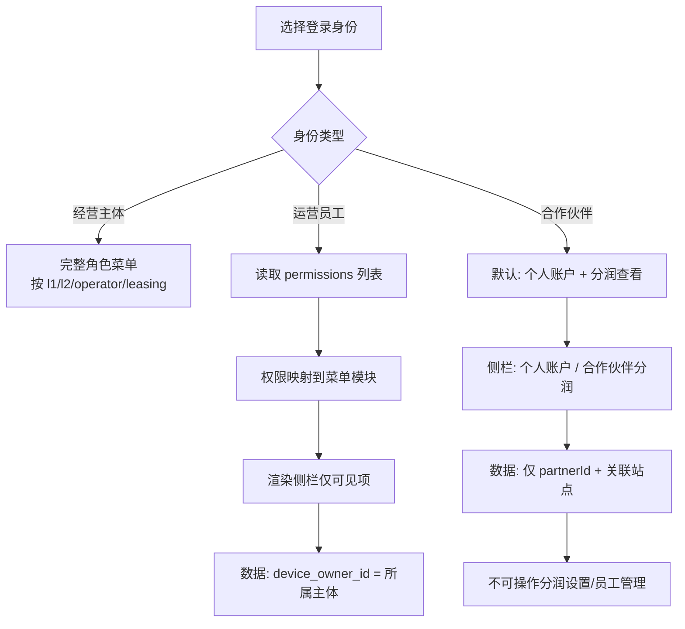

### 4.6 套餐服务生命周期（后台可见）

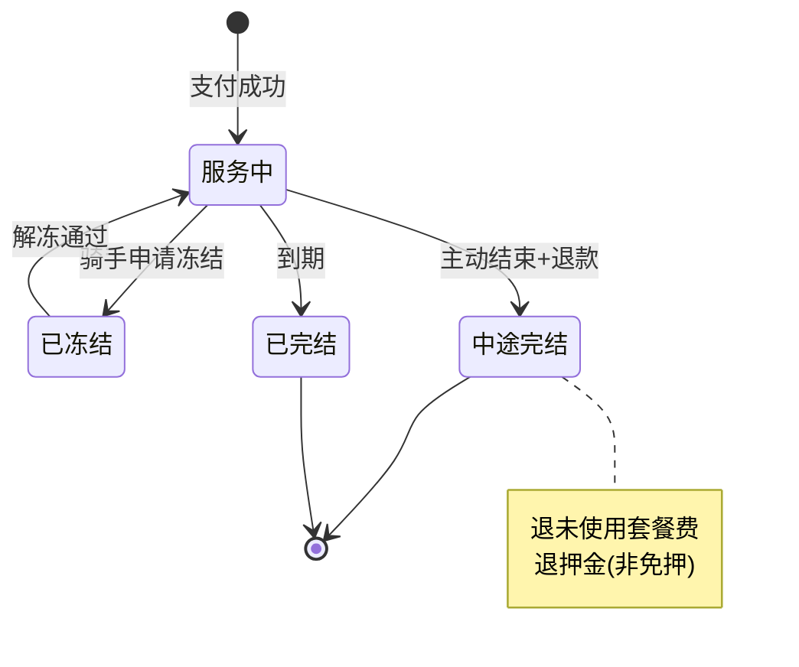

### 4.7 租赁设备与月租金

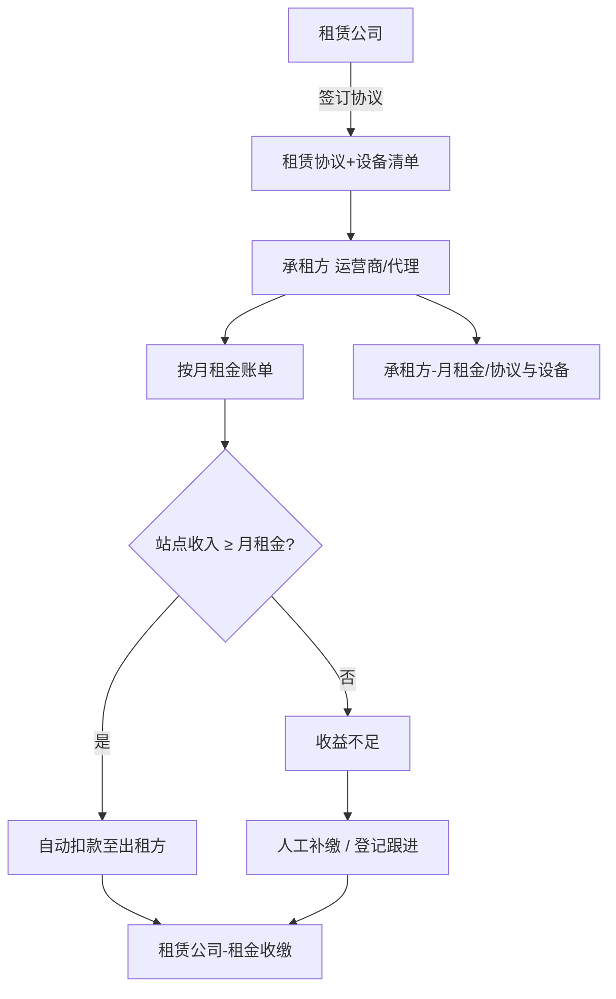

---

## 5. 数据隔离与分润菜单关系

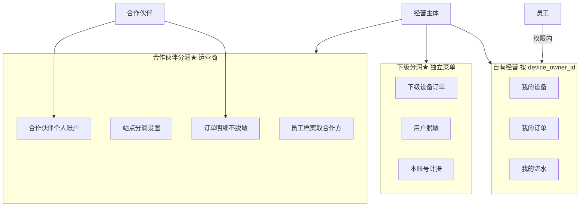

---

## 6. 菜单与角色对照（速查）

| 模块 | 一级代理 | 二级代理 | 合作运营商 | 租赁公司 | 运营员工 | 合作伙伴 |
|------|:--------:|:--------:|:----------:|:--------:|:--------:|:--------:|
| 总览 | ✓ | ✓ | ✓ | ✓ | 按权限 | — |
| 组织管理 | ✓ | ✓ | — | — | 按权限 | — |
| 员工 | ✓ | ✓ | ✓ | ✓ | 按权限 | — |
| 站点 | — | — | ✓ | — | 按权限 | — |
| 我的设备 | ✓ | ✓ | ✓ | — | 按权限 | — |
| 租赁-协议/月租金 | ✓ | ✓ | ✓ | 协议侧 | 按权限 | — |
| 租金收缴 | — | — | — | ✓ | 按权限 | — |
| 我的订单 | ✓ | ✓ | ✓ | — | 按权限 | — |
| 我的流水 | ✓ | ✓ | ✓ | — | 按权限 | — |
| 用户 | — | — | ✓ | — | 按权限 | — |
| 下级分润★ | ✓ | ✓ | — | — | 按权限 | — |
| 合作伙伴分润★ | — | — | 主体✓ | — | 按权限 | 本人✓ |
| 个人账户 | — | — | — | — | — | ✓ |
| 收款账户 | ✓ | ✓ | ✓ | ✓ | 按权限 | — |

---

## 7. 修订记录

| 版本 | 日期 | 说明 |
|------|------|------|
| 1.0 | 2026-05-24 | 初版：功能结构图、架构B分账、下级/合作伙伴分润、员工登录、租赁与套餐生命周期 |
