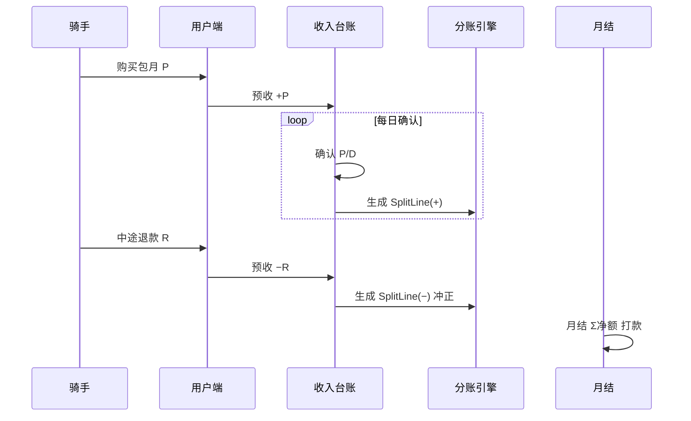

# 合作模式与分账（暂定）

> 业务扩张默认模式：**一/二级代理、合作运营商均可持有自有设备**（品牌方不持运营设备）；**品牌方（平台）提供物联网与用户端，不参与骑手套餐/换电的运营分成**。各方仅管理自有设备，订单按设备归属隔离；上级对下级的计提在「下级分润」单独展示。确认收入在合作运营商与一/二级代理商之间按合同切分；平台对合作方的收费以 **SaaS/技术服务费（另签合同、另开票）** 为主，不从运营流水抽成。

**产品形态**：`原型/外卖` 为**运营商/代理商自用后台**（管理己方站点、设备、订单、流水、用户）；品牌方总部看板与资方视角见 `req-prototype` 等其它项目。

**代理层级与周期打款**：一级/二级代理抽成规则、换电应分与包月完结后打款见 **`代理层级与分润结算.md`**。

**合作伙伴场地分润**：与上级代理抽成独立，见本文 §9 与 **`功能结构与业务流程.md`**。

## 1. 商业分工

| 角色 | 投入 / 产出 |
|------|-------------|
| **代理商** | 可**自有或租赁**柜/电；发展二级代理与合作运营商；承担渠道与资产（或租金）成本 |
| **运营商（合作方）** | 可**自有或租赁**柜/电；场地管理、运维、用户服务；架构 B 下常为**收款主体** |
| **合作伙伴（场地/联营）** | 不持设备；按合同约定从**关联站点**可分配收入中分成；可登录后台查分润与提现 |
| **我方（品牌方）** | 物联网、用户端、运营平台、支付清分能力、品牌与 SOP；**不抽运营分成** |
| **已有系统** | 物联网、用户端（向代理商及授权站点开放） |

硬件 CAPEX 可在**代理商或运营商**（租赁时产权在租赁公司）；合作伙伴收入来自场地分润，与代理层级分润**分表、分菜单**。

## 2. 我方服务包（可签约拆分）

| 服务项 | 说明 |
|--------|------|
| 物联网平台 | 设备接入、状态监控、告警、远程运维 |
| 用户端 | 骑手注册、换电、套餐与支付（资金进监管户） |
| 运营平台 / 工具 | 合作方看板、对账、工单、站点与设备管理 |
| 品牌与合规 | 定价框架、VIS、安全与 SLA 标准 |

可选：**按站 SaaS 年费 / 按柜月费 / 按量技术服务费**（与运营分成**分离**，按月或按年向代理商/合作运营商 billing，不进骑手套餐应分池）。

## 3. 分账规则（暂定）

### 3.1 原则

- 骑手套餐/次卡实收进入**持牌监管账户**（**架构 B**：收款主体为合作运营商或代理商二级商户号，见 §8）。
- 按订单归因至 **站点 → 合作运营商 → 代理合同** 后，在**运营参与方**之间分账。
- **平台不参与运营分成**：不设 `hq_share` 从套餐/换电确认收入中抽成；`hq_share` 字段在系统中固定为 **0**（或废弃，仅保留历史兼容）。
- **可分配经营收入** = 确认收入 − **支付通道手续费**（及合同约定的营销补贴分摊）；在合作运营商、二级代理、一级代理之间按 `l2_from_op_rate`、`l1_from_l2_rate`、`l1_from_op_rate` 切分（见 `代理层级与分润结算.md`）。
- **平台收入**仅来自与代理商/合作运营商签订的 **SaaS 或技术服务合同**，与单笔骑手订单的应分台账**分表管理**。

### 3.2 包月套餐：不要「一付就分」

骑手购买的是**包月套餐**（含服务期、可能含换电次数上限），中途可能**全额/部分退款**。若按支付成功立刻分账，会出现：

- 退款后合作方已拿钱，需追回，对账与客诉成本高；
- 骑手未使用天数对应的收入不应分给合作方；
- 跨月套餐、换站换电时，归因站点与分账周期易错乱。

**推荐：按「收入确认」分账，而非按「收款」分账。**

| 时点 | 只记台账 | 参与分账 |
|------|----------|----------|
| 骑手支付包月成功 | 预收账款（监管户余额 +） | 否 |
| 服务期内按规则「确认收入」 | 可分配经营收入 + | 是，在运营方之间按代理合同切分 |
| 中途退款 | 冲减可分配收入 / 预收 | 是，按退款规则负向冲正应分 |
| 月结打款 | — | 只对**已确认且未退款**的净额汇总打款 |

**后台展示（合作方/代理）**：`资金实收` 记骑手支付与退款出款（当前以套餐购买为主）；`应分台账` 记确认收入与各方应分、冲正；`打款批次` 记周期完结后的实际出款。三者不可混在同一列表，避免「未打款却出现冲正」误解。

### 3.3 收入确认（包月，推荐默认）

**按服务期按日摊销**（实现简单、与退款自然对齐）：

```
套餐实收（扣除支付手续费）= P
服务期天数 = D（如 30 天，按自然日或 24×30 小时写进合同）
每日确认收入 = P / D

第 t 日可分配收入 = 每日确认收入（若当日未发生退款终止）
```

可选增强（二期）：**按有效换电次数摊销**——设套餐等价「含 N 次换电」，每成功换电确认 `P/N`，更适合「包月限次」产品；未用完次数在到期时一次性确认或作废，需在用户协议写明。

**归因**：确认收入当日，按**主站点**归属（建议优先级）：

1. 套餐购买时绑定的 `purchase_site_id`（默认）  
2. 或：服务期内**换电次数最多的站点**（按月重算，写入合同二选一）  

取**确认当日**该站点生效的代理分成合同（无平台抽成项）。

### 3.4 分账计算公式（净额）

```
某笔确认（某日、某站点）：
  allocatable = 当日确认收入 − 支付手续费分摊 − 营销补贴分摊（若有）

  合作运营商净得、二级应得、一级应得 — 按 代理层级与分润结算.md 计算
  （allocatable 全额在运营参与方之间分配，平台留存 = 0）
```

**周期打款批次**：

```
合作运营商净得 = Σ 应分 − Σ 退款冲正
二级 / 一级应得 = Σ 上级抽成 − Σ 冲正
```

仅当净额 > 0 且站点满足有效站/SLA 时进入「可打款」；否则挂「待结算 / 冻结」。

### 3.5 退款设计（中途退款）

#### 3.5.1 退款类型

| 类型 | 典型场景 | 处理 |
|------|----------|------|
| **全额退款** | 开通后 N 天内未换电、重大故障 | 终止服务期；未确认部分不再确认；已确认部分按政策决定是否追回 |
| **部分退款** | 提前解约、协商退剩余天数 | 剩余天数不再确认；已确认收入按规则冲回 |
| **仅退差价** | 套餐降级 | 冲减差额对应的未确认 + 已确认（若需） |

#### 3.5.2 剩余天数法（部分退款，推荐）

```
已服务天数 = d
应退金额 R（支付通道退回骑手，R ≤ 未确认预收余额）

未确认收入冲减 = min(R, P − 已确认累计)
若 R 大于未确认部分，则超出部分从「已确认累计」中按相同比例冲减：
  冲减可分配收入 = R（上限为 P）
  冲减各方应分 = 按原 SplitLine 上合作运营商/二级/一级金额比例冲正（平台无留存，不产生平台冲正行）
```

**全额退款且未产生任何确认**（如 7 天无理由、0 次换电）：`R = P`，不产生分账行，支付手续费损失按合同约定（总部承担或按比例）。

**已月结打款后发生退款**：本期生成**负向调整单** `Adjustment`，在下个结算周期抵扣；不足则记入合作方应付余额为负或保证金扣回。

#### 3.5.3 退款与分账时序（示意）



### 3.6 与「按次换电」的并存

若同时有次卡/超次付费：

| 产品 | 收入确认时点 | 分账 |
|------|--------------|------|
| 包月 | 按日摊销或按次摊销 | 同上 |
| 次卡/超次 | **换电成功当笔**实收 | 当笔确认、当笔分账 |

同一骑手包月期内超次另付费：次卡订单**单独订单号**，不参与包月摊销表。

### 3.7 比例变更

- 以代理 `SettlementContract` 生效日为准，**新确认的收入**用新分成比例，历史 `SplitLine` 不追溯。
- 退款冲正按**原 SplitLine 各方金额**冲回。

### 3.8 暂不包含（二期）

- 平台 SaaS 账单与运营应分台账的自动对账
- 支付通道实时分账（首期：**内部台账 + 月结代付**）

## 4. 设备与结算前提

- 设备须为**总部认证型号**，经物联网平台入网后方可计费分账。
- 建议 **有效站** 门槛（可选）：月活跃骑手、柜体可用率、客诉闭环达标后，才释放上月分账打款。

## 5. 对账字段（运营看板 / 财务）

| 字段 | 说明 |
|------|------|
| `subscription_id` | 包月主单 |
| `payment_id` | 支付单（实付 P） |
| `service_start` / `service_end` | 服务期 |
| `recognition_date` | 收入确认日（摊销日） |
| `recognized_amount` | 当日确认收入 |
| `partner_id` / `site_id` | 归因 |
| `hq_share` | 固定 **0**（平台不参与运营分成） |
| `op_amount` / `l2_amount` / `l1_amount` | 运营方分账明细（正/负） |
| `saas_invoice_id` | 可选；平台 SaaS 费与运营台账分表 |
| `refund_id` / `refund_amount` | 退款单 |
| `split_line_type` | `RECOGNIZE` / `REFUND_REVERSAL` |
| `settlement_status` | 待对账 / 已确认 / 已打款 / 冻结 |

## 6. 数值示例

包月 **P = 300 元**，**D = 30 天**，合作运营商上级为二级（`l2_from_op_rate = 15%`），购买站点为「浦东站」。支付手续费另计，不参与下方比例。

| 事件 | 处理 |
|------|------|
| 支付成功 | 预收 300；不生成运营方打款 |
| 第 1–10 日正常服务 | 每日确认 10 元；二级 1.5 元/日，合作运营商 8.5 元/日（示意） |
| 第 11 日骑手申请退款 **R = 120**（退剩余约 12 天） | 停止第 11–30 日确认；冲减未确认 120；若已确认 110 则按规则冲回应分 |
| 第 5 日已换电但第 8 日全额退款 **R = 300**（0 次换电规则） | 已确认 50 → 冲减 SplitLine −50（仅运营方各行）；余款退骑手 |

周期打款：仅 SUM(第 1–10 日合作运营商+代理应分) = **约 100 元**（示意，已扣上级抽成）。

平台 SaaS：例如 200 元/柜/月，由代理商与平台**单独结算**，不出现在上述 10 元/日的 allocatable 中。

## 7. 合同与产品建议（写入协议）

1. **退款窗口**：未换电 N 天内可全额退；之后仅退剩余天数折算。  
2. **手续费**：退款是否退支付手续费、谁承担。  
3. **已打款后退款**：从下月应付抵扣或保证金扣回。  
4. **归因条款**：包月收入归属「购买站」或「主换电站」。  
5. **套餐暂停/冻结**：暂停期间是否继续摊销（建议：暂停不确认收入）。

## 8. 监管合规与分账主体（必读）

### 8.1 监管红线：避免「二清」

- 非持牌机构不得自建**资金池**、不得以平台名义代收后再**手工**向多方划款。
- 合规路径：资金进入**持牌支付机构**或**银行存管**体系，由持牌方按指令分账/结算；平台只做规则与对账，不碰「先汇总再私分」的银行账户。

### 8.2 必须明确的「一个分账主体」

业务上建议书面固定三类角色（合同 + 支付进件一致）：

| 角色 | 定义 | 本业务建议 |
|------|------|------------|
| **收款主体（分账出资方）** | 支付订单上的**商户**，资金先进入其待分账/待结算账户 | **合作运营商**（默认）或**代理商**二级商户 |
| **分账接收方** | 被分账的一方，须实名进件、签分账关系 | 上级代理商商户号（L2/L1 应得部分） |
| **分账发起方** | 调支付机构分账 API 的主体 | 平台技术服务商代调用，或收款方自助发起 |

### 8.2.1 已选定：架构 B（合作运营商/代理商主收款）

全平台统一采用 **架构 B**，不再使用平台主收款（原架构 A 仅作对照，不实施）。

```
骑手 → 支付 → 【合作运营商 微信/支付宝 二级商户】待分账账户
         → 服务期按日/按换电确认收入（应分台账，不打款给上级）
         → 套餐周期完结 → 延时分账/代付 → 【二级代理商商户】【一级代理商商户】
         → 合作运营商留存本站净应分
平台：IoT + 用户端 + 对账后台；不留存运营分成；SaaS 费对公另结
```

| 项 | 约定 |
|----|------|
| **默认收款主体** | **合作运营商**（本站换电服务销售方，骑手发票抬头） |
| **可选收款主体** | 无合作运营商的辖区可由**代理商**统一进件收款，再内部划拨 |
| **上级代理回款** | 周期完结后，从合作运营商待分账余额 **分出** 至 L2/L1 商户号（比例见代理合同） |
| **平台** | 非收款主体；可代接分账 API，**不从该笔订单分走运营资金** |
| **退款** | 原路退回骑手；优先冲收款方待分账余额；已分出部分走分账回退 |

进件示例（演示租户「闪送驿站联营」）：微信子商户 `19000001***`、支付宝直付通二级商户 `2088***`，签约主体与营业执照一致。

> 包月退款、应分冲正、打款批次规则与 §3 相同；仅资金起点在**合作运营商/代理商商户**，而非平台商户。

### 8.3 包月 + 退款在通道层的做法

- 下单时标记**分账订单** + 优先 **延时分账**（支付成功后先冻结，不立即分出）。
- **按日确认收入后**再发起分账（或月结批量分账），与 §3 台账一致。
- 退款：优先冲**未分账冻结余额**；已分账部分走**分账回退**（接收方须为**商户号**，个人零钱接收方往往不能回退）。
- 因此：**合作方分账账户必须用企业商户进件**，不要走个人零钱分账。

### 8.4 通道分账比例（运营方之间）

| 通道 | 分账产品 | 说明 |
|------|----------|------|
| 微信支付 | 服务商分账（子商户收款） | 合作运营商收款后，向 L2/L1 子商户分出；合计 ≤100% |
| 支付宝 | 直付通 + 商家分账 | 合作运营商为二级商户，上级代理为分账接收方 |
| 汇付等聚合 | 斗拱延时分账 | 按进件配置各接收方比例 |

平台 **SaaS 费**不走支付分账比例，宜用**独立合同+对公转账/代扣**，避免与骑手运营收入混同。

### 8.5 费率较低的常见通道（需商务议价，非承诺价）

| 类型 | 代表 | 典型综合费率（参考） | 分账能力 |
|------|------|----------------------|----------|
| 直连 | 微信支付、支付宝 | 约 **0.2%–0.6%**（行业/体量不同） | 原生分账、回退、延时分账 |
| 服务商/聚合 | 汇付斗拱、连连、易宝、拉卡拉、通联 | 打包 **0.25%–0.55%** + 可能分账费 | 延时分账、银行电子账簿 |
| 银行存管 | 中信 E 管家、网商、部分城商行电商存管 | 支付通道费 + 存管/清分费（按年/笔） | 适合大额、多主体，实施周期长 |

**成本提示**：最低价往往来自「微信/支付宝直连 + 服务商补贴」，但需自有进件与行业类目；聚合便于多通道与分账参数统一，需对比**支付费率 + 分账费 + 提现费**总和。

### 8.6 选型建议（本项目）

1. **架构 B 已锁定**：合作运营商（或代理商）为收款主体，与开票、用户协议销售方一致。  
2. 优先 **微信 + 支付宝** 子商户/直付通 + **延时分账 + 分账回退**，对接 §3 确认收入与周期打款。  
3. 合作运营商、一/二级代理必须 **企业商户进件**；分出给上级的比例 = 代理合同；平台运营分成 = **0**。  
4. 若需银行存管理念更强，再评估 **汇付斗拱 + 中信 E 管家** 等「收单 + 电子账簿」组合（费率与周期需单独 RFQ）。

> 费率与进件条件以签约时支付机构/服务商报价为准；本文仅作方案设计参考，不构成法律或合规意见。

## 9. 合作伙伴场地分润（与代理分润区分）

| 维度 | 上级代理分润 | 合作伙伴场地分润 |
|------|--------------|------------------|
| 关系 | 品牌组织层级（L1/L2 ← 运营商） | 运营商与物业/联营方商业合作 |
| 后台菜单 | **下级分润**（上级视角） | **合作伙伴分润**（运营商视角） |
| 档案维护 | 组织管理中的分成合同 | **员工 → 合作伙伴** |
| 站点绑定 | 按设备 `device_owner_id` | 每站点关联一位合作伙伴 |
| 订单明细隐私 | 上级看下级：用户**脱敏** | 运营商/合作方对账：用户**完整** |
| 资金出口 | 周期分账至代理商户 | 主体结算后进入**合作伙伴个人账户**，可**提现** |

计提基数（演示）：**站点可分配经营收入 × 合作伙伴比例**；仅统计该站点、该运营商自有设备产生的套餐/换电确认收入。未关联站点的经营不产生合作方分润。

## 10. 修订记录

| 版本 | 日期 | 说明 |
|------|------|------|
| 0.1 | 2026-05-24 | 三方购设备 + 我方服务 + 分账 0–30% |
| 0.2 | 2026-05-24 | 包月按日确认收入 + 退款冲正分账 |
| 0.3 | 2026-05-24 | 监管分账主体 + 支付通道对照 |
| 0.4 | 2026-05-24 | 平台不参与运营分成；SaaS 与运营应分分表 |
| 0.5 | 2026-05-24 | 支付架构定为 B（合作运营商/代理商主收款） |
| 0.6 | 2026-05-24 | 运营商可持设备；新增合作伙伴场地分润 §9 |
